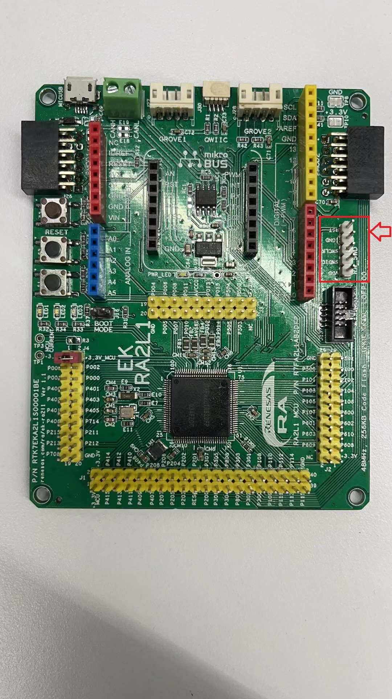
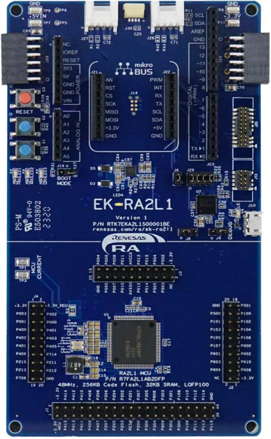
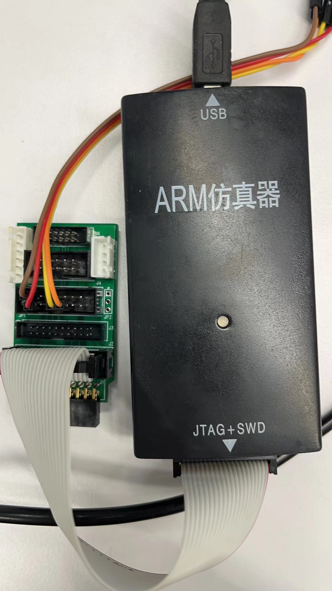
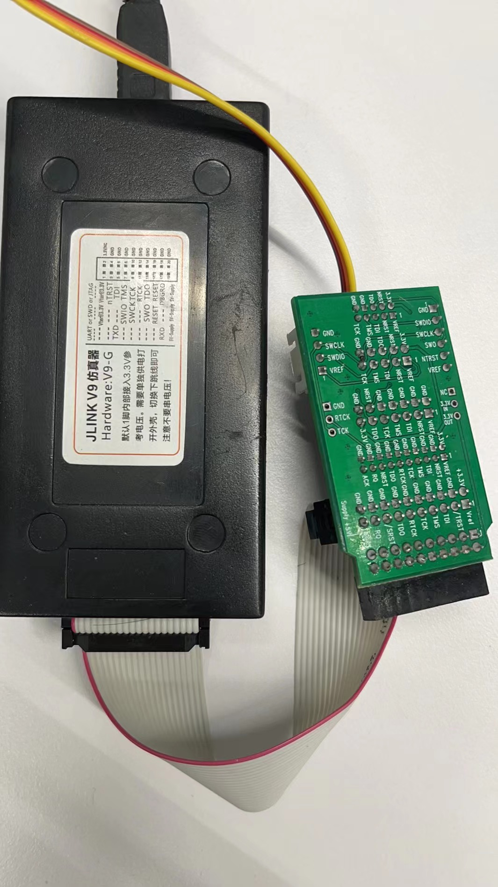
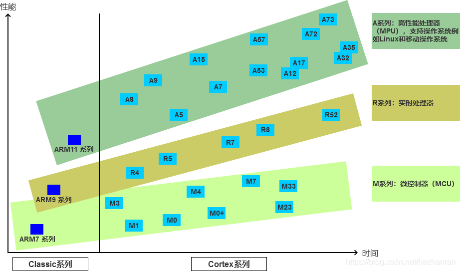
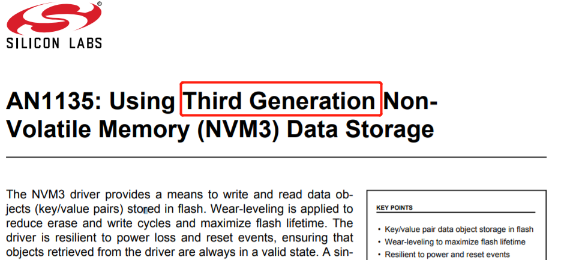
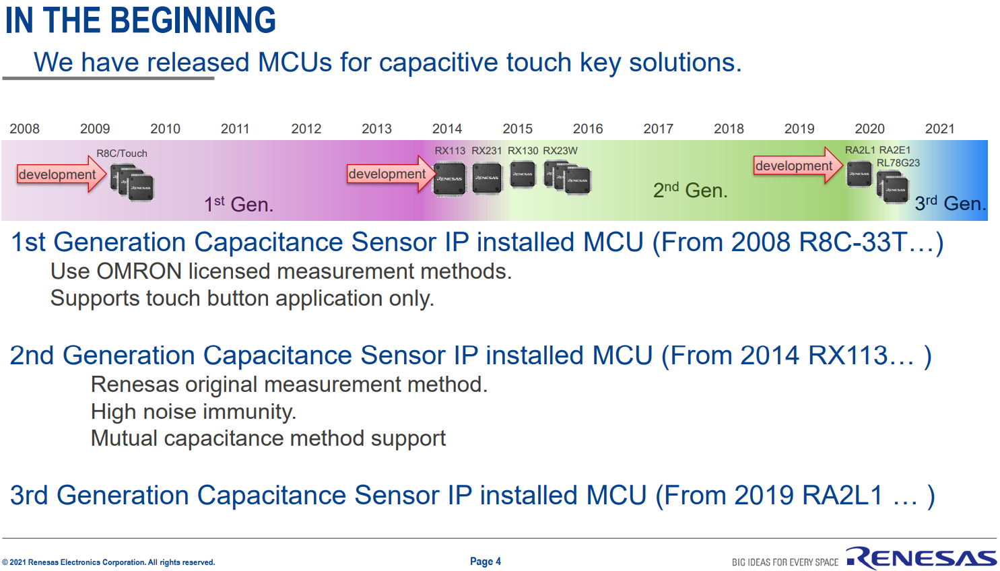

# 瑞萨RA&e2studio快速上手视频笔记 一、瑞萨RA&e2studio介绍
[TOC]

## 一、概述

分享自己通过瑞萨官网RA资料的学习，快速上手RA MCU。主要引用官方资料和例程，注明出处，创建自己的git仓库，更加“接地气”的分享RA&e2studio的学习过程。

## 二、学习资料

### 硬件

##### 开发板：EK-RA2L1
（同Renesas官方EK-RA2L1几乎一样）

EK-RA2L1 v1 - **Design Package**
ZIP19.09 MB
Schematic

jlink/swd替换jlink-ob
##### jlink仿真器

### 软件

##### 4种方式

| 集成开发环境 IDE | [e2studio: 2022-07](https://www2.renesas.cn/cn/zh/software-tool/e-studio) | [fsp_v4_0_0_e2s](https://www2.renesas.cn/cn/zh/software-tool/flexible-software-package-fsp#overview) | MDK: 5.31 | IAR: 8.50.6 |
|:-:|:-:|:-:|:-:|:-:|
| **软件包** |FPS: 4.0.0 | [FPS: 4.0.0](https://github.com/renesas/fsp/releases) | [RA Smart Configurator(RASC):2022-07](https://github.com/renesas/fsp/releases) | RASC: 2022-07 |
| **编译工具链 Toolchain** |GCC Compiler: 10.3-2021.10|GCC Compiler 10.3-2021.10|ARM Compiler: 6.18|IAR Compiler:  9.20.2|
| **IDE特点** |支持多种RenesasMCU 安装中下载FPS和Toolchain等等|RA系列一键安装 包括了FPS和Toolchain| RASC嵌入MDK FPS和Toolchain | RASC嵌入IAR FPS和Toolchain |
|**[J-link烧写软件和硬件](https://www.segger.com/downloads/jlink/)**|SEGGER J-Link:  7.68b|SEGGER J-Link:  7.68b|SEGGER J-Link:  7.68b|SEGGER J-Link:  7.68b|
|**[Renesas烧写软件](https://www2.renesas.cn/us/zh/software-tool/renesas-flash-programmer-programming-gui#overview)**|Renesas Flash Programme（RFP）|RFP|RFP|RFP|
|Renesas仿真硬件|[E2 emulator Lite](https://www2.renesas.cn/us/zh/software-tool/e2-emulator-lite-rte0t0002lkce00000r#overview) [E2 emulator](https://www2.renesas.cn/us/zh/software-tool/e2-emulator-rte0t00020kce00000r#overview)|[E2 emulator Lite](https://www2.renesas.cn/us/zh/software-tool/e2-emulator-lite-rte0t0002lkce00000r#overview) [E2 emulator](https://www2.renesas.cn/us/zh/software-tool/e2-emulator-rte0t00020kce00000r#overview)| | |

## 三、RA2L1在Renesas产品中的位置

#### RA2L1描述

#### Renesas RA系列

#### Renesas MCU&MPU

## 四、为什么选择RA2L1

#### 瑞萨最近比较火
#### 瑞萨入门型号 M23 新产品

#### 低端MCU带有CAN通讯
#### 外设电容触摸单元（CTSU）瑞萨特色

#### 外设数据运算电路(DOC)
https://www2.renesas.cn/cn/zh/blogs/what-s-doc-smart-way-manage-smart-peripherals

无需任何CPU干预即可运行，除非满足报警条件，如果需要，可以中断CPU.
后面会分享这个例程