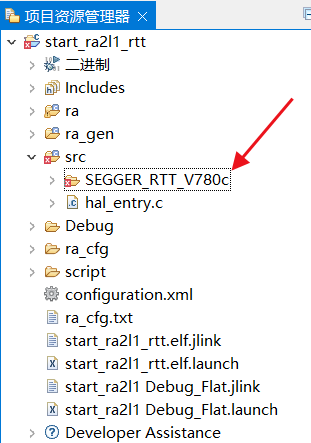
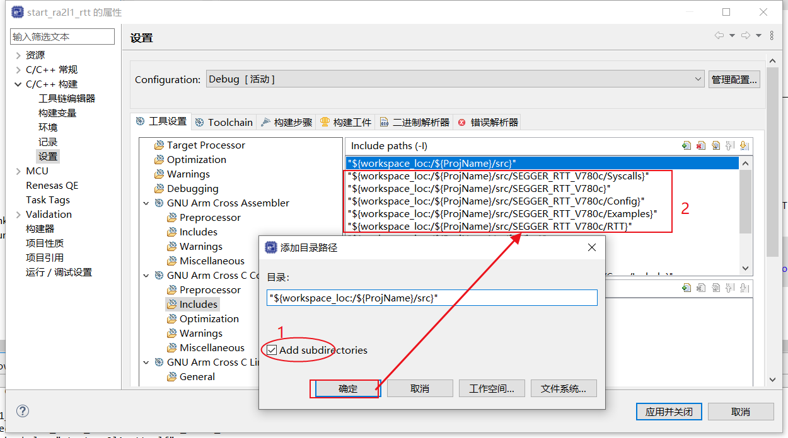
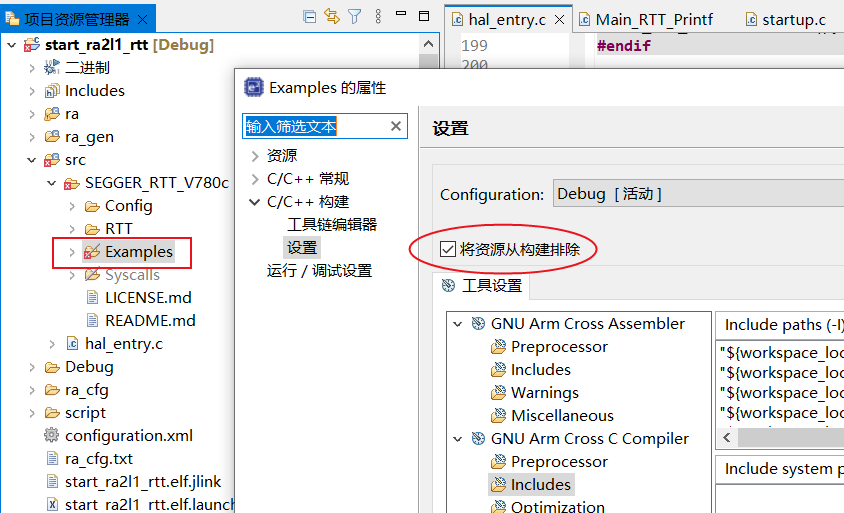

# 瑞萨RA&e2studio快速上手视频笔记 四、瑞萨官方资料的介绍
[toc]

## 一、官网RA2L1：
https://www2.renesas.cn/cn/en/products/microcontrollers-microprocessors/ra-cortex-m-mcus/ra2l1-48mhz-arm-cortex-m23-ultra-low-power-general-purpose-microcontroller
Datasheet
##### 1.1 User's Manual
##### 1.2 Documentation
##### 1.3 Software & Tools
##### 1.4 Sample Code
##### 1.5 Boards & Kits

## 二、官方github：
https://github.com/renesas
##### 2.1 fsp
##### 2.2 ra-fsp-examples
##### 2.3 amazon-freertos
##### 2.4 rx-driver-package

## 三、官方论坛：
https://community.renesas.com/mcu-mpu/ra/?_gl=1*ekwush*_ga*MTMwMTc3NDc5NC4xNjY3MDQwMzA3*_ga_D1706WVDQV*MTY2NzIzMzE2MS4xMC4xLjE2NjcyMzMxOTYuMC4wLjA.
##### 3.1 英文
##### 3.2 日文
##### 3.3 中文

## 四、微信公众号：瑞萨MCU小百科
**重点：非常多**

## 五、Renesas MCU Guide App


## 六、官方资料RA2L1打包下载
##### 6.1 RA2L1官方文档和例程、软件打包下载
链接：https://pan.baidu.com/s/1SbEbdG1g8sx4PwC8b0RMMA 
提取码：jfrm
##### 6.2 提炼资料，节省时间，例程优化，项目应用，必带源码。

## 七、github不稳定、打开很慢

「原名 Steam++」
Watt Toolkit：https://steampp.net/

问题：stream游戏和暴雪游戏也可以加速吗？

## 八、jlink rtt打印

#### 8.1 解压并复制源码到/src


#### 8.2 包含头文件

#### 8.3 无效不使用的例程代码

#### 8.4 在entry中#include "SEGGER_RTT.h"
*常用函数：*

##### 8.4.1 SEGGER_RTT_printf
**int SEGGER_RTT_printf (unsigned BufferIndex, const char * sFormat, …)
这个函数跟 C 库中 printf 一样，区别是不支持浮点数。**

##### 8.4.2 SEGGER_RTT_HasKey
int SEGGER_RTT_HasKey (void)
此函数用于判断接收缓冲区中是否有数据。返回 1 表示至少 1 个数据，返回 0 表示没有。

##### 8.4.3 SEGGER_RTT_GetKey
int SEGGER_RTT_GetKey (void)
从接收缓冲区 buffer 0 中接收一个字符。

##### 8.4.4 SEGGER_RTT_Read
unsigned SEGGER_RTT_Read (unsigned BufferIndex, void* pBuffer, unsigned BufferSize);
从接收缓冲区多个字符。

##### 8.4.5 SEGGER_RTT_ConfigUpBuffer
int SEGGER_RTT_ConfigUpBuffer(unsigned BufferIndex, const char* sName, void* pBuffer, unsigned BufferSize, unsigned Flags);
RTT缓冲区
  RTT不像串口发送数据的时候，必须等着一个字符一个字符传输，而是直接直接写入数据缓冲，接收数据的时候也是写入数据缓冲，然后程序去取。因此RTT需要上行和下行的数据缓冲区。
  RTT 上行缓冲区可以相对较小。 所需的最小缓冲区大小可以近似为一毫秒内写入的数据量或者一次写入操作中写入的最大值。 如果数据发送频率较低，那么缓冲区应该有足够的空间存储一次写入的数据。 如果频繁地发送数据，则缓冲区大小应满足在一毫秒内写入最大数据量。


#### 8.5 有效Syscalls重定向printf到SEGGER_RTT
**#define PRINTF 0**
```
#pragma message("if enable files:SEGGER_RTT_V780c/Syscalls,pls #define PRINTF 0,then redirect printf to SEGGER_RTT.")
#define PRINTF 0
```


