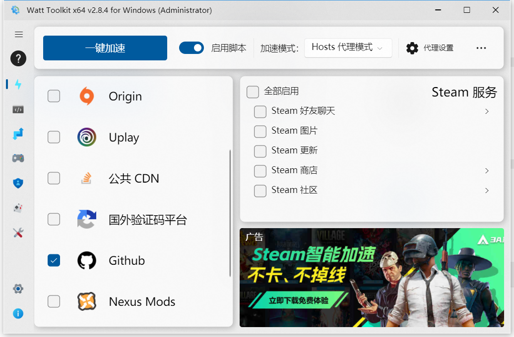

# 瑞萨RA&e2studio快速上手视频笔记 四、瑞萨官方资料的介绍
[toc]

## 一、官网RA2L1：
https://www2.renesas.cn/cn/en/products/microcontrollers-microprocessors/ra-cortex-m-mcus/ra2l1-48mhz-arm-cortex-m23-ultra-low-power-general-purpose-microcontroller
Datasheet
##### 1.1 User's Manual
##### 1.2 Documentation
##### 1.3 Software & Tools
##### 1.4 Sample Code
##### 1.5 Boards & Kits

## 二、官方github：
https://github.com/renesas
##### 2.1 fsp
##### 2.2 ra-fsp-examples
##### 2.3 amazon-freertos
##### 2.4 rx-driver-package

## 三、官方论坛：
https://community.renesas.com/mcu-mpu/ra/?_gl=1*ekwush*_ga*MTMwMTc3NDc5NC4xNjY3MDQwMzA3*_ga_D1706WVDQV*MTY2NzIzMzE2MS4xMC4xLjE2NjcyMzMxOTYuMC4wLjA.
##### 3.1 英文
##### 3.2 日文
##### 3.3 中文

## 四、微信公众号：瑞萨MCU小百科
**重点：非常多**

## 五、Renesas MCU Guide App

## 六、官方资料RA2L1打包下载
##### 6.1 RA2L1官方文档和例程、软件打包下载
链接：https://pan.baidu.com/s/1SbEbdG1g8sx4PwC8b0RMMA 
提取码：jfrm
##### 6.2 提炼资料，节省时间，例程优化，项目应用，必带源码。

## 七、github不稳定、打开很慢

「原名 Steam++」
Watt Toolkit：https://steampp.net/

问题：stream游戏和暴雪游戏也可以加速吗？