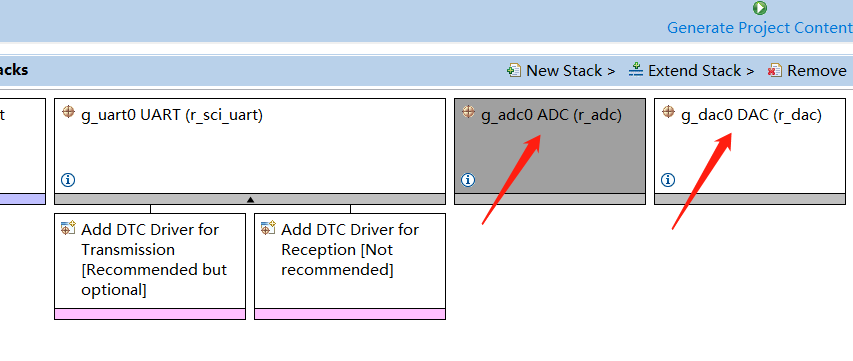
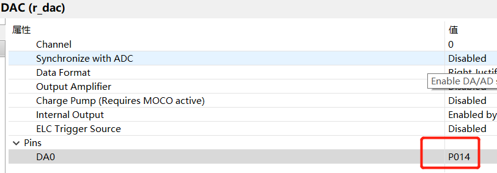
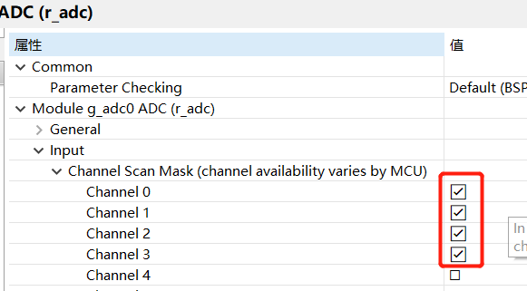
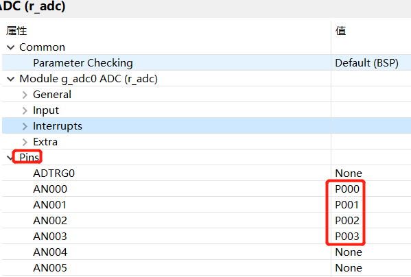
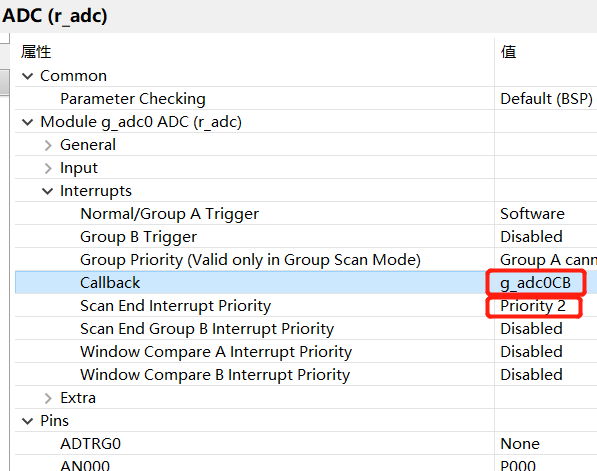

# 瑞萨RA&e2studio快速上手视频笔记 五、DAC&ADC相互验证

    当今我们经常讲“数字化、数字经济、数字化转型”，而忘记了“模拟”，现在就给大家回顾一下“封面”吧，😄😄😄


[toc]
## 一、FPS添加DAC和ADC的配置过程
**细讲ADC和DAC来体验瑞萨e2studio FPS给我们带来的便捷**
### 1.1添加DAC ADC stack

### 1.2修改DAC引脚

### 1.3修改ADC通道

### 1.4修改ADC引脚

### 1.5修改adc回调

### 1.6生成代码


## 二、DAC功能开启
```
/* Open the DAC channel */
    fsp_err_t err = FSP_SUCCESS;
    err = R_DAC_Open (&g_dac0_ctrl, &g_dac0_cfg);
    /* handle error */
    if (FSP_SUCCESS != err)
    {
        /* DAC module open failed */
        printf("\r\n ** DAC Open API failed ** \r\n");
        printf("ERR[%d]%d %d",err,__FUNCTION__,__LINE__);;
    }

    /* Write value to DAC module */
    err = R_DAC_Write (&g_dac0_ctrl, (uint16_t) (g_inputRead));
    /* handle error */
    if (FSP_SUCCESS != err)
    {
        /* dac Write Failure message */
        printf("** DAC Write API failed ** \r\n");
        return err;
    }

    /* Start DAC conversion */
    err = R_DAC_Start (&g_dac0_ctrl);
    /* handle error */
    if (FSP_SUCCESS != err)
    {
        /* dac start failure message */
        printf("** DAC Start API failed ** \r\n");
        return err;
    }
    /* As mentioned in DAC properties and Electrical characteristics of RA2A1 User Manual (Section 47.7),
     * a software delay has to be given for stabilizing the voltage on DAC output pin.
     * Also referred as DAC conversion time delay.*/
    R_BSP_SoftwareDelay(1, BSP_DELAY_UNITS_MILLISECONDS);
```

## 三、ADC功能开启
### 3.1开启
```
/* Open/Initialize ADC module */
    err = R_ADC_Open (&g_adc0_ctrl, &g_adc0_cfg);
    /* Handle error */
    if (FSP_SUCCESS != err)
    {
        /*ADC module open failed */
        printf("\r\n ** ADC module Open failed ** \r\n");
        printf("ERR[%d]%d %d",err,__FUNCTION__,__LINE__);;
    }

    /* Configures the ADC scan parameters */
    err = R_ADC_ScanCfg (&g_adc0_ctrl, &g_adc0_channel_cfg);

    /* handle error */
    if (FSP_SUCCESS != err)
    {
        R_ADC_Close(&g_adc0_ctrl);
        R_DAC_Close(&g_dac0_ctrl);
        /* ADC Failure message */
        printf("** ADC ScanCfg API failed ** \r\n");
        printf("ERR[%d]%d %d",err,__FUNCTION__,__LINE__);;
    }

    /* Start the ADC scan in Single scan mode*/
    err = R_ADC_ScanStart(&g_adc0_ctrl);
    /* handle error */
    if (FSP_SUCCESS != err)
    {
        /* ADC Scan Failure message */
        printf("** ADC ScanStart API failed ** \r\n");
        return err;
    }
```

### 3.2回调
```
/*******************************************************************************************************************//**
 * @brief ADC callback function.
 * @param[in]  p_args
 * @retval     None
 **********************************************************************************************************************/
void g_adc0CB(adc_callback_args_t *p_args)
{
    if (ADC_EVENT_SCAN_COMPLETE == p_args->event)
    {
        fsp_err_t err = FSP_SUCCESS;     // Error status

        scan_complete_flag = true;

    }

}
```
## 四、主循环
### 4.1 ADC转换完成就读取
```
if(scan_complete_flag)
        {
            scan_complete_flag = 0;


            err = R_ADC_Read(&g_adc0_ctrl, ADC_CHANNEL_0, &g_adc0_data);
                assert(FSP_SUCCESS == err);
            err = R_ADC_Read(&g_adc0_ctrl, ADC_CHANNEL_1, &g_adc1_data);
            assert(FSP_SUCCESS == err);
            err = R_ADC_Read(&g_adc0_ctrl, ADC_CHANNEL_2, &g_adc2_data);
                assert(FSP_SUCCESS == err);
            err = R_ADC_Read(&g_adc0_ctrl, ADC_CHANNEL_3, &g_adc3_data);
                assert(FSP_SUCCESS == err);

            printf("u can input change: DAC=%d ADC=%4d %4d %4d %4d\n", (int)g_inputRead,g_adc0_data,g_adc1_data,g_adc2_data,g_adc3_data);

            R_ADC_ScanStart(&g_adc0_ctrl);
        }
```
### 4.2 更新RTT输入得DAC数值
```
/* Validate input value from user */
        if(SEGGER_RTT_HasKey())
        {
            uint8_t readBuff[16] = { 0 };
            SEGGER_RTT_Read (0, readBuff, sizeof(readBuff));

            /* function returns the converted integral number as an int value.*/
            g_inputRead = atoi ((char *) readBuff);
            if ((1 <= g_inputRead) && (4095 >= g_inputRead))
            {
                R_DAC_Write (&g_dac0_ctrl, (uint16_t) (g_inputRead));
            }
        }
```

## 五、代码总结：
###### DAC：
###### Open
###### Write
###### Start
```
err = R_DAC_Open (&g_dac0_ctrl, &g_dac0_cfg);

err = R_DAC_Write (&g_dac0_ctrl, (uint16_t);

err = R_DAC_Start (&g_dac0_ctrl);

通过RTT输入改变DAC
R_DAC_Write (&g_dac0_ctrl, (uint16_t) (g_inputRead));

```
### ADC：
###### Open
###### Cfg
###### Start
###### Read
###### callback
```
err = R_ADC_Open (&g_adc0_ctrl, &g_adc0_cfg);

err = R_ADC_ScanCfg (&g_adc0_ctrl, &g_adc0_channel_cfg);

err = R_ADC_ScanStart(&g_adc0_ctrl);

if(scan_complete_flag)
{
    scan_complete_flag = 0;
    err = R_ADC_Read(&g_adc0_ctrl, ADC_CHANNEL_3, &
    R_ADC_ScanStart(&g_adc0_ctrl);
}

void g_adc0CB(adc_callback_args_t *p_args)
{
    if (ADC_EVENT_SCAN_COMPLETE == p_args->event)
    {
        fsp_err_t err = FSP_SUCCESS;     // Error status
        scan_complete_flag = true;
    }
}

```