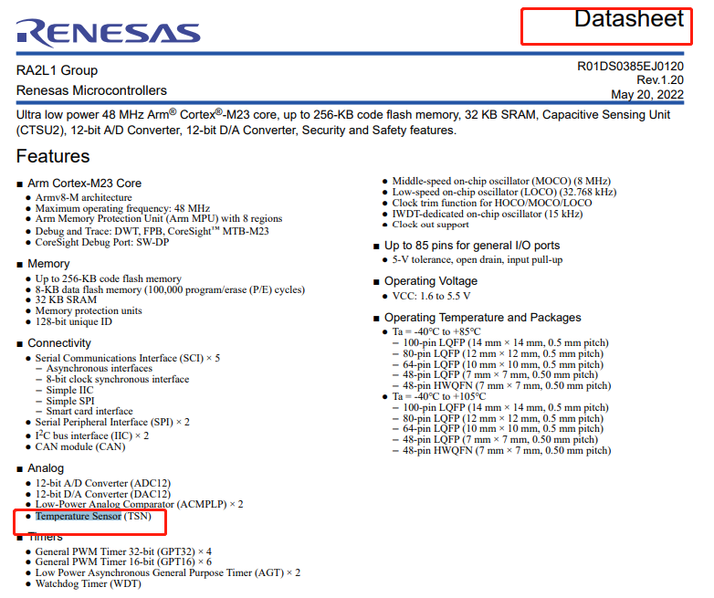
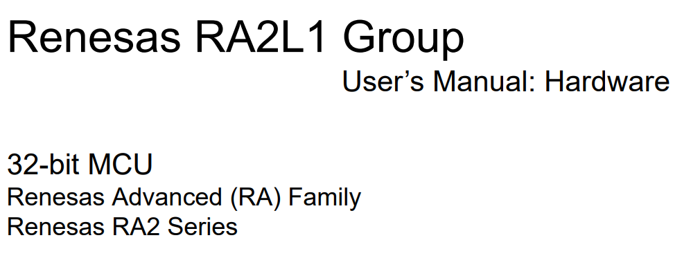
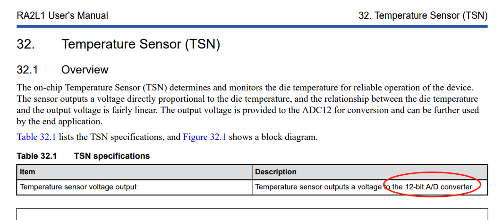
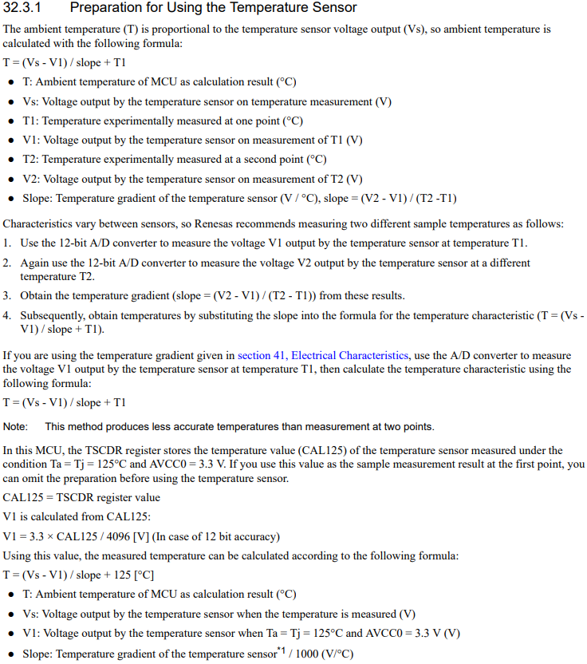

# 瑞萨RA&e2studio快速上手视频笔记 六、读取芯片温度(TSN&ADC)
[toc]
## 一、直接上封装API
#### 1.1 R_ADC_Read_Chip_Temp
```
static fsp_err_t R_ADC_Read_Chip_Temp(double *temp)
{
    fsp_err_t err = FSP_SUCCESS;
    static double die_temperature = 0 ;
    static double V1 = 0;
    static double Vs = 0;
    static adc_info_t adc_info ; //adc information
    //Output from ADC
    static uint16_t voltage_out ;

    //Open and start ADC
    err = R_ADC_Open(&g_adc0_ctrl, &g_adc0_cfg);
    if(err != FSP_SUCCESS)
    {
        printf("ERR! R_ADC_Open err=%d",err);
        return err;
    }

    //Get scan configurations
    err = R_ADC_ScanCfg(&g_adc0_ctrl, &g_adc0_channel_cfg);
    if(err != FSP_SUCCESS)
    {
        printf("ERR! R_ADC_ScanCfg err=%d",err);
        return err;
    }

    err = R_ADC_ScanStart(&g_adc0_ctrl);
    if(err != FSP_SUCCESS)
    {
        printf("ERR! R_ADC_ScanStart err=%d",err);
        return err;
    }

    //Read voltage from ADC
    err = R_ADC_Read (&g_adc0_ctrl, ADC_CHANNEL_TEMPERATURE, &voltage_out);
    if(err != FSP_SUCCESS)
    {
        printf("ERR! R_ADC_Read err=%d",err);
        return err;
    }

    //Get ADC info
    err = R_ADC_InfoGet(&g_adc0_ctrl, &adc_info);
    if(err != FSP_SUCCESS)
    {
        printf("ERR! R_ADC_InfoGet err=%d",err);
        return err;
    }

    //Die temperature formula according to TSN documentation: T = ( Vs - V1 ) / slope + 125 C
    V1 = ( 3.3 * (int) adc_info.calibration_data  ) / 4096 ;
    Vs = ( 3.3 * (int) voltage_out ) / 4096 ;

    die_temperature = 1000000 * ( Vs - V1 ) / ( adc_info.slope_microvolts ) + 125.0;

    *temp = die_temperature;

    return err;
}
```
#### 1.2 使用例程
```
/* generic headers */
#include <stdio.h>
//#include <string.h>
//#include <stdlib.h>
//#include "hal_data.h"
/* SEGGER RTT and error related headers */
#include "SEGGER_RTT.h"
...
while(1)
{
    ....
    double die_temperature = 0 ;
    fsp_err_t err = R_ADC_Read_Chip_Temp(&die_temperature);
    if(err == FSP_SUCCESS)
    {
        static char string_die_temp[10] = {0};
        sprintf( string_die_temp, "%.2f", die_temperature  );
        int a = (int)(die_temperature*100);
        printf("RA2L1 current chip temperature=%s a=%d\n", string_die_temp, a);
        //SEGGER_RTT_printf(0, "RA2L1 current chip temperature=%s a=%d\n", string_die_temp, a);
    }
    else
    {
        printf("ERR!R_ADC_Read_Chip_Temp err=%d\n", err);
    }

    /* Delay */
    R_BSP_SoftwareDelay(500, BSP_DELAY_UNITS_MILLISECONDS);
    ....

}
```

### 1.3 快餐的到此为止
---
---
## 二、芯片温度资料来源

#### 2.1 数据手册datasheet介绍


#### 2.2 用户手册User`sManual:Hardware

##### 2.2.1 Temperature Sensor (TSN)

##### 2.2.2 使用步骤



