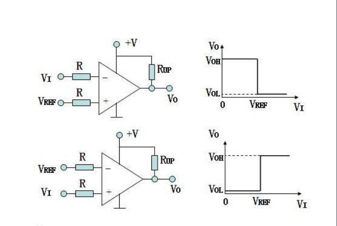
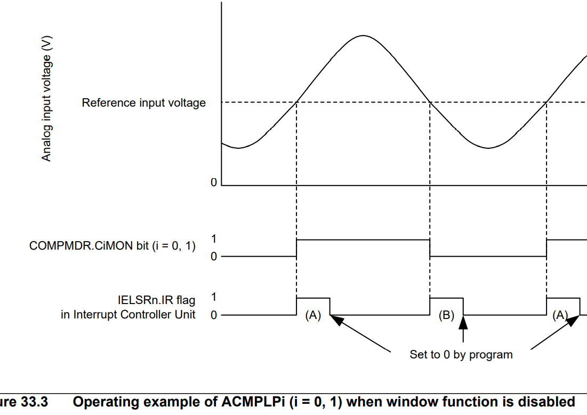
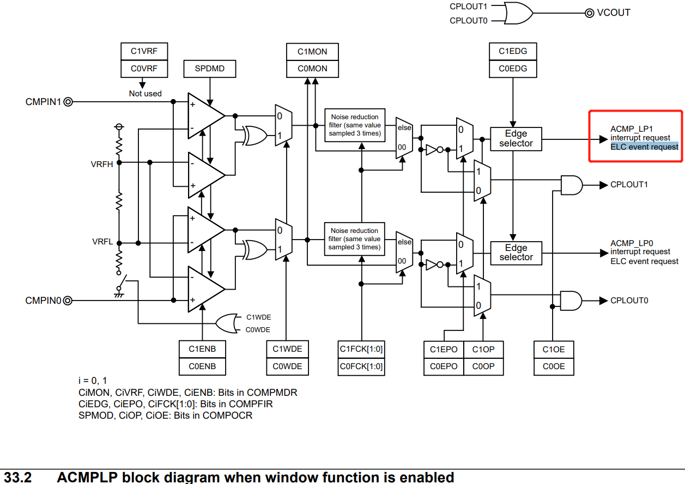
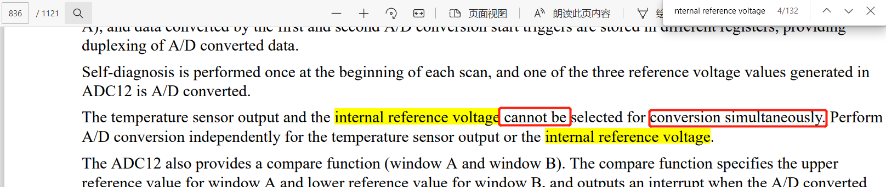
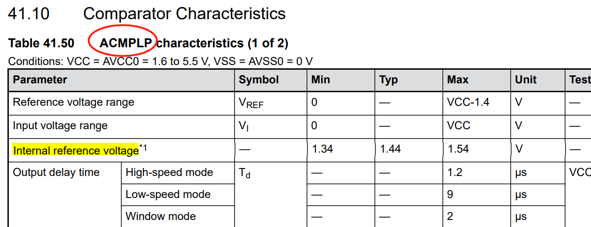
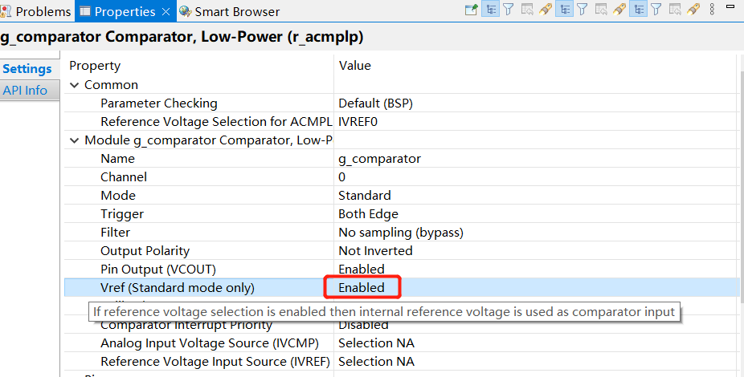
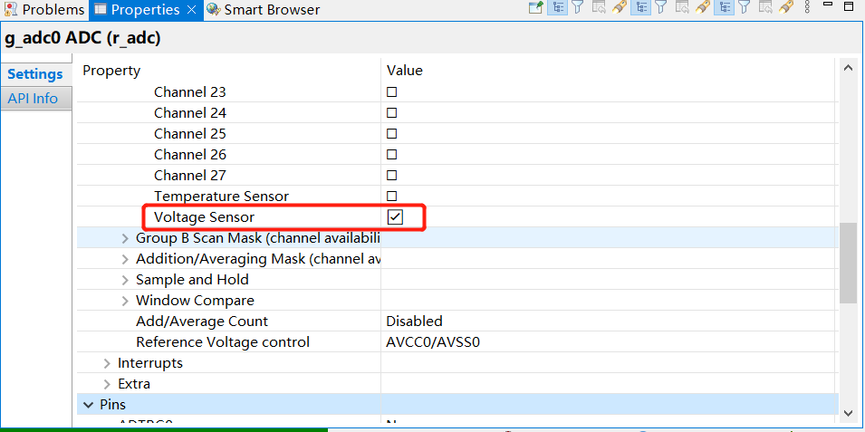

# 瑞萨RA&e2studio快速上手视频笔记 七、瑞萨RA2L1模拟/电压比较器(ACMPLP)
[toc]
## 一、模拟/电压比较器简介
### 1.1 简介和作用
比较器在最常用的简单集成电路中排名第二（第一是运算放大器）。

电压比较器是一种用来比较输入信号电压与参考电压大小，并将比较结果以高电平或低电平形式输出的一种信号处理电路，广泛应用于各种非正弦波的产生和变换电路中，在自动控制和自动测量系统中，常常用于**越限报警、模数转换**等。



### 1.2 RA2L1的低功耗模拟比较器ACMPLP
#### 1.2.1 可运行在睡眠模式
#### 1.2.1 ELC事件请求


## 二、例程介绍
### 2.1 官方例程
\ra-fsp-examples-master\example_projects\ek_ra2l1\acmplp\acmplp_ek_ra2l1_ep\e2studio
通过DAC输出，测试ACMPLP的输出。但是只有1路DAC无法在只有EK板子情况下测试。
Hardware connections:	
	
	RA4M1-EK/RA2L1-EK:
	1) CMPIN0(P100)  ----> DA0(P014)
	2) CMPREF0(P101) ----> Output of voltage divider
**存在报错：DAC P014冲突**

### 2.2 我们优化版本
RA2L1资源： 1个DAC、1个ADC、一个ACMPLP
所以，我们改ACMPLP为内部参考，外部输入使用DAC。通过修改DAC输出不同的电压，观看ACMPLP的输出结果。相当于起到阈值检测的作用。

#### 2.2.1 FSP的修改
##### 2.2.1.1 改ACMPLP为内部参考
**注意：温度传感器通道和内部参考电源通道不能同时读取**


*ACMPLP的内部参考电压描述*


*Vref看描述，enable可以使用内部参考*


##### 2.2.1.2 增加ADC通道voltage sensor


#### 2.2.2 代码的增加
##### 2.2.2.1 ADC初始化
```
#if 1
    /* Configures the ADC scan parameters */
    err = R_ADC_ScanCfg (&g_adc0_ctrl, &g_adc0_channel_cfg);

    /* handle error */
    if (FSP_SUCCESS != err)
    {
        R_ADC_Close(&g_adc0_ctrl);
        /* ADC Failure message */
        APP_PRINT("** ADC ScanCfg API failed ** \r\n");
        APP_PRINT("ERR[%d]%d %d",err,__FUNCTION__,__LINE__);;
    }

    /* Start the ADC scan in Single scan mode*/
    err = R_ADC_ScanStart(&g_adc0_ctrl);
    /* handle error */
    if (FSP_SUCCESS != err)
    {
        /* ADC Scan Failure message */
        APP_PRINT("** ADC ScanStart API failed ** \r\n");
    }
#endif
```
##### 2.2.2.2 读取内部参考
```
switch (read_data)
            {
                case NORMAL_MODE:
                ....
                ....

#if 1
                    static uint16_t g_adc3_data = 0;
                    err = R_ADC_ScanStart(&g_adc0_ctrl);
                    if(err != FSP_SUCCESS)
                    {
                        APP_PRINT("R_ADC_ScanStart err=%d", err);
                        break;
                    }
                    R_BSP_SoftwareDelay(10, 2);
                    err = R_ADC_Read(&g_adc0_ctrl, ADC_CHANNEL_VOLT, &g_adc3_data);
                    if(err != FSP_SUCCESS)
                    {
                        APP_PRINT("R_ADC_Read ADC_CHANNEL_VOLT err=%d", err);
                        break;
                    }

                    APP_PRINT("ADC_CHANNEL_VOLT=%4d\n", g_adc3_data);
#endif
```

#### 2.2.3 日志分析

*内部参考:1828，DAC输入1825/1835,ACMPLP输出LOW/HIGH*
```
00>  Menu Options
00>  1. Enter 1 for ACMPLP Normal Mode
00>  2. Enter 2 for Exit
00>  User Input:  
  < 1
00>  
00> Enter the DAC Value(0 - 4095) to Compare:
  < 1825
00> Input DAC value:  1825 
00> Comparator Output is LOW and Setting On-board LED LOW
00> ADC_CHANNEL_VOLT=1829
00> 
00>  Menu Options
00>  1. Enter 1 for ACMPLP Normal Mode
00>  2. Enter 2 for Exit
00>  User Input:  
  < 1
00>  
00> Enter the DAC Value(0 - 4095) to Compare:
  < 1835
00> Input DAC value:  1835 
00> Comparator Output is HIGH and Setting On-board LED HIGH
00> ADC_CHANNEL_VOLT=1828
```

## 三、总结
RA系列基本都带ACMPLP，可以在睡眠模式功能，输出ELC事件可以触发其他外设。
**相关API**
```
R_ACMPLP_Open(&g_comparator_ctrl, &g_comparator_cfg);
R_ACMPLP_OutputEnable(&g_comparator_ctrl);
R_ACMPLP_StatusGet(&g_comparator_ctrl, &status);
```
