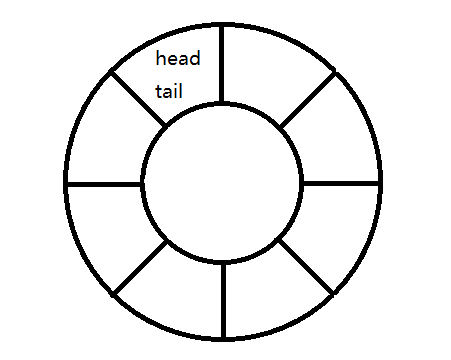
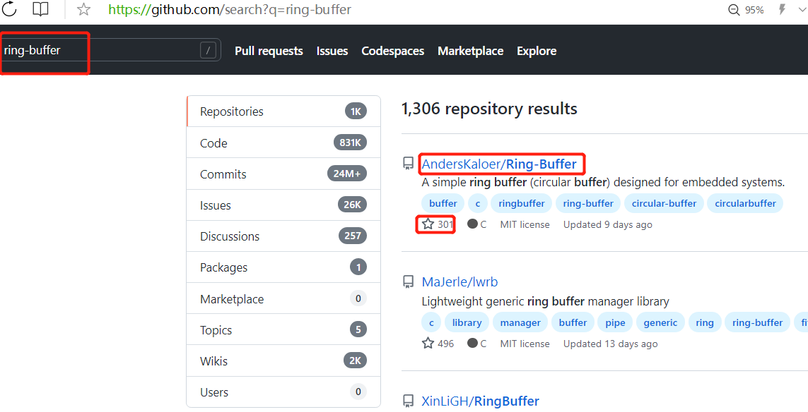
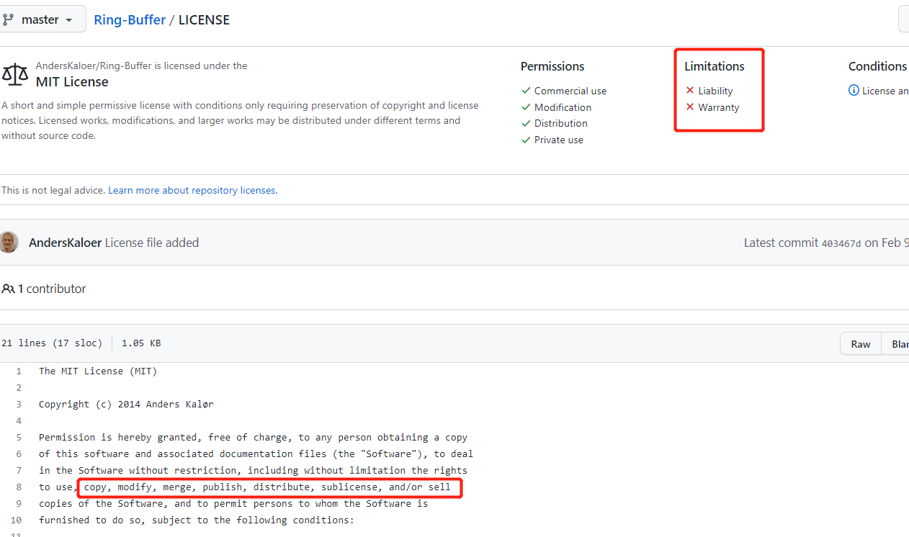
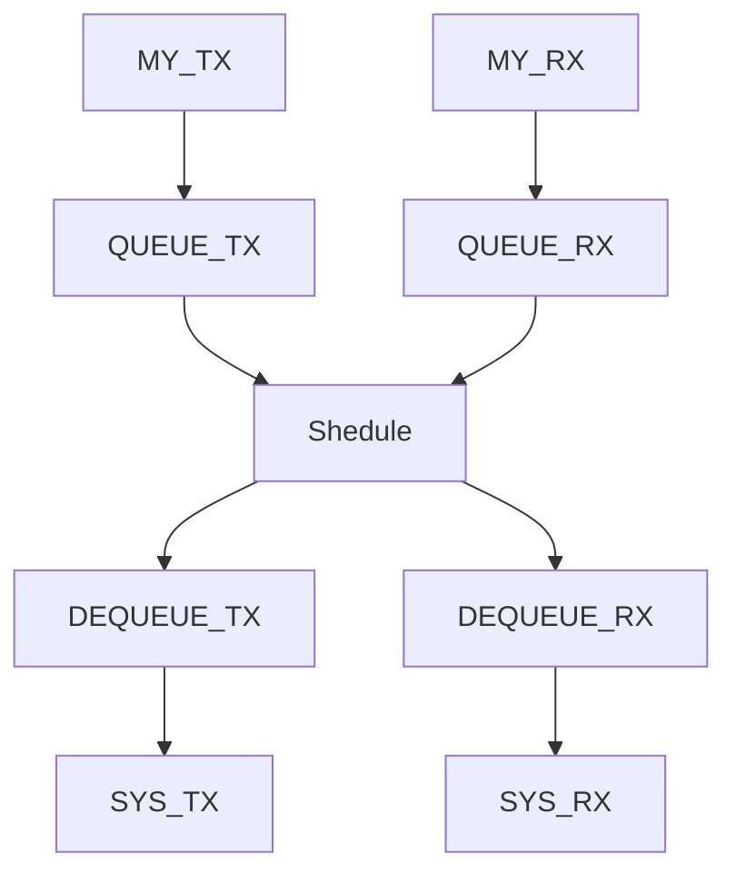

# 瑞萨RA&e2studio快速上手视频笔记 八、瑞萨RA2L1串口双环形缓冲ringbuffer
[toc]

## 一、**项目中可直接的串口代码**
### 1.1 前面的串口打印日志
第二节中已经初步设计串口功能：串口重定向，使用printf打印日志。
但是并没有完整的讲接收和发送的部分完整的展示出来，达不到拿去项目中使用的程度。
仅仅是使用串口打印日志的功能。

并且在第三节中优化了代码，使其在e2studio MDK IAR中均能使用，如下：

```
#ifndef PRINTF
#define PRINTF
#endif
#ifdef PRINTF
#include <stdio.h>
/**
 * notice: g_uart0CB; g_uart0_ctrl
 *
 * e2s:
 * 1.uart0 callback:g_uart0CB
 * 2.FSP-BSP-heap size:0x400
 * 3.-u _printf_float
 * 4.other link void
 *
 * iar:
 * 1.uart0 callback:g_uart0CB
 * 2.FSP-BSP-heap size:0x400
 * 3.libray=full
 * 4.Semihosted=None
 *
 * keil:
 * 1.uart0 callback:g_uart0CB
 * 2.FSP-BSP-heap size:0x400
 */
volatile bool uart_send_complete_flag = false;
void g_uart0CB (uart_callback_args_t * p_args)
{
    if(p_args->event == UART_EVENT_TX_COMPLETE)
    {
        uart_send_complete_flag = true;
    }
}
#if defined __GNUC__ && !defined __clang__
int _write(int fd, char *pBuffer, int size); //??????
int _write(int fd, char *pBuffer, int size)
{
   (void)fd;
   fsp_err_t err = R_SCI_UART_Write(&g_uart0_ctrl, (uint8_t *)pBuffer, (uint32_t)size);
   if(FSP_SUCCESS != err) __BKPT();
   while(uart_send_complete_flag == false);
   uart_send_complete_flag = false;

   return size;
}
#else
int fputc(int ch, FILE *f)
{
   (void)f;
   fsp_err_t err = R_SCI_UART_Write(&g_uart0_ctrl, (uint8_t *)&ch, 1);
   if(FSP_SUCCESS != err) __asm("bkpt 0");
   while(uart_send_complete_flag == false);
   uart_send_complete_flag = false;

   return ch;
}
#endif//#if defined __GNUC__ && !defined __clang__
#endif//PRINTF

````
void hal_entry (void)
```
#ifdef PRINTF
    /* Open the transfer instance with initial configuration. */
    fsp_err_t err = R_SCI_UART_Open(&g_uart0_ctrl, &g_uart0_cfg);
    assert(FSP_SUCCESS == err);

    printf("date:%s\ntime:%s\nfile:%s\nfunc:%s,line:%d\nhello world!\n", __DATE__, __TIME__, __FILE__, __FUNCTION__, __LINE__);

    double PI = 3.1415926;
    printf("PI=%f\n", PI);
#endif//PRINTF
```

### 1.2 环形缓冲区ringbuffer
串口接收/发送使用环形缓冲区ringbuffer是非常通用并且有效的方法。
可以有效的使得应用代码与驱动代码分层、缓冲接收发送的数据。


#### 1.2.1 **buffer[size]**
#### 1.2.2 **head index**
#### 1.2.3 **tail index**
```
struct ring_buffer_t {
  /** Buffer memory. */
  char buffer[RING_BUFFER_SIZE];
  /** Index of tail. */
  ring_buffer_size_t tail_index;
  /** Index of head. */
  ring_buffer_size_t head_index;
};
```

## 二、环形缓冲区ringbuffer源码
自己写或者GitHub下载。
### 2.1 GitHub下载
可以直接在GitHub搜索关键字，选择被关注多的，并且开源没有任何限制的


只能说：
Anders Kalør
AndersKaloer真帅，完全随意使用。

### 2.2 加入到e2studio中
方法参考前面讲过的RTT章节

### 2.3 使用ringbuffer
#### 2.3.1 定义
```
#include "ringbuffer.h"
...
static ring_buffer_t uart0_TxBuf, uart0_RxBuf;
```

### 2.3.2 使能串口后初始化ringbuffer
```
    fsp_err_t err = FSP_SUCCESS;
    err = R_SCI_UART_Open (&g_uart0_ctrl, &g_uart0_cfg);
    assert(FSP_SUCCESS == err);

    char test[20] = "uart test\n";
    My_Uart0_Tx_While_Complete((uint8_t*)test, (uint8_t)strlen(test));

    //init uart tx/rx ringbuffer
    ring_buffer_init(&uart0_TxBuf);
    ring_buffer_init(&uart0_RxBuf);
```

### 2.3.3 串口发送函数
```
uint8_t My_Uart0_Tx_UseRingBuf(uint8_t * buf, uint8_t len)
{
    /* Add array */
    ring_buffer_queue_arr(&uart0_TxBuf, (const char *)buf, len);
    return 0;
}
```

### 2.3.4 串口接收处理 
```
case UART_EVENT_RX_CHAR:
      {
            ring_buffer_queue(&uart0_RxBuf, (char) p_args->data);
            break;
      }
```

### 2.3.4 启动ringbuffer调度
```
void My_Uart0_Shedule(void)
{
    //rx ringbuf
    /* Is buffer empty? */
    if(!ring_buffer_is_empty(&uart0_RxBuf))
    {
        uint8_t rx[RING_BUFFER_SIZE] = {0};
        uint8_t cnt = ring_buffer_dequeue_arr(&uart0_RxBuf, (char*)rx, sizeof(uart0_RxBuf.buffer));

        //print to RTT
        rx[RING_BUFFER_SIZE-1] = 0;
        printf("uart0 rx ringbuffer data[%d]:%s\n", cnt, rx);
        printf("\t\tthe data can be used for protocol resolution\n\n");
    }

    ////////////////////////////////////////////////
    //tx ringbuf
    /* Is buffer empty? */
    if(!ring_buffer_is_empty(&uart0_TxBuf))
    {
        uint8_t tx[RING_BUFFER_SIZE] = {0};
        uint8_t cnt = ring_buffer_dequeue_arr(&uart0_TxBuf, (char*)tx, sizeof(uart0_TxBuf.buffer));

        My_Uart0_Tx_While_Complete(tx, cnt);
        printf("uart0 tx data user ringbuffer complete! pls check use sscom!!!\n\n");
    }

}
```
## 三、总结
ringbuffer是常用、有效的串口出来办法。
可以自己写代码或者GitHub下载代码。
使用ringbuffer过程：
**定义变量**
**初始化缓冲区**
**接收发送函数**
**启动调度器**


*RA2L1当然也可以接收用ringbuffer，发送依然使用中断方式，后面分享其他尝试*

### 流程图/示意图
