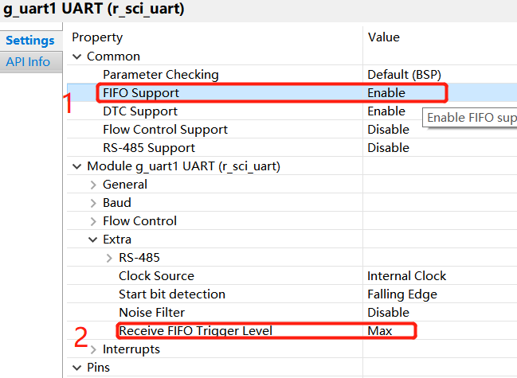
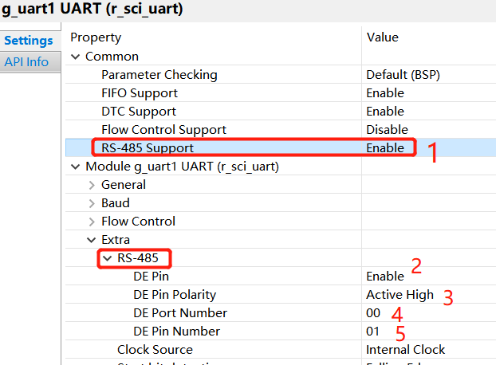

# 瑞萨RA&e2studio快速上手视频笔记 九、瑞萨RA2L1串口硬件16级FIFO和RS485支持
[toc]

# 一、RA2L1串口硬件16级FIFO
## 1.1 RA2L1 16级FIFO简介和对比
可选的1级寄存器或16级FIFO（Selectable to 1-stage register or 16-stage FIFO (only SCIn (n = 0) supports FIFO)），简单的理解就是硬件收发1个字节或者硬件缓冲16个字节。这是基于硬件的，对于调试或者增加收发速度是有好处的，后面有对比试验。
**瑞萨RA2L1串口框图**

**STM32F103串口框图**
对比103是没有FIFO的，但有DMA，RA2L1应该是低于103的，应该对比030

## 1.2 RA2L1如何启用串口FIFO
在瑞萨IDE e2studio 的FSP中使用串口FIFO仅仅需要2个步骤

### 1.2.1 FIFO Support Enable
在FSP-stack-r_sci_uart属性的common中使能FIFO
### 1.2.2 Receive FIFO Trigger Level Max
在FSP-stack-r_sci_uart属性的Extra中选择FIFO Trigger Level Max。这个其实对于我们编码也毫无影响。

### 1.2.3 FSP生成代码
与正常串口操作的API一模一样

## 1.3 试验结论
1.RA2L1的库函数只支持中断方式接收数据
2.RA2L1串口FIFO会缓存16个字节（串口硬件FIFO对比soc可以理解为一级缓存，soc的SDK一般带二级缓存）
3.个人建议硬件上使能FIFO，软件上使用环形队列ringbuffer来处理串口收发

# 二、RA2L1 RS485支持
## 2.1 RS485简介
RS485是由协会和联盟定义了电器特性的现场总线，通常由1主多从的**主从**结构组成。
硬件上通常使用屏蔽双绞线，采用平衡发送和**差分**接收，因此具有**抑制共模干扰**的能力；简单理解串口+485芯片。
协议上有rs485 modbus。
软件上简单理解，串口+DE使能引脚

## 2.2 RA2L1如何启用RS485支持
### 2.2.1 RS-485 Support Enable
在FSP-stack-r_sci_uart属性的common中使能RS-485 Support
### 2.2.2 RS-485 DE Pin配置
使能DE引脚、电平、引脚号

使用逻辑分析仪验证

### 2.2.3 FSP生成代码
与正常串口操作的API一模一样

# 三、总结
RA2L1串口个人建议硬件上使能FIFO，软件上使用环形队列，提升串口收发能力，代码上去耦合。瑞萨的FSP生成代码，我们带来非常多的便利。

