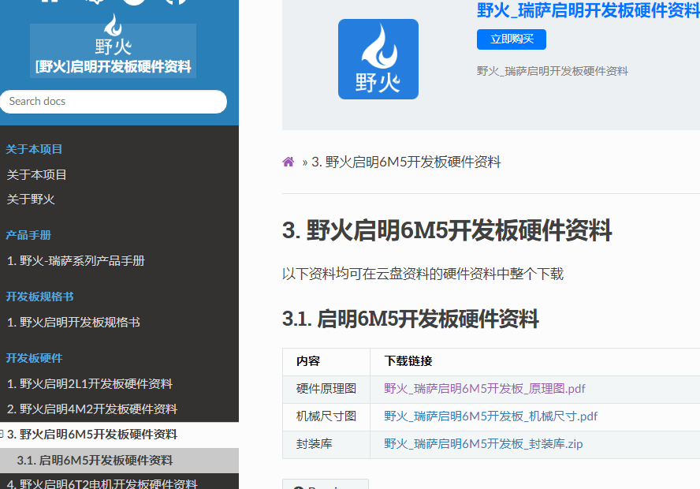
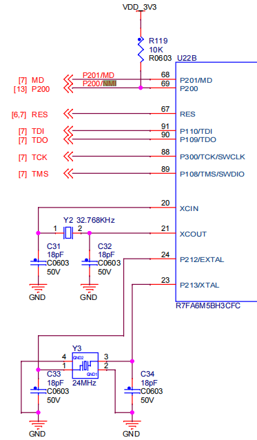

# 从0开始卷出一个新项目之瑞萨RA6M5
[toc]

## 一、范围
##### 1.1 初次在项目中使用瑞萨RA
##### 1.2 用过ST等但不熟悉瑞萨环境
##### 1.3 对嵌入式开发感兴趣

## 二、目的
通过boot+app两个工程源码和开发环境的分享，使得瑞萨RA6M5快速用于项目开发。

## 三、瑞萨RA6M5简介

## 四、瑞萨RA6M5应用
##### 新能源
##### 充电桩
##### BMS
##### DTU RTU
蜂窝云连接系统
交流变频器/GP 逆变器解决方案
语音识别和智能控制
基于 ROS 的机器人本体控制器
micro-ROS Solutions
Ubiquitous AI Edge Trust for RA MCUs
工业用嵌入式可编程逻辑控制器 (PLC)
无线多通道隔离数据记录器
ABUP UA差分升级解决方案
Remote Predictive Maintenance Solution
远程预测性维护
有线以太网应用
需要增强安全功能的产品（火灾探测、防盗检测、面板控制）
表计类产品（电力，自动抄表）
工业应用（机器人、开门器、缝纫机、自动售货机、UPS）
HVAC（供暖、空调、锅炉控制）

## 五、分享内容
##### 5.1 工程框图

##### 5.1 flash分区

##### 5.1 软件资源

## 六、硬件设计

#### 6.1 资料来源

##### 6.1.1 官方：RA6 快速设计指南、datasheet、User’s Manual、ek-designpackage

##### 6.1.3 第三方：野火启明6M5开发板 https://doc.embedfire.com/mcu/renesas/fsp_ra/zh/latest/index.html

##### 6.1.4 嘉立创、b站等

#### 6.2 各部分设计
##### 6.2.1 电源
    VSS VSS **VCL** AVCC AVSS VREF VBAT
   
##### 6.2.2 时钟
    24M 32.768K(**注意未使用**) 25M 
     
##### 6.2.3 调试接口
    建议预留JTAG，非单SWD，上拉
     
##### 6.2.4  复位

##### 6.2.5  串口、CAN、以太网
    上拉
##### 6.2.6  未使用引脚

## 七、软件设计