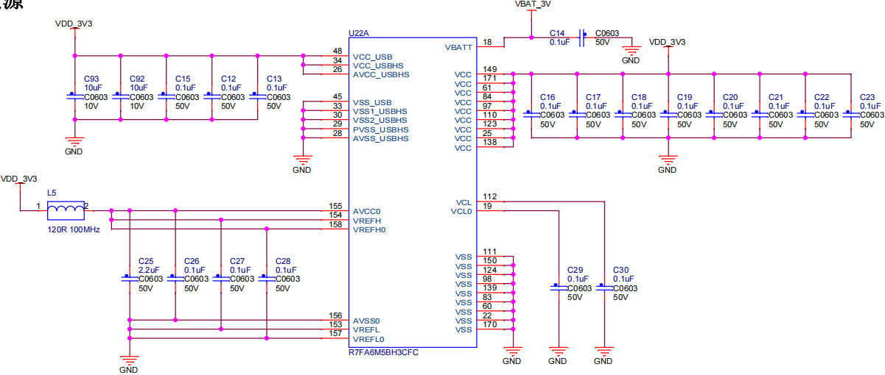
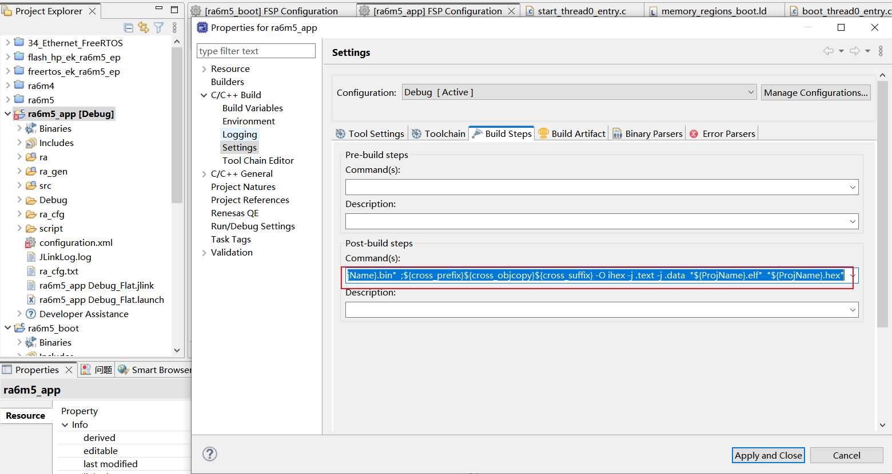
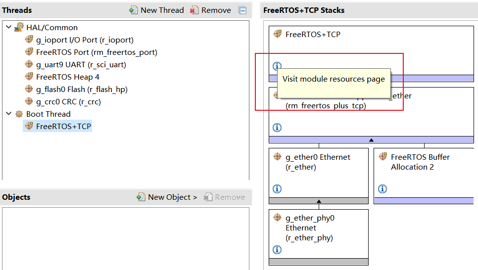

# 从0开始卷出一个新项目之瑞萨RA6M5
[toc]

## 一、范围
##### 1.1 初次在项目中使用瑞萨RA
##### 1.2 用过ST等但不熟悉瑞萨环境
##### 1.3 对嵌入式开发感兴趣

## 二、目的
通过boot+app两个工程源码和开发环境的分享，使得瑞萨RA6M5快速用于项目开发。

## 三、瑞萨RA6M5简介


## 四、瑞萨RA6M5应用
##### 新能源
##### 充电桩
##### BMS
##### DTU RTU
蜂窝云连接系统
交流变频器/GP 逆变器解决方案
语音识别和智能控制
基于 ROS 的机器人本体控制器
micro-ROS Solutions
Ubiquitous AI Edge Trust for RA MCUs
工业用嵌入式可编程逻辑控制器 (PLC)
无线多通道隔离数据记录器
ABUP UA差分升级解决方案
Remote Predictive Maintenance Solution
远程预测性维护
有线以太网应用
需要增强安全功能的产品（火灾探测、防盗检测、面板控制）
表计类产品（电力，自动抄表）
工业应用（机器人、开门器、缝纫机、自动售货机、UPS）
HVAC（供暖、空调、锅炉控制）

## 五、分享内容
##### 5.1 工程框图

##### 5.1 flash分区

##### 5.1 软件资源


## 六、硬件设计

#### 6.1 资料来源

##### 6.1.1 官方：RA6 快速设计指南、datasheet、User’s Manual、ek-designpackage

##### 6.1.2 第三方：野火启明6M5开发板 https://doc.embedfire.com/mcu/renesas/fsp_ra/zh/latest/index.html


##### 6.1.3 嘉立创、b站等


#### 6.2 各部分设计
##### 6.2.1 电源
    VSS VSS **VCL** AVCC AVSS VREF VBAT
   
##### 6.2.2 时钟
    24M 32.768K(**注意未使用**) 25M 
     
##### 6.2.3 调试接口
    建议预留JTAG，非单SWD，上拉
     
##### 6.2.4  复位

##### 6.2.5  串口、CAN、以太网
    上拉
##### 6.2.6 引脚分配
    datasheet


    rasc分配导出表格
     
##### 6.2.7  未使用引脚


##### 6.2.8 原理图 PCB
    库文件

## 七、软件设计

### 7.1 配置分析
#### 7.1.1 IDE等开发环境

| 集成开发环境<br>IDE | [e2studio](https://www2.renesas.cn/cn/zh/software-tool/e-studio) | [fsp_v4_0_0_e2s](https://www2.renesas.cn/cn/zh/software-tool/flexible-software-package-fsp#overview) | MDK:<br>5.31 | IAR:<br>8.50.6 |
|:-:|:-:|:-:|:-:|:-:|
| **软件包** |FPS | [FPS](https://github.com/renesas/fsp/releases) | [RA Smart Configurator(RASC)<br>fsp_v4_1_0_e2s](https://github.com/renesas/fsp/releases) | RASC |
| **编译工具链<br>Toolchain** |GCC Compiler|GCC Compiler|ARM Compiler|IAR Compiler|
| **IDE特点** |支持多种RenesasMCU<br>安装中下载FPS和Toolchain等等|RA系列一键安装<br>包括了FPS和Toolchain| RASC嵌入MDK<br>FPS和Toolchain | RASC嵌入IAR<br>FPS和Toolchain |
|**[J-link烧写软件和硬件](https://www.segger.com/downloads/jlink/)**|SEGGER J-Link: <br>7.68b|SEGGER J-Link: <br>7.68b|SEGGER J-Link: <br>7.68b|SEGGER J-Link: <br>7.68b|
|**[Renesas烧写软件](https://www2.renesas.cn/us/zh/software-tool/renesas-flash-programmer-programming-gui#overview)**|Renesas Flash Programme（RFP）|RFP|RFP|RFP|
|Renesas仿真硬件|[E2 emulator Lite](https://www2.renesas.cn/us/zh/software-tool/e2-emulator-lite-rte0t0002lkce00000r#overview)<br>[E2 emulator](https://www2.renesas.cn/us/zh/software-tool/e2-emulator-rte0t00020kce00000r#overview)|[E2 emulator Lite](https://www2.renesas.cn/us/zh/software-tool/e2-emulator-lite-rte0t0002lkce00000r#overview)<br>[E2 emulator](https://www2.renesas.cn/us/zh/software-tool/e2-emulator-rte0t00020kce00000r#overview)| | |

#### 7.1.2 创建两个工程
    使用e2sstudio创建boot+app两个带rtos的工程
    注意芯片型号和编译工具
    创建成功后debug运行测试

#### 7.1.3 修改link文件
/script
fsp_boot.ld
memory_regions_boot.ld

fsp_app.ld
memory_regions_app.ld

```
RAM_START = 0x20000000;
RAM_LENGTH = 0x80000;
FLASH_START = 0x00000000;
FLASH_LENGTH = 0x010000;
DATA_FLASH_START = 0x08000000;
DATA_FLASH_LENGTH = 0x2000;
OPTION_SETTING_START = 0x0100A100;
OPTION_SETTING_LENGTH = 0x100;
OPTION_SETTING_S_START = 0x0100A200;
OPTION_SETTING_S_LENGTH = 0x100;
ID_CODE_START = 0x00000000;
ID_CODE_LENGTH = 0x0;
SDRAM_START = 0x90000000;
SDRAM_LENGTH = 0x0;
QSPI_FLASH_START = 0x60000000;
QSPI_FLASH_LENGTH = 0x4000000;
OSPI_DEVICE_0_START = 0x68000000;
OSPI_DEVICE_0_LENGTH = 0x8000000;
OSPI_DEVICE_1_START = 0x70000000;
OSPI_DEVICE_1_LENGTH = 0x10000000;
```

```
unsigned long Boot_Addr = 0x10000;//memory_regions_boot.ld FLASH_LENGTH
printf("\n**************************************\n");
printf(  "**********JUMP TO APP:0x%lX**********\n", Boot_Addr);
printf(  "**************************************\n");

//close any peripherals before do_boot
g_uart9.p_api->close(&g_uart9_ctrl);
R_FLASH_HP_Close(&g_flash0_ctrl);

//jump
do_boot(Boot_Addr);
printf("this message cant print!\n");
```

    flash分区


#### 7.1.4 链接elf


    增加jump函数
    测试debug和跳转功能

#### 7.1.5 用FSP添加外设
    boot


    app


#### 7.1.6 输出文件格式




    ${cross_prefix}${cross_objcopy}${cross_suffix} -O binary  -j .text -j .data  "${ProjName}.elf" "${ProjName}.bin"  ;${cross_prefix}${cross_objcopy}${cross_suffix} -O ihex -j .text -j .data  "${ProjName}.elf"  "${ProjName}.hex"

### 7.2 源码分析    
#### 7.2.1 框图


#### 7.2.2 boot源码
##### 7.2.2.1 boot源码分析


    boot中只有一个线程
    //jump，跳转前关闭外设，关闭中断，注意带rtos需要的处理
    do_boot(Boot_Addr);
    如果不需要通过网络升级固件，则不添加网络协议栈，可用串口升级。
```
void boot_thread0_entry(void *pvParameters)
{
    FSP_PARAMETER_NOT_USED (pvParameters);

///////////////////////////////////////////////////////////////////////////
    fsp_err_t err = FSP_SUCCESS;
    err = g_uart9.p_api->open(&g_uart9_ctrl, &g_uart9_cfg);
    if(err == FSP_SUCCESS)
    {
        const char *log_uart_init = "\nboot log uart init successed!!!\r\n";
        g_uart9.p_api->write(&g_uart9_ctrl, (uint8_t*)log_uart_init, strlen(log_uart_init));
        while(uart_send_complete_flag == false)
        {;}
        uart_send_complete_flag = false;
    }
    printf("\nprintf redirect successed!!!\ndate:%s\ntime:%s\nfile:%s\nfunc:%s,line:%d\nhello world!\n", __DATE__, __TIME__, __FILE__, __FUNCTION__, __LINE__);

    check_reset_status();

    /* Open Flash_HP */
    err = R_FLASH_HP_Open(&g_flash0_ctrl, &g_flash0_cfg);
    /* Handle Error */
    if (FSP_SUCCESS != err)
    {
        printf("R_FLASH_HP_Open API failed=%d", err);
    }

    uint8_t fwUpgradeFlg = 0;
    /*Read code flash data */
    readCodeFlash((uint8_t *) FLASH_HP_CF_BLCOK_69, &fwUpgradeFlg, sizeof(fwUpgradeFlg));
    printf("fwUpgradeFlg=%d", fwUpgradeFlg);

    if(fwUpgradeFlg == 1)
    {
        //do frameware upgrade over Ethernet or other
        //creat frameware thread
        //download frameware and check crc
        //write fwUpgradeFlg = 1, jump to app or reset
    }
    else
    {
        unsigned long Boot_Addr = 0x10000;//memory_regions_boot.ld FLASH_LENGTH
        printf("\n**************************************\n");
        printf(  "**********JUMP TO APP:0x%lX**********\n", Boot_Addr);
        printf(  "**************************************\n");

        //close any peripherals before do_boot
        g_uart9.p_api->close(&g_uart9_ctrl);
        R_FLASH_HP_Close(&g_flash0_ctrl);

        //jump
        do_boot(Boot_Addr);

        printf("this message cant print!\n");
    }
///////////////////////////////////////////////////////////////////////////
    /* TODO: add your own code here */
    while (1)
    {
        vTaskDelay (1);
    }
}
```
**FreeRTOS-Plus-TCP**    


CSDN当前主流的小型嵌入式网络协议栈:https://blog.csdn.net/Simon223/article/details/115673495
freertos对比lwip：https://www.freertos.org/FreeRTOS_Support_Forum_Archive/November_2014/freertos_FreeRTOS_TCP_IP_stack_vs_lwIP_8324ceabj.html
    
    ChatGPT做的几款小型嵌入式网络协议栈的对比，仅供参考

| 协议栈           | 所属组织                                           | 最早时间 | 最新版本号 | 是否免费商用 | 许可证               | 优劣势                                                         | 所需 Flash | 所需 RAM |
| ---------------- | -------------------------------------------------- | -------- | ---------- | ------------ | -------------------- | -------------------------------------------------------------- | ---------- | -------- |
| embTCP           | [lwIP.org](http://lwip.org/)（LwIP）               | 2005     | 2.5.3      | 是           | BSD                  | 占用系统资源极少，运行速度快。提供了核心 TCP/IP 功能。         | 30KB      | 3.5KB    |
| FreeRTOS-Plus-TCP | [Amazon Web Services](https://aws.amazon.com/)    | Unknown  | 2.2.2      | 是           | GPL                  | 集成度高，易于移植，支持 IPv4 和 IPv6。                       | 30KB+     | 10KB+    |
| LwIP             | [Swedish Institute of Computer Science (SICS)](https://www.sics.se/), [lwIP.org](http://lwip.org/) | 2001     | 2.1.2      | 是           | BSD                  | 小巧、灵活，提供了 TCP/IP 功能以及丰富的应用层协议。          | 40KB      | 10KB     |
| Nanostack        | [ARM](https://www.arm.com/)                        | 2014     | 3.6.0      | 是           | Apache               | 可靠性高，提供了易于使用的 API，并支持 IPv6。                   | 50KB      | 10KB     |
| uIP              | [Adam Dunkels](https://dunkels.com/adam/)          | 2002     | 1.0        | 是           | BSD                  | 轻量级、支持 IPv4 和 TCP/IP，占用资源非常少。            | 4KB       | 1.5KB    |

##### 7.2.2.12 boot测试效果
    串口日志
```
boot log uart init successed!!!

printf redirect successed!!!
date:Jun 18 2023
time:20:12:37
file:../src/boot_thread0_entry.c
func:boot_thread0_entry,line:226
hello world!

RSTSR0=0 RSTSR1=0 RSTSR2=0

************************ Cold start ************************
fwUpgradeFlg=255
**************************************
**********JUMP TO APP:0x10000**********
**************************************
```

#### 7.2.3 app源码
##### 7.2.3.1 app源码分析


| app线程 | 说明 | 
|------|--------|-------|
| 线程0 start_thread0_entry  | 日志和监控   | 
| 线程1 tcp_thread1_entry  | 云端通讯   |
| 线程2 uart_thread2_entry  | 本地通讯   | 

| 线程0 start_thread0_entry | 说明 | 
|------|--------|-------|
| 移植easylogger  | 日志分级别   | 
| fsp littlefs  | dataflash保存经常变化数据   |
| 移植shell  | 监控系统状态   | 
| 移植ring buffer  | shell串口数据依赖   | 
    流程图：


    复制线程源码：
```
void start_thread0_entry(void *pvParameters)
{
    FSP_PARAMETER_NOT_USED (pvParameters);

///////////////////////////////////////////////////////////////////////////
    fsp_err_t err = FSP_SUCCESS;
    ring_buffer_init(&uart9_RxBuf);
    err = g_uart9.p_api->open(&g_uart9_ctrl, &g_uart9_cfg);
    if(err == FSP_SUCCESS)
    {
        const char *log_uart_init = "\napp log uart init successed!!!\r\n";
        g_uart9.p_api->write(&g_uart9_ctrl, (uint8_t*)log_uart_init, strlen(log_uart_init));
        while(uart_send_complete_flag == false)
        {;}
        uart_send_complete_flag = false;
    }
    printf("\nprintf redirect successed!!!\ndate:%s\ntime:%s\nfile:%s\nfunc:%s,line:%d\nhello world!\n", __DATE__, __TIME__, __FILE__, __FUNCTION__, __LINE__);

    fsp_pack_version_t version;
    R_FSP_VersionGet(&version);
    const uint8_t versionstr[] = FSP_VERSION_BUILD_STRING;
    printf("fsp:%s", versionstr);

    const uint32_t bspVCC = BSP_CFG_MCU_VCC_MV;
    const uint32_t bspStack = BSP_CFG_STACK_MAIN_BYTES;
    const uint32_t bspHeap = BSP_CFG_HEAP_BYTES;
    printf("bspVCC=%d MV,bspStack:%d Byte,bspHeap=%d Byte", (int)bspVCC, (int)bspStack, (int)bspHeap);

    volatile const bsp_unique_id_t * uniqueID;
    uniqueID = R_BSP_UniqueIdGet();
    printf("uniqueID:%08X%08X%08X%08X", (unsigned int)uniqueID->unique_id_words[0],(unsigned int)uniqueID->unique_id_words[1],(unsigned int)uniqueID->unique_id_words[2],(unsigned int)uniqueID->unique_id_words[3]);
    printf("MAC:%02X%02X%02X%02X%02X%02X",g_ether0.p_cfg->p_mac_address[0],g_ether0.p_cfg->p_mac_address[1],g_ether0.p_cfg->p_mac_address[2],g_ether0.p_cfg->p_mac_address[3],g_ether0.p_cfg->p_mac_address[4],g_ether0.p_cfg->p_mac_address[5]);

///////////////////////////////////////////////////////////////////////////

#if 1//test
    /* if littlefs enable thread safe,must copy to common_data.c  g_rm_littlefs0_lfs_cfg,FSP 4.4.0 bug
    #ifdef LFS_THREAD_SAFE
    .lock = &rm_littlefs_flash_lock,
    .unlock = &rm_littlefs_flash_unlock,
    #endif
     */
    err = g_rm_littlefs0.p_api->open(&g_rm_littlefs0_ctrl, &g_rm_littlefs0_cfg);
    if(FSP_SUCCESS != err)
    {
        printf("g_rm_littlefs0.p_api->open err=%d\r\n", err);
        g_rm_littlefs0.p_api->close(&g_rm_littlefs0_ctrl);
    }
    printf("g_rm_littlefs0.p_api->open successed!!!\n");

    err = lfs_mount(&g_rm_littlefs0_lfs, &g_rm_littlefs0_lfs_cfg);
    if( err )
    {
        printf("lfs_mount err=%d\r\n", err);
        lfs_format(&g_rm_littlefs0_lfs, &g_rm_littlefs0_lfs_cfg);
        lfs_mount(&g_rm_littlefs0_lfs, &g_rm_littlefs0_lfs_cfg);
    }


    // read current count
    uint32_t boot_count2 = 0;
    lfs_file_open(&g_rm_littlefs0_lfs, &g_log_lfs_file, "boot_count2", LFS_O_RDWR | LFS_O_CREAT);
    lfs_file_read(&g_rm_littlefs0_lfs, &g_log_lfs_file, &boot_count2, sizeof(boot_count2));
    printf("g_log_lfs_file.id ID:%d\r\n", g_log_lfs_file.id);

    // update boot count
    boot_count2 += 1;
    lfs_file_rewind(&g_rm_littlefs0_lfs, &g_log_lfs_file);
    lfs_file_write(&g_rm_littlefs0_lfs, &g_log_lfs_file, &boot_count2, sizeof(boot_count2));

    // remember the storage is not updated until the file is closed successfully
    lfs_file_close(&g_rm_littlefs0_lfs, &g_log_lfs_file);

    uint32_t txt2 = 0;
    lfs_file_open(&g_rm_littlefs0_lfs, &g_log_lfs_file, "txt2", LFS_O_RDWR | LFS_O_CREAT);
    lfs_file_read(&g_rm_littlefs0_lfs, &g_log_lfs_file, &txt2, sizeof(txt2));
    printf("ID:%d\r\n", g_log_lfs_file.id);

    // update boot count
    txt2 += 1;
    lfs_file_rewind(&g_rm_littlefs0_lfs, &g_log_lfs_file);
    lfs_file_write(&g_rm_littlefs0_lfs, &g_log_lfs_file, &txt2, sizeof(txt2));

    // remember the storage is not updated until the file is closed successfully
    lfs_file_close(&g_rm_littlefs0_lfs, &g_log_lfs_file);

    // release any resources we were using
    lfs_unmount(&g_rm_littlefs0_lfs);

    // print the boot count
    printf("boot_count2: %ld\r\n", boot_count2);
    printf("txt2: %ld\r\n", txt2);
    printf("\r\n");
#endif
    ///////////////////////////////////////////////////
    ///
    elog_init();
#if 0
    elog_set_fmt(ELOG_LVL_ASSERT, ELOG_FMT_ALL & ~ELOG_FMT_P_INFO);
    elog_set_fmt(ELOG_LVL_ERROR, ELOG_FMT_LVL | ELOG_FMT_TAG | ELOG_FMT_TIME);
    elog_set_fmt(ELOG_LVL_WARN, ELOG_FMT_LVL | ELOG_FMT_TAG | ELOG_FMT_TIME);
    elog_set_fmt(ELOG_LVL_INFO, ELOG_FMT_LVL | ELOG_FMT_TAG | ELOG_FMT_TIME);
    elog_set_fmt(ELOG_LVL_DEBUG, ELOG_FMT_ALL & ~(ELOG_FMT_FUNC | ELOG_FMT_P_INFO));
    elog_set_fmt(ELOG_LVL_VERBOSE, ELOG_FMT_ALL & ~(ELOG_FMT_FUNC | ELOG_FMT_P_INFO));
#else
    /* set EasyLogger log format */
    elog_set_fmt(ELOG_LVL_ASSERT, ELOG_FMT_ALL);
    elog_set_fmt(ELOG_LVL_ERROR, ELOG_FMT_LVL | ELOG_FMT_TAG | ELOG_FMT_TIME);
    elog_set_fmt(ELOG_LVL_WARN, ELOG_FMT_LVL | ELOG_FMT_TAG | ELOG_FMT_TIME);
    elog_set_fmt(ELOG_LVL_INFO, ELOG_FMT_LVL | ELOG_FMT_TAG | ELOG_FMT_TIME);
    elog_set_fmt(ELOG_LVL_DEBUG, ELOG_FMT_ALL & ~(ELOG_FMT_FUNC | ELOG_FMT_T_INFO | ELOG_FMT_P_INFO));
    elog_set_fmt(ELOG_LVL_VERBOSE, ELOG_FMT_ALL & ~(ELOG_FMT_FUNC | ELOG_FMT_T_INFO | ELOG_FMT_P_INFO));
#endif
    //start easylogger
    elog_start();
    vTaskDelay(1000);
#if 1//test easylogger
    log_a("Hello EasyLogger!");//断言 assert
    // A/NO_TAG   [10:08:12 pid:1008 tid:24] (../Core/Src/freertos.c LED_TASK03:207)Hello EasyLogger!
    log_e("Hello EasyLogger!");//error
    // E/NO_TAG   [10:08:12] Hello EasyLogger!
    log_w("Hello EasyLogger!");//waring
    // W/NO_TAG   [10:08:12] Hello EasyLogger!
    log_i("Hello EasyLogger!");//info
    // I/NO_TAG   [10:08:12] Hello EasyLogger!
    log_d("Hello EasyLogger!");//dbug
    // D/NO_TAG   [10:08:12] (../Core/Src/freertos.c:211)Hello EasyLogger!
    log_v("Hello EasyLogger!");//日志
    //V/NO_TAG   [10:08:12] (../Core/Src/freertos.c:212)Hello EasyLogger!

    uint8_t buf[256]= {0};
    uint16_t i = 0;

    for (i = 0; i < sizeof(buf); i++)
    {
        buf[i] = (uint8_t)i;
    }
    elog_hexdump("test", 16, buf, sizeof(buf));
    log_d("\nTEXT END!\n");
#endif
///////////////////////////////////////////////////////////////////////////

    //init simple shell, then start it
    shell_init();
    shell_register("shell", shell);
    log_i("shell: welcome to shell ra6m5");


    /* TODO: add your own code here */
    while (1)
    {
        //get strings from uart0 rx ring buffer
        if(!ring_buffer_is_empty(&uart9_RxBuf))
        {
            //get strings from uart0 rx ring buffer
            uint8_t cnt = ring_buffer_dequeue_arr(&uart9_RxBuf, (char*)rx, sizeof(uart9_RxBuf.buffer));
            //log_i("rx=%s cnt=%d",rx,cnt);//print input string for test

            //shell parse, shell register callback 'shell'
            uint8_t res = shell_parse((char *)rx, cnt);

            //shell parse result informations
            if (res == 0)
            {
                /* run success */
            }
            else if (res == 1)
            {
                log_i("shell: run failed.\n");
            }
            else if (res == 2)
            {
                log_i("shell: unknown command.\n");
            }
            else if (res == 3)
            {
                log_i("shell: length is too long.\n");
            }
            else if (res == 4)
            {
                log_i("shell: pretreat failed.\n");
            }
            else if (res == 5)
            {
                log_i("shell: param is invalid.\n");
            }
            else
            {
                log_i("shell: unknown status code.\n");
            }
        }

        vTaskDelay (100);
    }
}
```  

##### 7.2.3.12 boot+app测试效果

```
boot log uart init successed!!!

printf redirect successed!!!
date:Jun 18 2023
time:20:12:37
file:../src/boot_thread0_entry.c
func:boot_thread0_entry,line:226
hello world!

RSTSR0=0 RSTSR1=0 RSTSR2=0

************************ Cold start ************************
fwUpgradeFlg=255
**************************************
**********JUMP TO APP:0x10000**********
**************************************

app log uart init successed!!!

printf redirect successed!!!
date:Jun 18 2023
time:19:53:43
file:../src/start_thread0_entry.c
func:start_thread0_entry,line:439
hello world!
fsp:Built with Renesas Advanced Flexible Software Package version 4.4.0bspVCC=3300 MV,bspStack:8192 Byte,bspHeap=8192 ByteuniqueID:2D033F8E5736363299DA4E364E4B292DMAC:001122334455g_rm_littlefs0.p_api->open successed!!!
g_log_lfs_file.id ID:0
ID:1
boot_count2: 181
txt2: 180

I/elog    [42] EasyLogger V2.2.99 is initialize success.
I/TCP_TAG [47] tcp_thread1_entry
I/TCP_TAG [50] tcp_thread1_thread
I/UART_TAG [53] uart_thread2_entry
I/UART_TAG [56] uart_thread2_thread
A/INIT_TAG [1047  ] (../src/start_thread0_entry.c:540 start_thread0_entry)Hello EasyLogger!
E/INIT_TAG [1055] Hello EasyLogger!
W/INIT_TAG [1058] Hello EasyLogger!
I/INIT_TAG [1061] Hello EasyLogger!
D/INIT_TAG [1064] (../src/start_thread0_entry.c 548)Hello EasyLogger!
V/INIT_TAG [1070] (../src/start_thread0_entry.c 550)Hello EasyLogger!
D/HEX test: 0000-000F: 00 01 02 03 04 05 06 07  08 09 0A 0B 0C 0D 0E 0F    ................
D/HEX test: 0010-001F: 10 11 12 13 14 15 16 17  18 19 1A 1B 1C 1D 1E 1F    ................
D/HEX test: 0020-002F: 20 21 22 23 24 25 26 27  28 29 2A 2B 2C 2D 2E 2F     !"#$%&'()*+,-./
D/HEX test: 0030-003F: 30 31 32 33 34 35 36 37  38 39 3A 3B 3C 3D 3E 3F    0123456789:;<=>?
D/HEX test: 0040-004F: 40 41 42 43 44 45 46 47  48 49 4A 4B 4C 4D 4E 4F    @ABCDEFGHIJKLMNO
D/HEX test: 0050-005F: 50 51 52 53 54 55 56 57  58 59 5A 5B 5C 5D 5E 5F    PQRSTUVWXYZ[\]^_
D/HEX test: 0060-006F: 60 61 62 63 64 65 66 67  68 69 6A 6B 6C 6D 6E 6F    `abcdefghijklmno
D/HEX test: 0070-007F: 70 71 72 73 74 75 76 77  78 79 7A 7B 7C 7D 7E 7F    pqrstuvwxyz{|}~.
D/HEX test: 0080-008F: 80 81 82 83 84 85 86 87  88 89 8A 8B 8C 8D 8E 8F    ................
D/HEX test: 0090-009F: 90 91 92 93 94 95 96 97  98 99 9A 9B 9C 9D 9E 9F    ................
D/HEX test: 00A0-00AF: A0 A1 A2 A3 A4 A5 A6 A7  A8 A9 AA AB AC AD AE AF    ................
D/HEX test: 00B0-00BF: B0 B1 B2 B3 B4 B5 B6 B7  B8 B9 BA BB BC BD BE BF    ................
D/HEX test: 00C0-00CF: C0 C1 C2 C3 C4 C5 C6 C7  C8 C9 CA CB CC CD CE CF    ................
D/HEX test: 00D0-00DF: D0 D1 D2 D3 D4 D5 D6 D7  D8 D9 DA DB DC DD DE DF    ................
D/HEX test: 00E0-00EF: E0 E1 E2 E3 E4 E5 E6 E7  E8 E9 EA EB EC ED EE EF    ................
D/HEX test: 00F0-00FF: F0 F1 F2 F3 F4 F5 F6 F7  F8 F9 FA FB FC FD FE FF    ................
D/INIT_TAG [1208] (../src/start_thread0_entry.c 561)
TEXT END!

I/INIT_TAG [1214] shell: welcome to shell ra6m5
I/TCP_TAG [2376475] tcp_thread1_thread
I/UART_TAG [2376481] uart_thread2_thread
I/INIT_TAG [2380884] Usage:
I/INIT_TAG [2380886]   shell (-h | --help)
I/INIT_TAG [2380890]   shell (-i | --information)
I/INIT_TAG [2380894]   shell (-g highwater | --get=highwater)
I/INIT_TAG [2380899]   shell (-g freeheap | --get=freeheap)
I/INIT_TAG [2380905]   shell (-g dietemp | --get=dietemp)
I/INIT_TAG [2380910] Options:
I/INIT_TAG [2380912]       --times=<num>    Set the running times.([default: 3])

I/TCP_TAG [2381478] tcp_thread1_thread
I/UART_TAG [2381484] uart_thread2_thread
I/TCP_TAG [2386481] tcp_thread1_thread
I/UART_TAG [2386487] uart_thread2_thread
I/TCP_TAG [2391484] tcp_thread1_thread
I/UART_TAG [2391490] uart_thread2_thread
``


