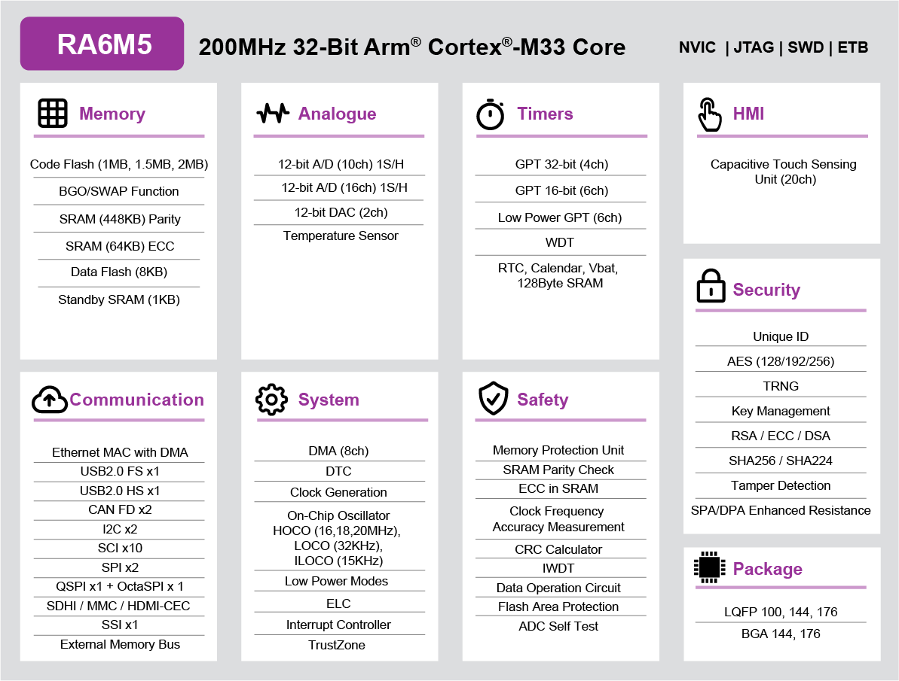
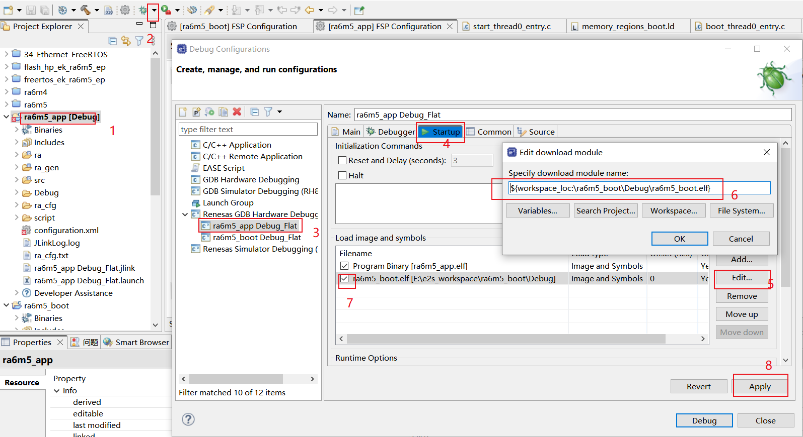

# 从0开始卷出一个新项目之瑞萨RA6M5
[toc]

## 一、范围
##### 1.1 初次在项目中使用瑞萨RA
##### 1.2 用过ST等但不熟悉瑞萨环境
##### 1.3 对嵌入式开发感兴趣

## 二、目的
通过boot+app两个工程源码和开发环境的分享，使得瑞萨RA6M5快速用于项目开发。

## 三、瑞萨RA6M5简介



## 四、瑞萨RA6M5应用
##### 新能源
##### 充电桩
##### BMS
##### DTU RTU
蜂窝云连接系统
交流变频器/GP 逆变器解决方案
语音识别和智能控制
基于 ROS 的机器人本体控制器
micro-ROS Solutions
Ubiquitous AI Edge Trust for RA MCUs
工业用嵌入式可编程逻辑控制器 (PLC)
无线多通道隔离数据记录器
ABUP UA差分升级解决方案
Remote Predictive Maintenance Solution
远程预测性维护
有线以太网应用
需要增强安全功能的产品（火灾探测、防盗检测、面板控制）
表计类产品（电力，自动抄表）
工业应用（机器人、开门器、缝纫机、自动售货机、UPS）
HVAC（供暖、空调、锅炉控制）

## 五、分享内容
##### 5.1 工程框图

##### 5.1 flash分区

##### 5.1 软件资源


## 六、硬件设计

#### 6.1 资料来源

##### 6.1.1 官方：RA6 快速设计指南、datasheet、User’s Manual、ek-designpackage

##### 6.1.2 第三方：野火启明6M5开发板 https://doc.embedfire.com/mcu/renesas/fsp_ra/zh/latest/index.html


##### 6.1.3 嘉立创、b站等


#### 6.2 各部分设计
##### 6.2.1 电源
    VSS VSS **VCL** AVCC AVSS VREF VBAT
   
##### 6.2.2 时钟
    24M 32.768K(**注意未使用**) 25M 
     
##### 6.2.3 调试接口
    建议预留JTAG，非单SWD，上拉
     
##### 6.2.4  复位

##### 6.2.5  串口、CAN、以太网
    上拉
##### 6.2.6 引脚分配
    datasheet


    rasc分配导出表格
     
##### 6.2.7  未使用引脚


##### 6.2.8 原理图 PCB
    库文件

## 七、软件设计

### 7.1 配置分析
#### 7.1.1 IDE等开发环境

| 集成开发环境<br>IDE | [e2studio](https://www2.renesas.cn/cn/zh/software-tool/e-studio) | [fsp_v4_0_0_e2s](https://www2.renesas.cn/cn/zh/software-tool/flexible-software-package-fsp#overview) | MDK:<br>5.31 | IAR:<br>8.50.6 |
|:-:|:-:|:-:|:-:|:-:|
| **软件包** |FPS | [FPS](https://github.com/renesas/fsp/releases) | [RA Smart Configurator(RASC)<br>fsp_v4_1_0_e2s](https://github.com/renesas/fsp/releases) | RASC |
| **编译工具链<br>Toolchain** |GCC Compiler|GCC Compiler|ARM Compiler|IAR Compiler|
| **IDE特点** |支持多种RenesasMCU<br>安装中下载FPS和Toolchain等等|RA系列一键安装<br>包括了FPS和Toolchain| RASC嵌入MDK<br>FPS和Toolchain | RASC嵌入IAR<br>FPS和Toolchain |
|**[J-link烧写软件和硬件](https://www.segger.com/downloads/jlink/)**|SEGGER J-Link: <br>7.68b|SEGGER J-Link: <br>7.68b|SEGGER J-Link: <br>7.68b|SEGGER J-Link: <br>7.68b|
|**[Renesas烧写软件](https://www2.renesas.cn/us/zh/software-tool/renesas-flash-programmer-programming-gui#overview)**|Renesas Flash Programme（RFP）|RFP|RFP|RFP|
|Renesas仿真硬件|[E2 emulator Lite](https://www2.renesas.cn/us/zh/software-tool/e2-emulator-lite-rte0t0002lkce00000r#overview)<br>[E2 emulator](https://www2.renesas.cn/us/zh/software-tool/e2-emulator-rte0t00020kce00000r#overview)|[E2 emulator Lite](https://www2.renesas.cn/us/zh/software-tool/e2-emulator-lite-rte0t0002lkce00000r#overview)<br>[E2 emulator](https://www2.renesas.cn/us/zh/software-tool/e2-emulator-rte0t00020kce00000r#overview)| | |

#### 7.1.2 创建两个工程
    使用e2sstudio创建boot+app两个带rtos的工程
    注意芯片型号和编译工具
    创建成功后debug运行测试

#### 7.1.3 修改link文件
/script
fsp_boot.ld
memory_regions_boot.ld

fsp_app.ld
memory_regions_app.ld

```
RAM_START = 0x20000000;
RAM_LENGTH = 0x80000;
FLASH_START = 0x00000000;
FLASH_LENGTH = 0x010000;
DATA_FLASH_START = 0x08000000;
DATA_FLASH_LENGTH = 0x2000;
OPTION_SETTING_START = 0x0100A100;
OPTION_SETTING_LENGTH = 0x100;
OPTION_SETTING_S_START = 0x0100A200;
OPTION_SETTING_S_LENGTH = 0x100;
ID_CODE_START = 0x00000000;
ID_CODE_LENGTH = 0x0;
SDRAM_START = 0x90000000;
SDRAM_LENGTH = 0x0;
QSPI_FLASH_START = 0x60000000;
QSPI_FLASH_LENGTH = 0x4000000;
OSPI_DEVICE_0_START = 0x68000000;
OSPI_DEVICE_0_LENGTH = 0x8000000;
OSPI_DEVICE_1_START = 0x70000000;
OSPI_DEVICE_1_LENGTH = 0x10000000;
```

```
unsigned long Boot_Addr = 0x10000;//memory_regions_boot.ld FLASH_LENGTH
printf("\n**************************************\n");
printf(  "**********JUMP TO APP:0x%lX**********\n", Boot_Addr);
printf(  "**************************************\n");

//close any peripherals before do_boot
g_uart9.p_api->close(&g_uart9_ctrl);
R_FLASH_HP_Close(&g_flash0_ctrl);

//jump
do_boot(Boot_Addr);
printf("this message cant print!\n");
```

    flash分区


#### 7.1.4 链接elf


    增加jump函数
    测试debug和跳转功能

#### 7.1.5 用FSP添加外设
    boot


    app


#### 7.1.6 输出文件格式


    ${cross_prefix}${cross_objcopy}${cross_suffix} -O binary  -j .text -j .data  "${ProjName}.elf" "${ProjName}.bin"  ;${cross_prefix}${cross_objcopy}${cross_suffix} -O ihex -j .text -j .data  "${ProjName}.elf"  "${ProjName}.hex"

### 7.2 源码分析    
#### 7.2.1 框图


#### 7.2.2 boot源码

#### 7.2.3 app源码