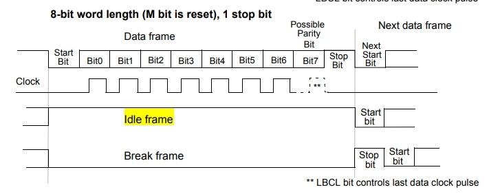
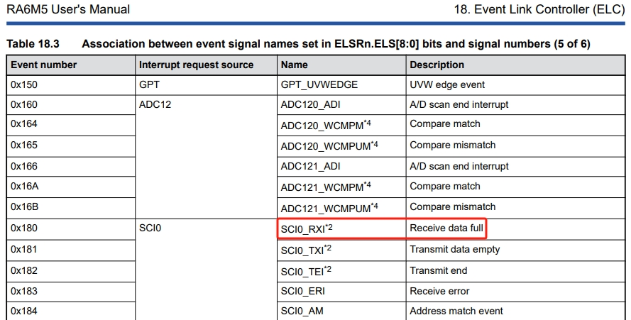
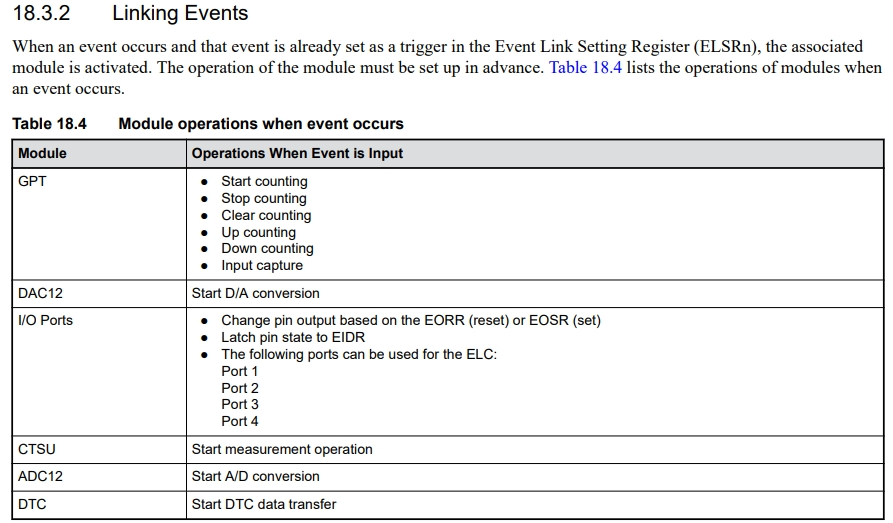
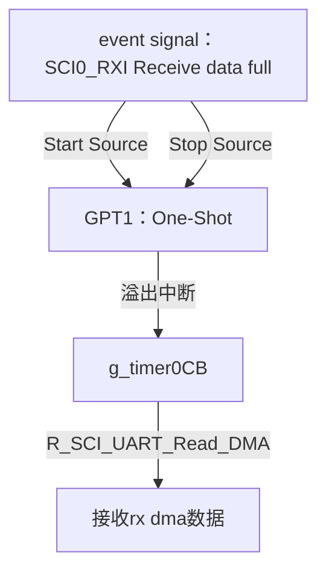
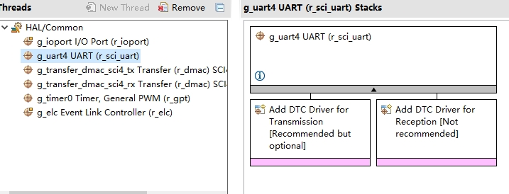
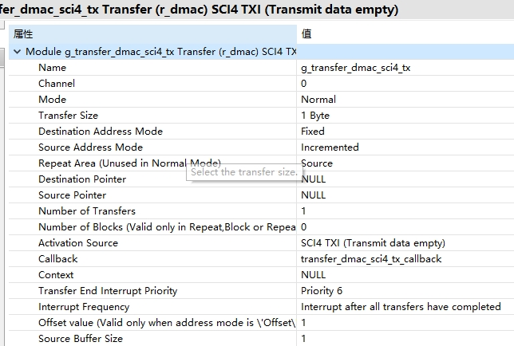
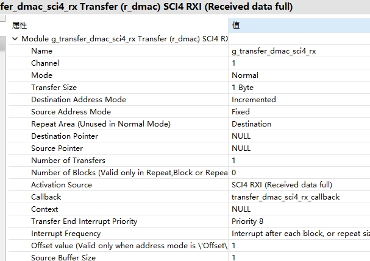

十二、从0开始卷出一个新项目之瑞萨RA6M5串口DMA接收不定长
===
[toc]

# 一、概述
- [十一、从0开始卷出一个新项目之瑞萨RA6M5串口DTC接收不定长](https://mp.weixin.qq.com/s?__biz=MzkxNDQyMTU4Mg==&mid=2247485323&idx=1&sn=186d5310a5278e09916adde1e5c81097&chksm=c16fe5aaf6186cbc85d37bd69deeec93a80045fe80acfdbadaef983378973ac80499fae4b546&token=924418606&lang=zh_CN#rd)
- 关键原理：串口空闲中断，stm32利用空闲中断来处理串口dma接收不定长度，可用hal库api
- 瑞萨RA使用gpt定时器和elc来硬件检测串口空闲。但是：1、fsp没有sci+dma的api，需要自己封装；2：dma接收不定长的实现
- 参考野火：
    - https://www.bilibili.com/video/BV1xm421j7M1/?spm_id_from=333.788&vd_source=21efa952a2d53fd4f04dc76ba0278b18 
    - https://doc.embedfire.com/mcu/renesas/fsp_ra/zh/latest/doc/chapter20/chapter20.html#dmac-uart
    - 但是野火例程只是单次dma发送，多次发送会出错，未封装成api

参考资料：
- [STM32之串口DMA接收不定长数据:https://shequ.stmicroelectronics.cn/thread-617564-1-1.html](https://shequ.stmicroelectronics.cn/thread-617564-1-1.html)



- [基于RA2L1实现串口DTC数据接收](https://mp.weixin.qq.com/s/fJFG_CBPK-5JkVWcqJ0OgA)
- [RA串口通信空闲中断](https://mp.weixin.qq.com/s/0lJAPD95SQB_bUEfDtuNkA)
- [RX系列MCU串口+DMA接收数据完成的空闲判断方法](https://mp.weixin.qq.com/s/lHGh4HUeYK3ISiUy4TZ1Pg)

# 二、对策：通过rx full elc gpt判断串口空闲
## 2.1 用户手册




## 2.2 框图



## 2.3 fsp配置







## 2.4 串口dma api封装

```
fsp_err_t R_SCI_UART_Write_DMA (uart_ctrl_t * const p_api_ctrl, uint8_t const * const p_src, uint16_t const bytes)
{
    /* SCI SCR register bit masks */
    #define SCI_SCR_TEIE_MASK                       (0x04U) ///< Transmit End Interrupt Enable
    #define SCI_SCR_RE_MASK                         (0x10U) ///< Receive Enable
    #define SCI_SCR_TE_MASK                         (0x20U) ///< Transmit Enable
    #define SCI_SCR_RIE_MASK                        (0x40U) ///< Receive Interrupt Enable
    #define SCI_SCR_TIE_MASK                        (0x80U) ///< Transmit Interrupt Enable

    fsp_err_t err = FSP_SUCCESS;

    sci_uart_instance_ctrl_t * p_ctrl = (sci_uart_instance_ctrl_t *) p_api_ctrl;

    //Before initiating DMA transfer, must be clear it first.
    R_ICU->IELSR[SCI4_TXI_IRQn] = 0U;

    /* Transmit interrupts must be disabled to start with. */
    p_ctrl->p_reg->SCR &= (uint8_t) ~(SCI_SCR_TIE_MASK | SCI_SCR_TE_MASK);

    //dma config
    g_transfer_dmac_sci4_tx.p_cfg->p_info->p_src = (void*)&p_src[0];
    g_transfer_dmac_sci4_tx.p_cfg->p_info->p_dest = (void*)&R_SCI4->TDR;
    g_transfer_dmac_sci4_tx.p_cfg->p_info->length = bytes;

    err = g_transfer_dmac_sci4_tx.p_api->reconfigure(g_transfer_dmac_sci4_tx.p_ctrl, g_transfer_dmac_sci4_tx.p_cfg->p_info);

    /* Trigger a TXI interrupt. This triggers the transfer instance or a TXI interrupt if the transfer instance is
         * not used. */
    p_ctrl->p_reg->SCR |= (SCI_SCR_TIE_MASK | SCI_SCR_TE_MASK);

    return err;

}

fsp_err_t R_SCI_UART_Read_DMA (uart_ctrl_t * const p_api_ctrl, uint8_t const * const p_dest, uint16_t const bytes)
{
    /* SCI SCR register bit masks */
    #define SCI_SCR_TEIE_MASK                       (0x04U) ///< Transmit End Interrupt Enable
    #define SCI_SCR_RE_MASK                         (0x10U) ///< Receive Enable
    #define SCI_SCR_TE_MASK                         (0x20U) ///< Transmit Enable
    #define SCI_SCR_RIE_MASK                        (0x40U) ///< Receive Interrupt Enable
    #define SCI_SCR_TIE_MASK                        (0x80U) ///< Transmit Interrupt Enable

    fsp_err_t err = FSP_SUCCESS;

    sci_uart_instance_ctrl_t * p_ctrl = (sci_uart_instance_ctrl_t *) p_api_ctrl;

    //Before initiating DMA transfer, must be clear it first.
    R_ICU->IELSR[SCI4_RXI_IRQn] = 0U;

    /* Transmit interrupts must be disabled to start with. */
    p_ctrl->p_reg->SCR &= (uint8_t) ~(SCI_SCR_RIE_MASK | SCI_SCR_RE_MASK);

    //dma config
    g_transfer_dmac_sci4_rx.p_cfg->p_info->p_src = (void*)&R_SCI4->RDR;
    g_transfer_dmac_sci4_rx.p_cfg->p_info->p_dest = (void*)&p_dest[0];
    g_transfer_dmac_sci4_rx.p_cfg->p_info->length = bytes;

    err = g_transfer_dmac_sci4_rx.p_api->reconfigure(g_transfer_dmac_sci4_rx.p_ctrl, g_transfer_dmac_sci4_rx.p_cfg->p_info);

    /* Trigger a TXI interrupt. This triggers the transfer instance or a TXI interrupt if the transfer instance is
         * not used. */
    p_ctrl->p_reg->SCR |= (SCI_SCR_RIE_MASK | SCI_SCR_RE_MASK);

    return err;

}
```

## 2.5 源码

```
void g_timer0CB(timer_callback_args_t *p_args)
{
    if(p_args->event == TIMER_EVENT_CYCLE_END)
    {
        transfer_properties_t p_info;

        R_DMAC_InfoGet(g_transfer_dmac_sci4_rx.p_ctrl, &p_info);

        R_SCI_UART_Write_DMA(g_uart4.p_ctrl, rx_buf, (uint16_t)(RX_MAX - p_info.transfer_length_remaining));


        R_SCI_UART_Read_DMA(g_uart4.p_ctrl, rx_buf, RX_MAX);
    }

}
/*******************************************************************************************************************//**
 * main() is generated by the RA Configuration editor and is used to generate threads if an RTOS is used.  This function
 * is called by main() when no RTOS is used.
 **********************************************************************************************************************/
void hal_entry(void)
{
#if 1
    fsp_err_t err = FSP_SUCCESS;

#if 0//use api
    err = R_SCI_UART_Open (&g_uart4_ctrl, &g_uart4_cfg);
    assert(FSP_SUCCESS == err);
#else//use g_uart4 handler
    g_uart4.p_api->open(g_uart4.p_ctrl, g_uart4.p_cfg);
    assert(FSP_SUCCESS == err);
#endif

    g_timer0.p_api->open(g_timer0.p_ctrl, g_timer0.p_cfg);
    g_timer0.p_api->enable(g_timer0.p_ctrl);

    g_elc.p_api->open(g_elc.p_ctrl, g_elc.p_cfg);
    g_elc.p_api->enable(g_elc.p_ctrl);

    printf("hello world!\n");

    //test tx use isr
    g_uart4.p_api->write(g_uart4.p_ctrl, &sci_tx_data[0], BUFFER_SIZE);
    while( false == uart_send_complete_flag );
    uart_send_complete_flag = false;

    //dma init
    err = g_transfer_on_dmac.open(g_transfer_dmac_sci4_tx.p_ctrl, g_transfer_dmac_sci4_tx.p_cfg);
    assert(FSP_SUCCESS == err);
    err = g_transfer_on_dmac.enable(g_transfer_dmac_sci4_tx.p_ctrl);
    assert(FSP_SUCCESS == err);
    err = g_transfer_on_dmac.open(g_transfer_dmac_sci4_rx.p_ctrl, g_transfer_dmac_sci4_rx.p_cfg);
    assert(FSP_SUCCESS == err);
    err = g_transfer_on_dmac.enable(g_transfer_dmac_sci4_rx.p_ctrl);
    assert(FSP_SUCCESS == err);

    R_SCI_UART_Write_DMA(g_uart4.p_ctrl, (uint8_t *)test, (uint16_t)strlen(test));


    R_SCI_UART_Read_DMA(g_uart4.p_ctrl, rx_buf, RX_MAX);

    while(1)
    {

        // 以下是LED闪烁
        LED2_TOGGLE;
        R_BSP_SoftwareDelay(1, BSP_DELAY_UNITS_SECONDS);

        //R_SCI_UART_Write_DMA(g_uart4.p_ctrl, (uint8_t *)test, (uint16_t)strlen(test));

    }
```

# 三、测试效果
略