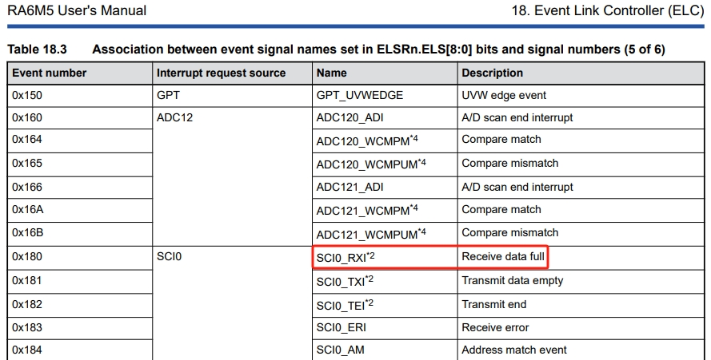
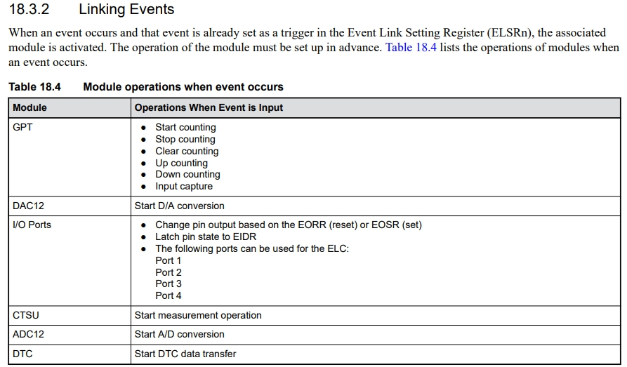
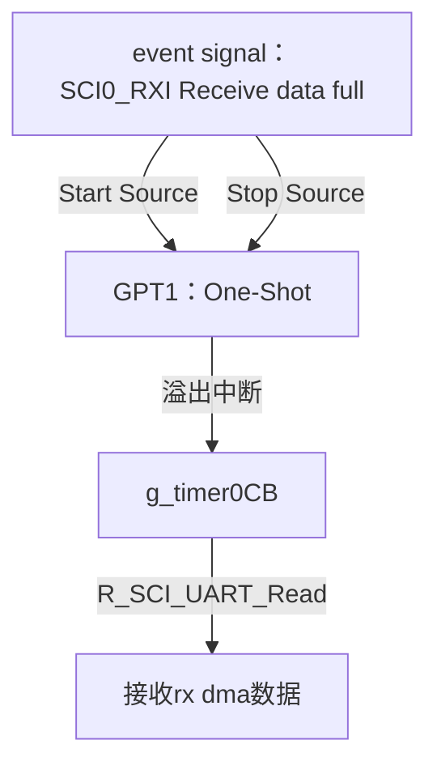
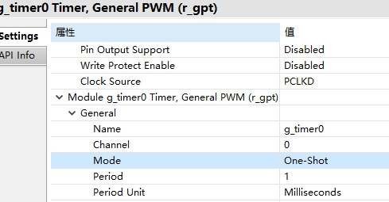
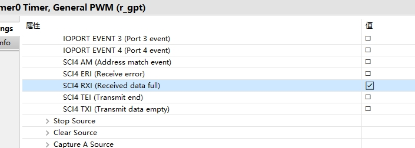
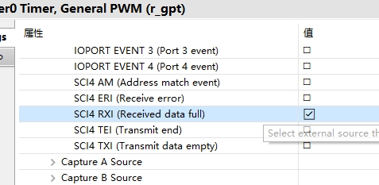
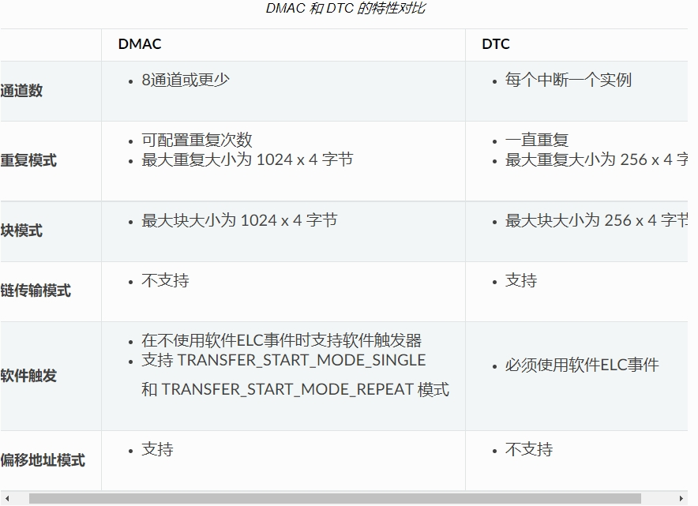

十一、从0开始卷出一个新项目之瑞萨RA6M5串口DTC接收不定长
===
[toc]

# 一、概述
- 关键原理：串口空闲中断，stm32利用空闲中断来处理串口dma接收不定长度，可用hal库api
- 瑞萨RA使用gpt定时器和elc来硬件检测串口空闲。但是：1、fsp没有sci+dma的api，需要自己封装；2：dma接收不定长的实现
- 参考野火：
    - https://www.bilibili.com/video/BV17u4m1c7Xg/?spm_id_from=333.788&vd_source=21efa952a2d53fd4f04dc76ba0278b18 
    - https://doc.embedfire.com/mcu/renesas/fsp_ra/zh/latest/doc/chapter20/chapter20.html#dtc-uart
    - 但是野火不建议dtc接收（不确定接收长度，无法完成中断），这是错误的理解，dma接收不是一样不确定长度么？

参考资料：
- [STM32之串口DMA接收不定长数据:https://shequ.stmicroelectronics.cn/thread-617564-1-1.html](https://shequ.stmicroelectronics.cn/thread-617564-1-1.html)


- [基于RA2L1实现串口DTC数据接收](https://mp.weixin.qq.com/s/fJFG_CBPK-5JkVWcqJ0OgA)
- [RA串口通信空闲中断](https://mp.weixin.qq.com/s/0lJAPD95SQB_bUEfDtuNkA)
- [RX系列MCU串口+DMA接收数据完成的空闲判断方法](https://mp.weixin.qq.com/s/lHGh4HUeYK3ISiUy4TZ1Pg)

# 二、对策：通过rx full elc gpt判断串口空闲
## 2.1 用户手册




## 2.2 框图



## 2.3 fsp配置







## 2.4 源码

```
void hal_entry(void)
{
    /* TODO: add your own code here */
    LED_Init();         // LED 初始化
    Debug_UART4_Init(); // SCI4 UART 调试串口初始化

    /* 使能DTC */
    R_DTC_Enable(g_uart4.p_cfg->p_transfer_rx->p_ctrl);

    printf("\r\n实验4：DTC+UART串口收发\r\n");

    R_ELC_Open(&g_elc_ctrl, &g_elc_cfg);
    R_ELC_Enable(&g_elc_ctrl);

    R_GPT_Open(&g_timer0_ctrl, &g_timer0_cfg);
    R_GPT_Enable(&g_timer0_ctrl);


    /* 发送数据到串口（通过DTC发送） */
    // 可以尝试在 configuration.xml 中将 DTC 模块去除，再进行代码调试，看看会有什么区别
    R_SCI_UART_Write(g_uart4.p_ctrl,
                     (uint8_t *)(uart4_dtc_tx_data),
                     sizeof(uart4_dtc_tx_data)/sizeof(uart4_dtc_tx_data[0]));

    /* 串口的数据发送完成中断依旧会产生 */
    if (uart_send_complete_flag == true)
    {
        //LED1_TOGGLE;
        uart_send_complete_flag = false;
    }

    R_SCI_UART_Read(g_uart4.p_ctrl, (uint8_t *)(uart4_dtc_rx_data), RX_MAX);

    while(1)
    {
        // 以下是LED闪烁
        LED2_TOGGLE;
        R_BSP_SoftwareDelay(1, BSP_DELAY_UNITS_SECONDS);
    }
}
/*
 *
 */
void g_timer0CB(timer_callback_args_t *p_args)
{
    if(p_args->event == TIMER_EVENT_CYCLE_END)
    {
        transfer_properties_t p_properties;
        g_transfer1_dtc_uart4_rx.p_api->infoGet(g_transfer1_dtc_uart4_rx.p_ctrl, &p_properties);

        R_SCI_UART_Write(g_uart4.p_ctrl, (uint8_t *)(uart4_dtc_rx_data), RX_MAX - p_properties.transfer_length_remaining);

        R_SCI_UART_Read(g_uart4.p_ctrl, (uint8_t *)(uart4_dtc_rx_data), RX_MAX);
    }
}Cnt++;//for test
}
```

# 三、测试效果
略

# 四、DTC和DMA的主要差别

- 野火DMAC和DTC关键特性对比：https://doc.embedfire.com/mcu/renesas/fsp_ra/zh/latest/doc/chapter20/chapter20.html#id19



- 使用中的差别：
    - fsp的串口默认支持dtc（有api），fsp的串口默认不支持dma（无api）
    - dtc数据与外设中断匹配，dma只有固定通道数量
    - dtc和dma都无需cpu参与
    - dtc使用额外的内存（DTCVBR_SEC）：gp_dtc_vector_table[DTC_VECTOR_TABLE_ENTRIES] BSP_ALIGN_VARIABLE(1024)；dma无需
    - dtc延迟大于dma
    - dtc低配版dma？


# 五、DMA的主要作用
- 无需cpu参与
- 无需频繁中断，数据“凑整”
- 链式DMA等高级功能