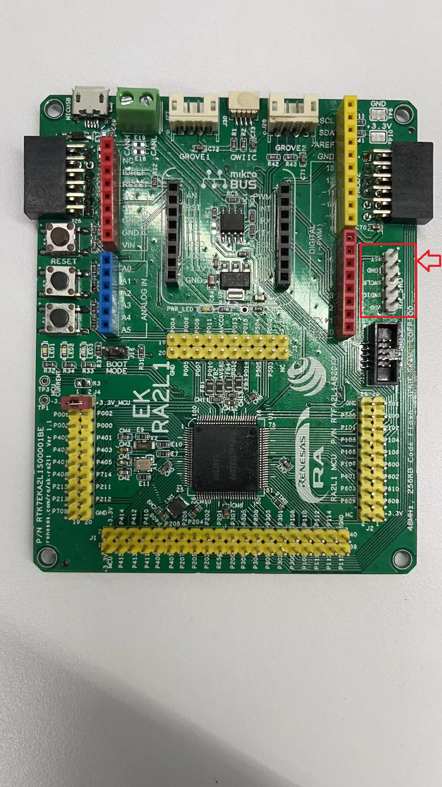
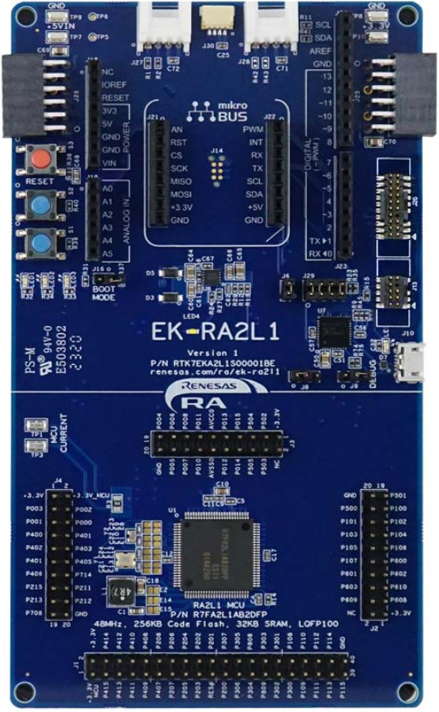
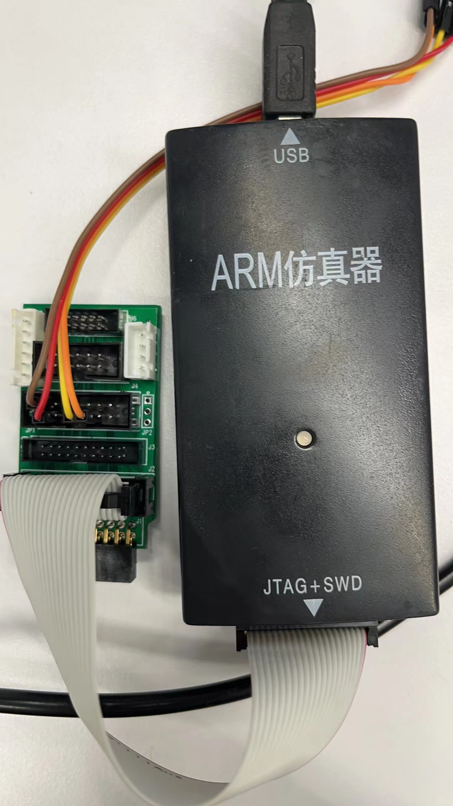
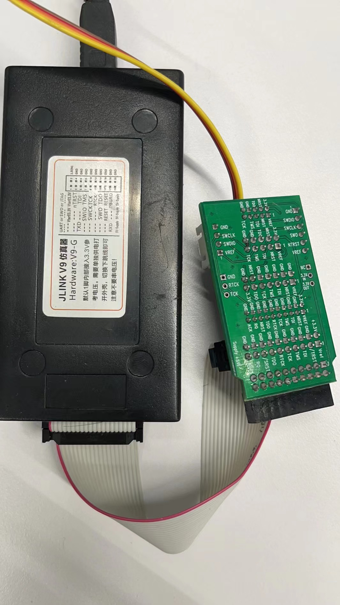

# 瑞萨RA&e2studio快速上手视频笔记

## 概述

主要分享通过瑞萨官网RA资料的学习，快速上手RA MCU。引用官方资料和例程，注明出处，创建自己的git仓库，更加“接地气”的分享RA&e2studio的学习过程。

## 学习资料

### 硬件

##### 开发板：EK-RA2L1
（同Renesas官方EK-RA2L1几乎一样）

jlink/swd替换jlink-ob
##### jlink仿真器

### 软件

##### e2studio

