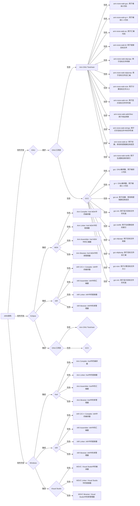

# Renesas
Renesas
瑞萨MCU/MPU快速上手视频笔记 

分享自己通过瑞萨官网RA资料的学习，快速上手RA MCU。主要引用官方资料和例程，注明出处，创建自己的git仓库，更加“接地气”的分享RA&e2studio的学习过程。

RA2L1官方文档和例程、软件打包下载
链接：https://pan.baidu.com/s/1SbEbdG1g8sx4PwC8b0RMMA 
提取码：jfrm

bilibili：嵌入式科普
https://space.bilibili.com/417060922/video

公众号：嵌入式科普

Qqun：33718742

西瓜shipin：嵌入式科普
https://www.ixigua.com/home/818516314816996

gitee：
https://gitee.com/292812832/Renesas

CSDN：
https://blog.csdn.net/cl234583745?type=blog

理解了。下面是一个更完整的Mermaid流程图，展示了在不同开发环境下各种编译工具的逻辑和包含关系：

以上示例中，我们展示了在不同开发环境下各种编译工具的逻辑和包含关系，包括Eclipse集成的MDK、IAR和GNU工具链，以及Windows环境下的Keil、IAR和Visual Studio。这样的流程图可以帮助您更清晰地了解各种环境下的编译工具关系。