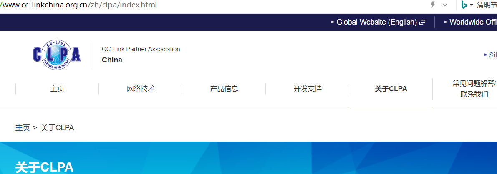
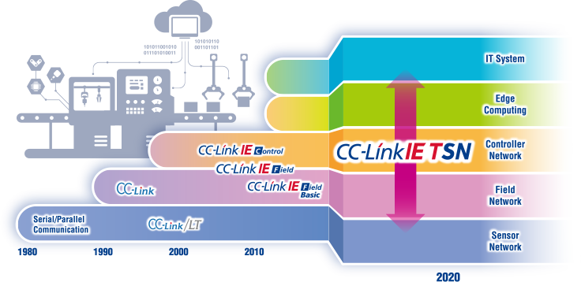
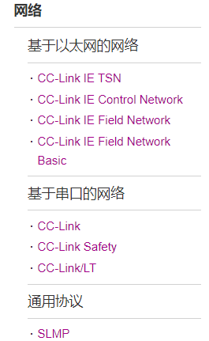
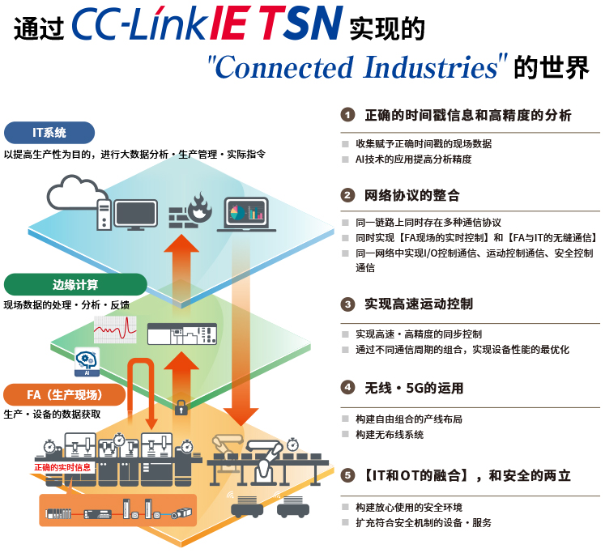
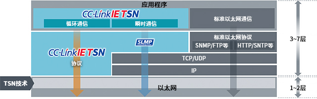
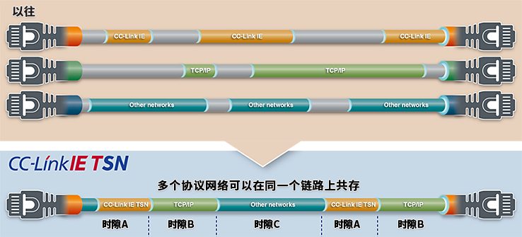
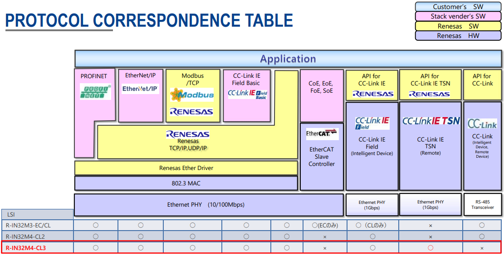

**从0开始卷出一个新项目之CC-Link IE TSN** 

[toc]

# 一、CC-Link介绍
## 1.1 范围
- 快速实现CC-Link IE TSN/Field
- 单芯片方案
## 1.2 目的
介绍工业以太网协议CC-Link相关知识，介绍实现的芯片软硬件方案
## 1.3 CC-Link介绍
### 1.3.1 CPLA协会
官网：https://www.cc-linkchina.org.cn

CLPA是开放式网络的推动者
CLPA协会成立于日本，并以亚洲为中心在全球十个地区设立了分支机构。协会致力于CC-Link工业网络在全球范围的普及推广。除了工厂设备控制，为了满足通过设备管理、设备保全、数据收集功能实现系统的整体最优化的这一新的需求，我们发布了基于以太网的整合网络“CC-Link IE”，从设备厂商的兼容产品开发到用户的工厂自动化系统构筑，协会都将提供广泛的支持。

### 1.3.2 CC-Link协议家族
CC-Link协议家族开放式现场总线
进入上世纪90年代后，随着工厂自动化要求的提高、以及生产线向复杂化发展，工厂对于连接各种设备的工业网络产生了需求。“CC-Link”由此应运而生，之后，CC-Link协议家族完成了3个阶段的进化。继2000年发布“第1代”以串行通信为基础的“CC-Link”规范后，又于2008年发布了业内第一个以1GbpsEthernet为基础的“第2代”“CC-Link IE”规范，使数据量得到飞跃式提高，将适用范围从现场层扩大到了控制器层。之后，随着市场对于智能工厂的要求不断提升，还在2018年发布了在世界上率先采用TSN（Time-Sensitive Networking）的“第3代”“CC-Link IE TSN”规范。
CLPA今后会继续与包括理事公司在内的合作伙伴们共同推进CC-Link IE TSN的技术革新，在全球加大推广真正的开放式工业网络，加快实现“Connected Industries”的速度。

### 1.3.3 CC-Link IE TSN
官网：https://www.cc-linkchina.org.cn/zh/cclink/cclinkie/cclinkie_tsn.html

CC-Link IE TSN，在全球率先采用了基于标准以太网规范的TSN（时间敏感网络）。在进一步提高网络开放性的同时，通过采用高效的协议有效强化了CC-Link IE所具备的性能和功能。

TSN技术与协议层级
CC-Link IE TSN协议以位于OSI参考模型第2层的TSN技术为基础，由在第3-第7层CC-Link IE TSN独立协议和标准以太网协议组成。

特点
(1) 控制信息通信与管理信息通信的融合

在实现控制信息实时性通信的同时，能与其他开放式网络进行通信，并在同一个网络中与IT系统进行信息通信，提高了系统构成的自由度，实现了布线成本的削减。

# 二、瑞萨RIN32M4-CL3
## 2.1 芯片简介
用于工业以太网通信的R-IN32M4-CL3 ic支持CC-Link IE TSN。凭借其内置千兆以太网PHY和瑞萨R-IN引擎(“R-IN引擎”)技术，R-IN32M4-CL3使您能够在单芯片上实现最新的时间敏感网络(TSN)技术。
设备间时间同步精度小于±1μs(兼容CC-Link IE TSN B类)
2端口GbE兼容PHY, CPU和RAM (1.3MB)在一个芯片上
从R-IN引擎继承协议支持
小尺寸的封装和内置的PHY调节器减少了安装面积
低功耗(与R-IN32M3-CL2相比降低35%)

## 2.2 资料下载
官网：https://www.renesas.cn/cn/zh/products/interface/industrial-ethernet/industrial-ethernet-communication/r-in32m4-cl3-ics-industrial-ethernet-communication

手册：
[renesas-r-in32m4-cl3-data-sheet-rev100.pdf](./DOC/renesas-r-in32m4-cl3-data-sheet-rev100.pdf)
[renesas-r-in32m4-cl3-users-manual-rev100.pdf](./DOC/renesas-r-in32m4-cl3-users-manual-rev100.pdf)

## 2.3 RIN系列产品

