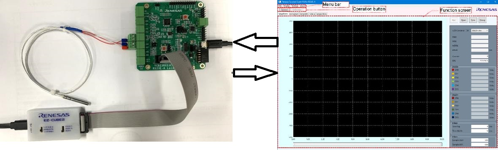
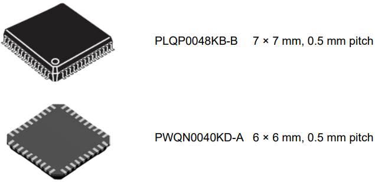
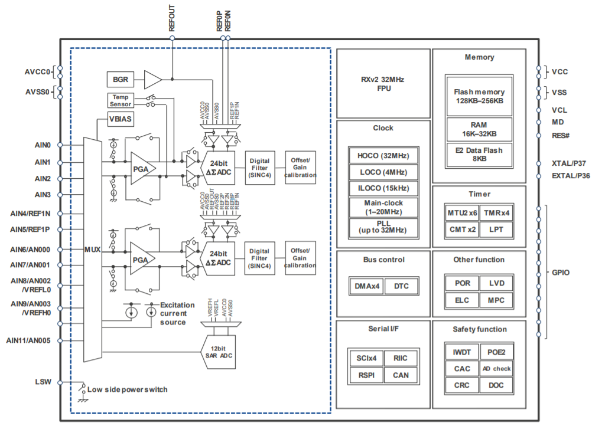
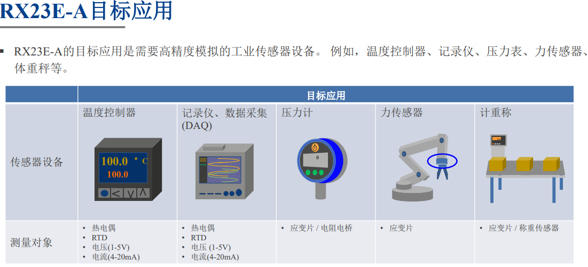

**万语始于HelloWorld，万物基于点灯之瑞萨RX23E-A介绍**

[TOC]

|NO.|目的|系列|型号|
|:-:|:-:|:-:|:-:|
|1|介绍|||
|2|功能展示|瑞萨RZN2L工业以太网|RZN2L|
|3|**快速上手**|**“万语始于HelloWorld，万物基于点灯之”**|RA2L1 **RX23E-A**|
|4|产品开发|“从0开始卷出一个新项目之”|RA6M5 RZN2L|
|5|功能对比|||

# 一、RX23E-A MCU 24位ΔΣADC实战培训 
一周前，非常幸运参加[线下培训 | 瑞萨电子RX23E-A MCU高精度测量应用实战培训](https://mp.weixin.qq.com/s/ICjlDB4FHxf1odw4z5btHw)

- 介绍RX23E-A介绍和应用
- DSADC和AFE的理论知识
- RX23E-A三线RTD实验

# 二、RX23E-A MCU介绍
## 2.1 外观与封装

## 2.2 官方介绍

- **双 24 位 delta sigma** 模数转换器：高达 23 位的有效分辨率，可编程数据速率为 7.6 sps 至 15,625 ksps
- **PGA**：轨到轨模拟输入，增益 1 至 128 倍，失调漂移 10 nV/°C，增益漂移 1 ppm/°C
- **基准电压源**：10ppm/°C的低温漂特性，具有良好的温度稳定性
- **励磁电流源**：匹配可编程电流源
- CPU：32 位 RXv2 (32 MHz)
- 数字信号处理的 **DSP/FPU**
- 接口：SPI x 1 通道、UART x 4 通道、I2C x 1 通道、CAN x 1 通道

## 2.3 芯片框图

## 2.4 目标应用
- **“日常生活见不到的高精度传感器”**

- 精密工业温度控制
- 工业传感器网络解决方案
- 隔离式多通道传感解决方案
- 珀尔帖冷却器
- Industrial Ethernet and Fieldbus
- IO-Link 设备解决方案
- 精准重量称（Scale-IT）
- 无线多通道隔离数据记录器
- Force Sensor Solution
- 力传感器解决方案
- Torque Control Solution
- 转矩控制解决方案

## 2.5 下一代RX23E-B
|型号|输入电压|转换速度|
|:-:|:-:|:-:|
|RX23E-A|5V|31.25kSPS|
|RX23E-B|5V&±10v|125kSPS|
 

## 2.6 RX系列

- [RX产品家族特性https://www.renesas.cn/cn/zh/products/microcontrollers-microprocessors/rx-32-bit-performance-efficiency-mcus/rx-features](https://www.renesas.cn/cn/zh/products/microcontrollers-microprocessors/rx-32-bit-performance-efficiency-mcus/rx-features)

