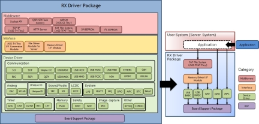
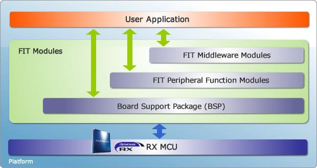
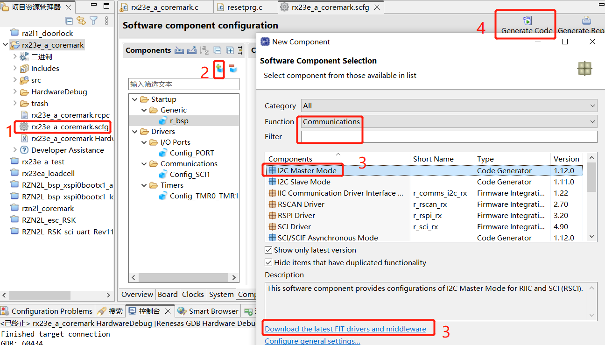
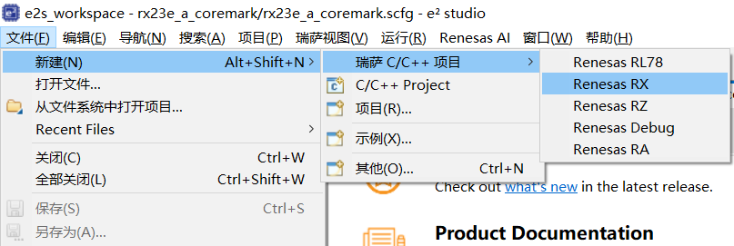
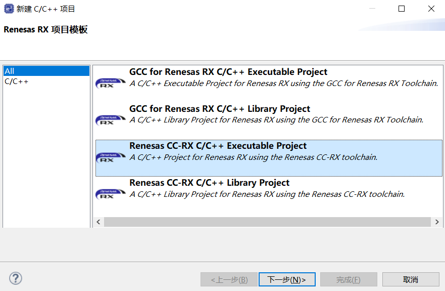
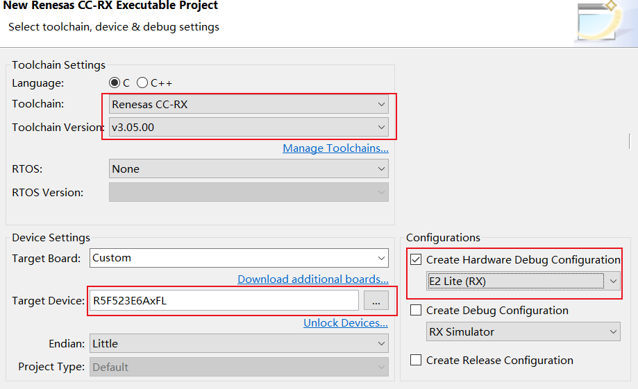
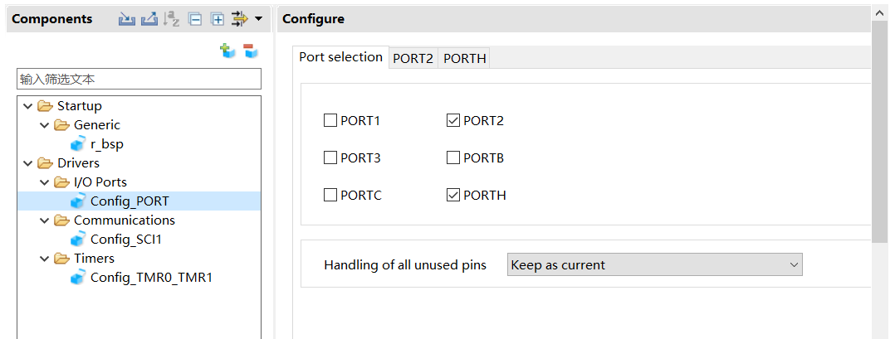
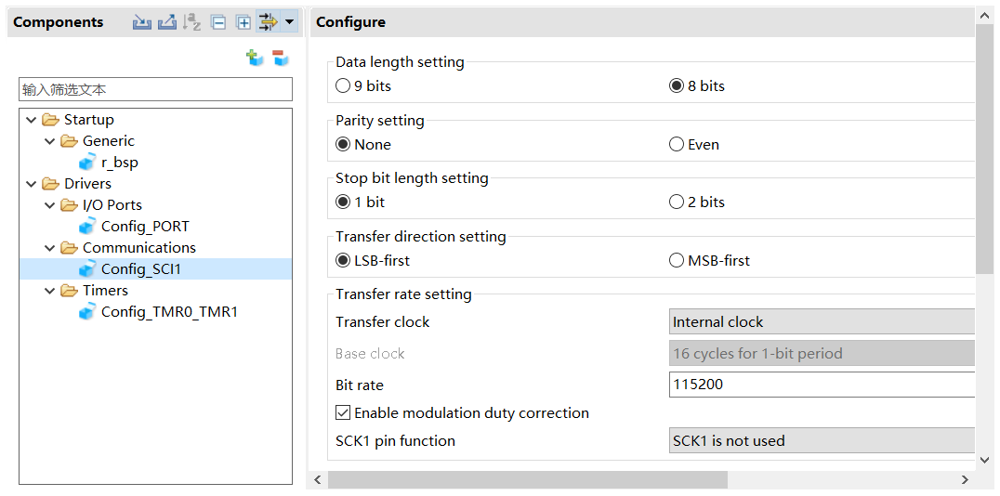
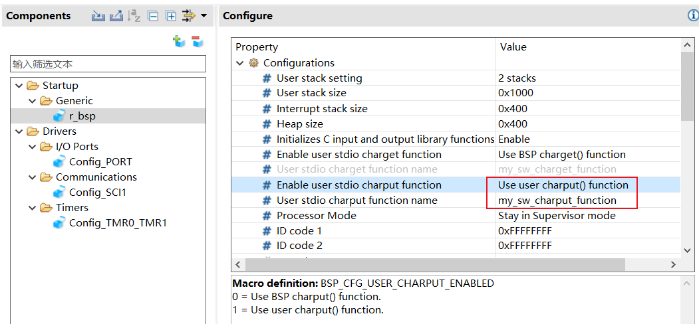
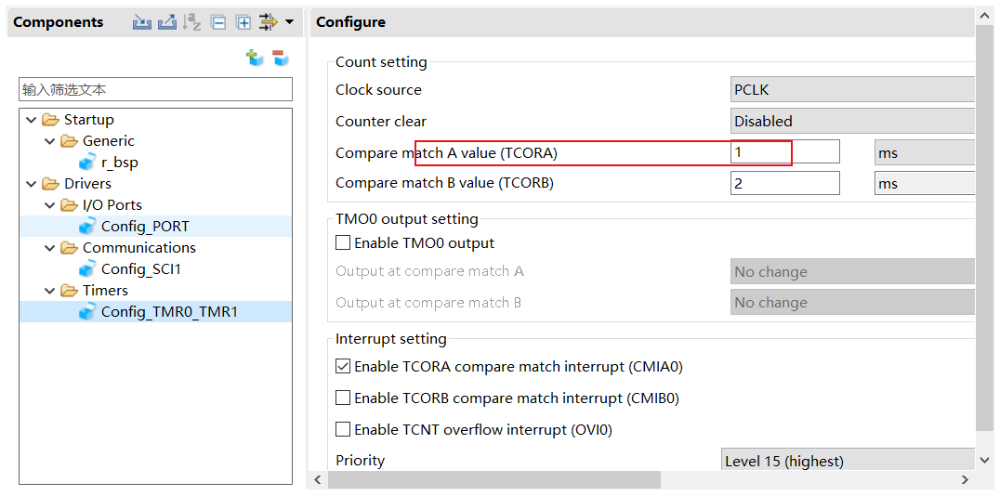

**万语始于HelloWorld，万物基于点灯之瑞萨RX23E-A设计和开发**

[TOC]


# 一、开发环境
**本章适合没有用过瑞萨rx系列的参考，以便快速上手**
## 1.1 IDE和软件包
+ e2studio 2023-10 + RX Driver Package v1.4.1([FIT](https://www.renesas.cn/cn/zh/software-tool/fit))
    + e2studio下载安装请参考RA2L1、RA6M5、RZN2L系列分享。
    + RX Family RX Driver Package Ver.1.41 -> 
    + Firmware Integration Technology (FIT) ->
    + RX Smart Configurator ->
    + Code Generator (CG) components and
Firmware Integration Technology (FIT) modules

## 1.2 对比理解

|系列|举例|IDE|软件包|
|:-:|:-:|:-:|:-:|
|RX|RX23E-A|e2studio<br>cs+<br>IAREW|RX Driver Package<br>FIT<br>smart configurator<br>CG/FIT|
|RA<br>RZ|RA2L1 RA6M5<br>RZN2L|e2studio<br>MDK+<br>IAR|FSP<br>RASC/RZSC|
|ST|F103 G H|cubeIDE<br>MDK+<br>IAR|hal/ll/std<br>cubeMX|


## 1.3 资料来源
+ 文档
  + [rx-family-rxv2-instruction-set-architecture-users-manual-software.pdf](./DOC/rx-family-rxv2-instruction-set-architecture-users-manual-software.pdf)
  + [rx-family-manually-importing-firmware-integration-technology-modules.pdf](./DOC/rx-family-manually-importing-firmware-integration-technology-modules.pdf)
  + [rx-family-guide-porting-fit-project-other-rx-family-rev100.pdf](./DOC/rx-family-guide-porting-fit-project-other-rx-family-rev100.pdf)
  + [rx-family-board-support-package-module-using-firmware-integration-technology-rev741.pdf](./DOC/rx-family-board-support-package-module-using-firmware-integration-technology-rev741.pdf)
  + [rx-smart-configurator-users-guide-e-studio.pdf](./DOC/rx-smart-configurator-users-guide-e-studio.pdf)
  + [firmware-integration-technology-users-manual.pdf](./DOC/firmware-integration-technology-users-manual.pdf)

+ 官网





## 1.4 IDE功能
一张图看懂：


# 二、输出helloworld点亮led
## 2.1 向导新建工程




## 2.2 使用scfg增加外设
- led
- uart
- printf redirect
- timer






## 2.3 printf重定向
```
extern volatile uint8_t  g_sci1_tx_end;
void my_sw_charput_function(char output_char)
{
	R_Config_SCI1_Serial_Send((uint8_t *)&output_char, 1);
	while(g_sci1_tx_end == false);
	g_sci1_tx_end = false;
}
```

```
/* Start user code for global. Do not edit comment generated here */
volatile uint8_t  g_sci1_tx_end;
/* End user code. Do not edit comment generated here */

/***********************************************************************************************************************
* Function Name: r_Config_SCI1_callback_transmitend
* Description  : This function is a callback function when SCI1 finishes transmission
* Arguments    : None
* Return Value : None
***********************************************************************************************************************/

static void r_Config_SCI1_callback_transmitend(void)
{
    /* Start user code for r_Config_SCI1_callback_transmitend. Do not edit comment generated here */
	g_sci1_tx_end = 1;
    /* End user code. Do not edit comment generated here */
}
```
+ 测试printf
    + __FUNCTION__无效，使用__func__
    + 扩展：https://www.jianshu.com/p/7cd2b1c8542a
```
void main(void)
{
	int timer = 0;
	R_Config_SCI1_Start();
	R_Config_TMR0_TMR1_Start();

	printf("date:%s\ntime:%s\nfile:%s\nfunc:%s,line:%d\nhello world!\n", __DATE__, __TIME__, __FILE__, __func__, __LINE__);

```

## 2.4 移植coremark
+ include coremark 文件
+ rx23e没有systick，使用16位定时器
+ cc-rl没有timer.h
+ coremark迭代次数3000

```

	printf("start coremain!\n");
	coremain();
	printf("terminated coremain!\n");
```

## 2.5 莱布尼茨级数计算圆周率测试浮点
+ 迭代一百万次
```
int iterations = 1000000;
double pi;

pi = calculatePi_Leibniz(iterations);
printf("calculatePi_Leibniz\niterations=%d pi=%lf\n", iterations, pi);
```

## 2.6 结果输出和总结
+ 莱布尼茨级数迭代一百万次约700ms
+ coremark 175（32Mhz，cc-rl v3.05.00，fast）

```
[20:04:23.508]收←◆date:Nov  7 2023
time:19:46:35
file:../src/rx23e_a_coremark.c
func:main,line:45
hello world!

[20:04:24.275]收←◆calculatePi_Leibniz
iterations=1000000 pi=3.141595
start coremain!

[20:04:59.264]收←◆2K performance run parameters for coremark.
CoreMark Size    : 666
Total ticks      : 17078
Total time (secs): 17.077998
Iterations/Sec   : 175.664613
Iterations       : 3000
Compiler version : Please put compiler version here (e.g. gcc 4.1)
Compiler flags   : Please put compiler flags here (e.g. -o3)
Memory location  : STACK
seedcrc          : 0xe9f5
[0]crclist       : 0xe714
[0]crcmatrix     : 0x1fd7
[0]crcstate      : 0x8e3a
[0]crcfinal      : 0xcc42
Correct operation validated. See README.md for run and reporting rules.
CoreMark 1.0 : 175.664613 / Please put compiler version here (e.g. gcc 4.1) Please put compiler flags here (e.g. -o3) / STACK
terminated coremain!
printf:hello world 1, 0 sec,R_LED1_toggle

[20:05:00.398]收←◆printf:hello world 1, 1 sec,R_LED1_toggle

[20:05:01.407]收←◆printf:hello world 1, 2 sec,R_LED1_toggle

[20:05:02.414]收←◆printf:hello world 1, 3 sec,R_LED1_toggle
```
