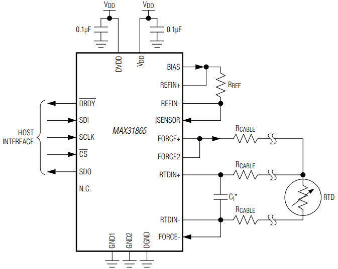

**万语始于HelloWorld，万物基于点灯之瑞萨RX23E-A 3线RTD PT100测温**

[TOC]

# 一、概述/目的
介绍工业过程控制中的测温最常用的PT100三线制，使用瑞萨RX23E-A实现3线RTD PT100测温，展示其便捷性，简单对比MCU+MAX31865。

# 二、RX23E-A+PT100三线制
## 2.1 资料来源
- [官方资料-开发板+例程](https://www.renesas.cn/cn/zh/products/microcontrollers-microprocessors/rx-32-bit-performance-efficiency-mcus/rx23e-analog-front-end-mounted-32-bit-microcontroller-ideal-high-precision-sensing-test-and-measurement#design_development)
- [RX MCU RX23E-A 高精度测量基础知识与应用实战培训 2023-09_v1.0.pdf](./DOC/RX%20MCU%20RX23E-A%20高精度测量基础知识与应用实战培训%202023-09_v1.0.pdf)
- [RX MCU RX23E-A 高精度测量基础知识与应用实战_实验指南.pdf](./DOC/RX%20MCU%20RX23E-A%20高精度测量基础知识与应用实战_实验指南.pdf)
- [RX23E_A_Local_Board_SCH.pdf](./DOC/RX23E_A_Local_Board_SCH.pdf)
## 2.2 接线图


## 2.3 工程配置AFE+24ΔΣADC+PGA
- rx23ea_local_board_lab
- rx23ea_rtd


## 2.4 代码

```
float R_RTD_DsadToTemp (float dsad)
{
    float rrtd = (D_RTD_GAIN * dsad) + D_RTD_OFFSET;        /** Convert DSAD Value to RTD resistance value [ohm]   */
    uint16_t idx = R_CALC_BinarySearch(s_rtd_table, D_RTD_TABLE_SIZE, rrtd);

    /** Set a temperature range that includes the value of the argument */
    float x0 = s_rtd_table[idx];                            /** x0:Temperature range lower limit resistance [ohm]  */
    float x1 = s_rtd_table[idx + 1];                        /** x1:Temperature range upper limit resistance [ohm]  */

    /** convert idx to temperature */
    float y0 = (float) idx + D_RTD_TABLE_TOP_TEMPARATURE;

    /** convert idx + 1 to temperature */
    float y1 = (float) (idx + 1) + D_RTD_TABLE_TOP_TEMPARATURE;

    float f_temp = R_CALC_Lerp(x0, y0, x1, y1, rrtd);       /** Calculated temperature [degree]                     */

    return f_temp;
}
```


```
/** A/D conversion complete for DSAD0? */
if (true == r_dsad0_IsConversionEnd())
{
    int32_t dsad0_value;        /** Signed 24-bit DSAD0 value                                   */

    r_dsad0_ClearIrFlag();      /** clear DSAD0 IR flag                                         */

    /** Get A/D value */
    {
        R_Config_DSAD0_Get_ValueResult( &dsad0_reg);

        /** Flag mask, Sign extension */
        dsad0_value = (int32_t) ((dsad0_reg & 0x00FFFFFFU) << 8) >> 8;
    }

    /** Calculate the temperature [degree] of the reference junction */
    rtd_temp = R_RTD_DsadToTemp((float) dsad0_value);
```

## 2.5 IIR数字滤波器


# 三、方案对比



|芯片|方案|ADC|接口|软件|其他|
|:-:|:-:|:-:|:-:|:-:|:-:|
|RX23E-A|单mcu|24ΔΣADC|无需|简单||
|MAX31865|MCU+MAX31865|15ΔΣADC|spi|简单||