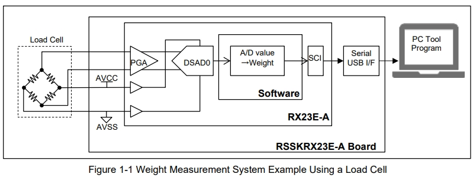

**万语始于HelloWorld，万物基于点灯之瑞萨RX23E-A采集称重传感器**

[TOC]

# 一、概述/目的
使用瑞萨RX23E-A采集称重传感器得到重量数据，展示其便捷性和注意事项，得以快速上手。

# 二、RX23E-A称重实验
## 2.1 资料来源
- [官方资料-开发板+例程](https://www.renesas.cn/cn/zh/products/microcontrollers-microprocessors/rx-32-bit-performance-efficiency-mcus/rx23e-analog-front-end-mounted-32-bit-microcontroller-ideal-high-precision-sensing-test-and-measurement#design_development)
- [RX MCU RX23E-A 高精度测量基础知识与应用实战培训 2023-09_v1.0.pdf](./DOC/RX%20MCU%20RX23E-A%20高精度测量基础知识与应用实战培训%202023-09_v1.0.pdf)

- [RX23E_A_Local_Board_SCH.pdf](./DOC/RX23E_A_Local_Board_SCH.pdf)
- [RX23E-A Group Weight Measurement Example Using a Load Cell](./DOC/r01an4789ej0110-rx23e-a.pdf)

## 2.2 官方例程
给出了非常详细的测试过程和结果分析。我们按照可以调试硬件、导入工程、分析计算和校准。





### 2.2.1 计算


```
#define D_LC_PGA_GAIN           (128.0F)
#define D_LC_CODE_FS            (16777216)//(16777216)//16762400
#define D_LC_VREF               (5.0F)
#define D_LC_VCC                (5.0F)
#define D_LC_RO                 (0.001F)//(0.0009F)
#define D_LC_MMAX               (1000.0F)//(600.0F)
#define D_LC_DF_GAIN            (0.677626F) /** Oversampling ratio 50000                            */

#define D_LC_COEFFICIENT_A      ((D_LC_MMAX * D_LC_VREF * 2) / \
                                    (D_LC_RO * D_LC_VCC * D_LC_PGA_GAIN * D_LC_CODE_FS * D_LC_DF_GAIN))
#define D_LC_COEFFICIENT_B      (0.0F)


R_Config_DSAD0_Get_ValueResult( &dsad0_reg);

/** Flag mask, Sign extension */
dsad0_value = (int32_t) ((dsad0_reg & 0x00FFFFFFU) << 8) >> 8;

/** Calculate moving average of Load cell A/D conversion value[LSB] */
dsad0_ave = R_CALC_MovingAverage((float)dsad0_value, s_ad_array, (size_t) D_PRV_SAMPLE_NUM, &data_index);

weight_value = R_LC_DsadToWeight(dsad0_ave, s_coef_a, s_coef_b);

float R_LC_DsadToWeight (float dsad, float coef_a, float coef_b)
{
    return ((dsad * coef_a) + coef_b);
}

```
### 2.2.1 校准(重要)
- 官方只是文档介绍了，但例程代码没有实现


## 2.3 实际测试
### 2.3.1 1kg称重传感器


### 2.3.2 校准后实测
我没有实现校准的代码，在调试中记录了M1M2对应的adc数值，代入公式就是校准参数ab的过程了
```
//s_coef_a = (M2-M1)/(dsad2-dsad1)
//s_coef_b = M1-s_coef_a*dsad1 =  M2-s_coef_a*dsad2
//s_coef_a = (900-10)/(0x8b950-0xffffddd0)
//s_coef_b = 10-s_coef_a*dsad1 =  900-s_coef_a*dsad2
s_coef_a = (900.0F-10.0F)/(0x8b950-0xffffddd0);
//s_coef_b = 10.0F-s_coef_a * 0xffffddd0;
s_coef_b = 900.0F-s_coef_a * 0x8b950;
/** Calculate weight [g] from A/D conversion value[LSB] of Load cell */
weight_value = R_LC_DsadToWeight(dsad0_ave, s_coef_a, s_coef_b);
```


# 三、扩展&提问
- 10元的电子秤是如何实现的呢？


- 高精度测量的经验，例如，称重传感器内应变片的形变误差？
- 应变片的其他应用相似性？

