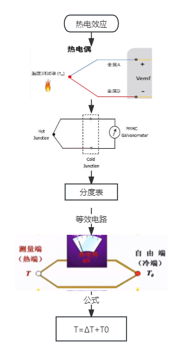
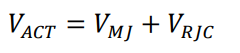

**五、万语始于HelloWorld，万物基于点灯之瑞萨RX23E-A热电偶温度采集**

[TOC]

# 一、概述/目的
使用瑞萨RX23E-A采集K型热电偶，展示其便捷性和注意事项，得以快速上手。

# 二、RX23E-A K型热电偶实验
## 2.1 资料来源
- [RX23E-A GroupTemperature Measurement Example Using a Thermocouple](./DOC/r01an4747ej0110-rx23e-a.pdf)
- [Selecting Temperature Sensors for System Measurement and Protection](./DOC/selecting-temperature-sensors-for-system-measurement-and-protection--maxim-integrated.pdf)
- [为系统测量和保护选择温度传感器](https://www.analog.com/cn/design-notes/selecting-temperature-sensors-for-system-measurement-and-protection.html)
- [MAX6675](./DOC/MAX6675.pdf)
- [热电偶冷端补偿](https://www.analog.com/cn/technical-articles/cold-junction-compensation-in-thermocouple-guide.html)
- [在传感器近端量化热电偶输出](https://www.analog.com/cn/design-notes/circuit-digitizes-thermocouple-output-near-sensing-point.html)

## 2.2 热电偶原理和冷端补偿
- 热电效应
- 温度-电动势
- 分度表
- 等效电路
- 冷端补充
- 简单理解：测量温度=室温+冷端温度

- 常见热电偶

## 2.3 官方例程

### 2.3.1 原理图和接线

### 2.3.2 计算公式
- 计算公式的推导：文档公式推导结合代码理解

- 校准（略）

### 2.3.4 源码分析
- RTD温度计算（trtd参考端温度）
- RTD温度转电动势（vrjc参考端电动势）
- 热电偶电动势（vmj测量端电动势）
- 参考补偿（vact参考端补偿电动势 = vmj + vrjc）
- 转换为温度（tact测量端温度）

## 2.3 实验测试结果

# 三、相关知识扩展

