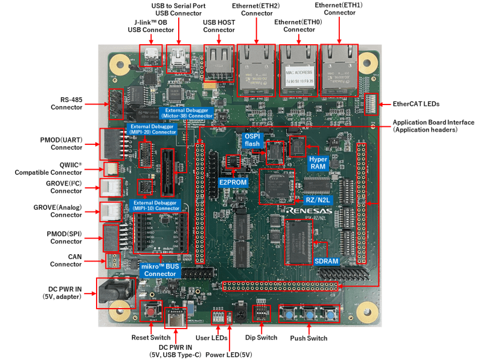
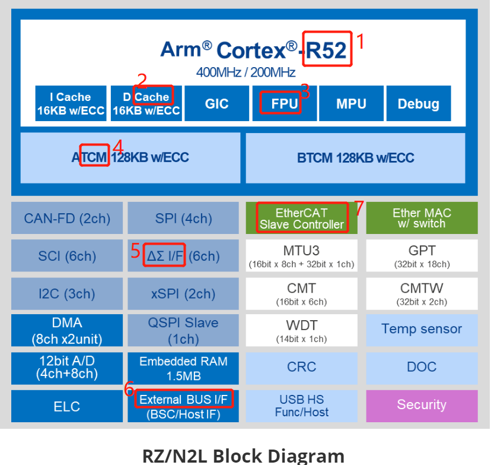
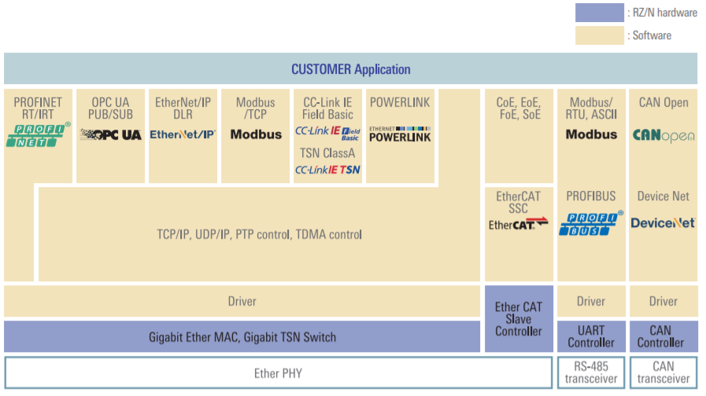
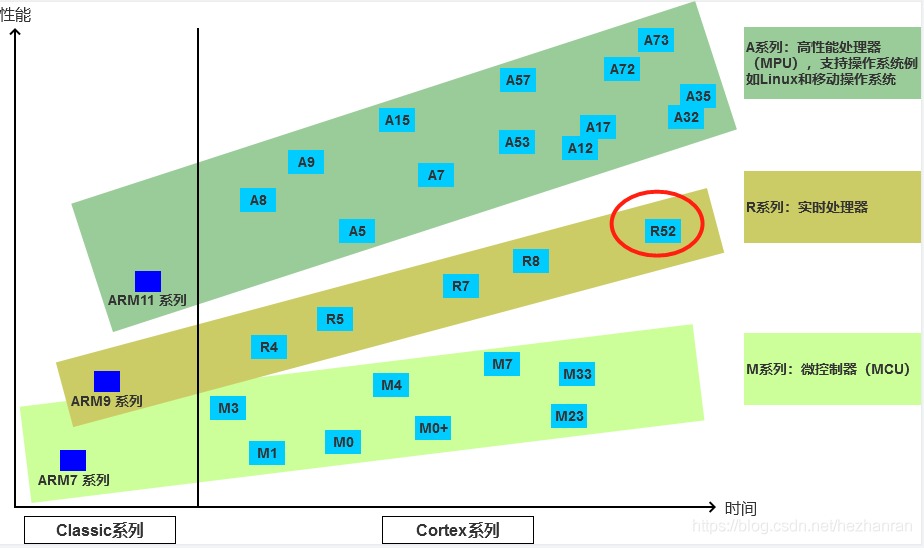
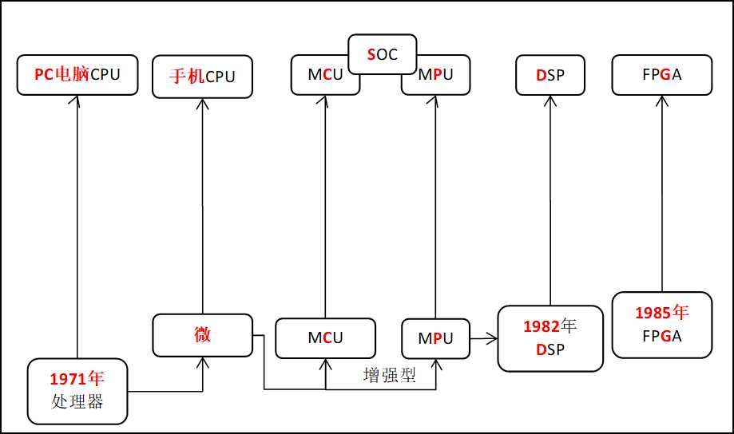
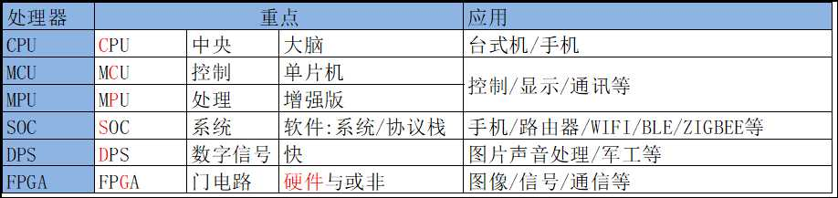

# 瑞萨RZN2L工业以太网MPU视频笔记 一、瑞萨RZN2L介绍和各处理器概念
[TOC]

# 一、RZN2L MPU概述
RZ/N2L是一种**工业以太网**通信用MPU，可轻松将网络功能添加到工业设备中。它搭载支持**TSN**的三端口千兆以太网交换机和EtherCAT®从控制器，可支持**EtherCAT、PROFINET RT/IRT、EtherNet/IP™、OPC UA**等主要的工业以太网通信协议。它对网络专用配套芯片加以优化，无需大幅改变设备的内部配置即可直接连接并快速访问外部应用主机CPU。此外，Arm® **Cortex®-R52**的最大工作频率为400MHz，外设功能包括带 ECC 的大容量RAM与ΔΣ I/F、A/D转换器、PWM定时器、UART和CAN等，可在**单个芯片**上实现**远程 I/O**、**传感器集线器**、**变频器**和**网关**。

# 二、学习资料

## 2.1 硬件

**开发板：RZ/N2L-RSK**

## 2.2 软件
| 集成开发环境 IDE | e2studio | IAR: 9.30.1  |
|:-:|:-:|:-:|
| 软件包 | FSP:  v1.0.0 RZN_FSP_Packs_v1.0.0.exe| RZSC: setup_rznfsp_v1_0_0_rzsc_v2022-07.exe|
| Toolchain | GCC Compiler :  9-2020-q2-update | IAR Compiler |
| Jlink |SEGGER J-Link: 7.64 later|SEGGER J-Link: 7.64 later|

# 三、RZN2L在Renesas产品中的位置
## 3.1 RZN2L MPU系统框图

## 3.2 RZ N系列MPU的定位
**工业以太网**

## 3.3 瑞萨MPU各系列特点
AI、图形、实时控制、工业网络

## 3.4 RZN2L的R52内核在ARM位置
**最新ARM实时内核**

# 四、各种处理器概念
## 4.1 CPU MCU MPU SOC DSP FPGA发展

## 4.2 CPU MCU MPU SOC DSP FPGA关键字

# 五、总结
RZN2L 重点在工业以太网通讯，软硬件支持多种协议；
MPU 是增强型通用微处理器