**瑞萨RZN2L工业以太网MPU视频笔记** 
四、瑞萨RZN2L Modbus TCP Slave
[toc]
# 一、Modbus资料和简介

## 1.1 官网
**https://www.Modbus.cn/**

**https://Modbus.org/**

 
## 1.2 简介
**ModbusRTU**
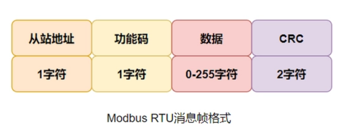
**ModbusASCII**
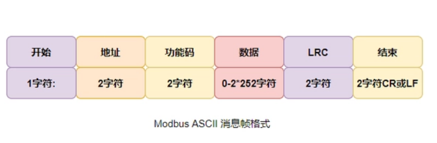
**ModbusTCP**
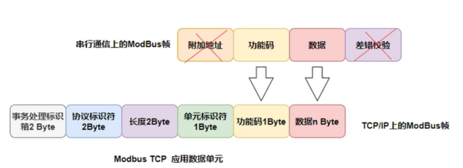

## 1.3 命令
1. (0x01) - Read coils
2. (0x02) - Read discrete input
3. (0x03) - Read holding registers
4. (0x04) - Read input registers
5. (0x05) - Write single coil
6. (0x06) - Write single register
7. (0x0F) - Write multiple coils
8. (0x10) - Write multiple registers
9. (0x17) - Read/Write multiple registers


# 二、瑞萨RZN2L Modbus TCP Slave
## 2.1 资料：文档&开发板&源码

[RZ/T2M, RZ/N2L Group
Quick Start Guide: Modbus TCP Slave Software]()

## 2.2 建立连接
### 2.2.1 框图
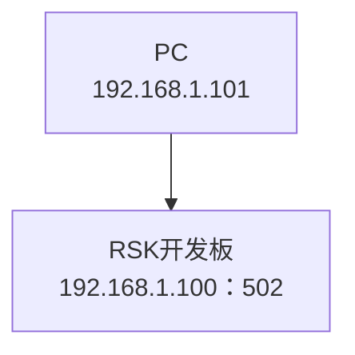
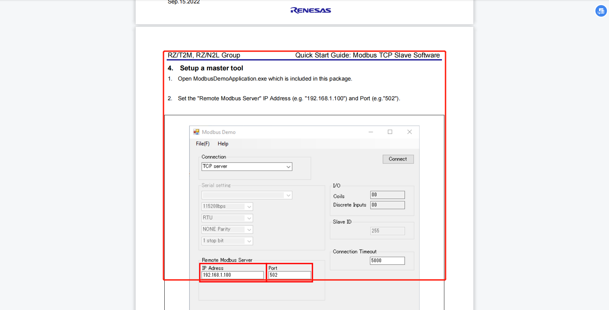
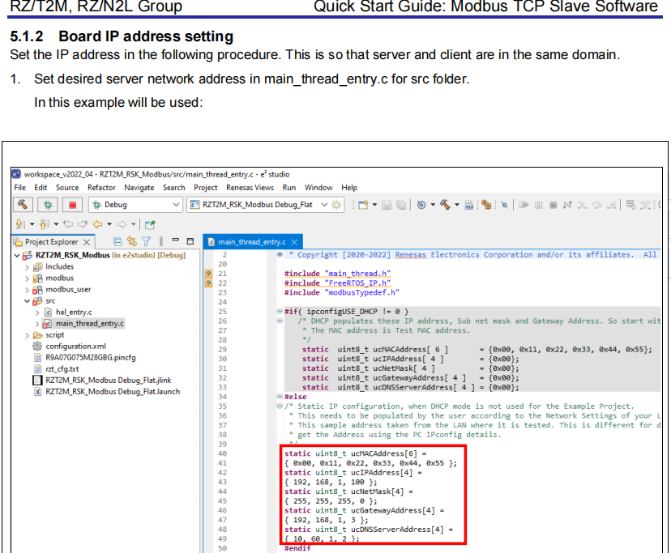

### 2.2.2 host IP list
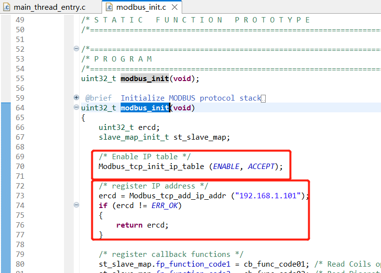

### 2.2.3 ModbusDemoApplication


### 2.2.4 wireshark抓包
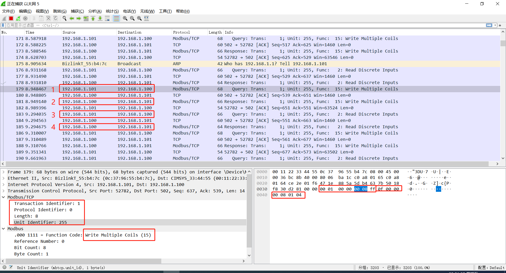

### 2.2.5 ModbusPoll
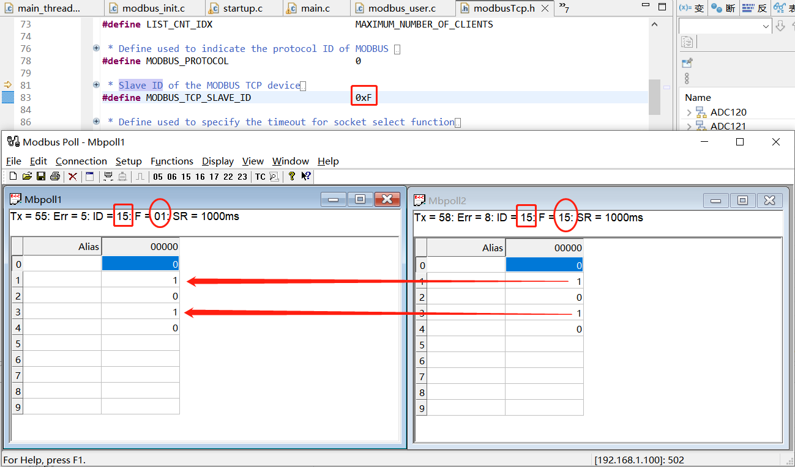

### 2.2.6 现象
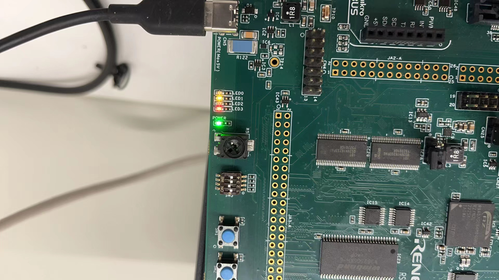

### 2.2.7 API
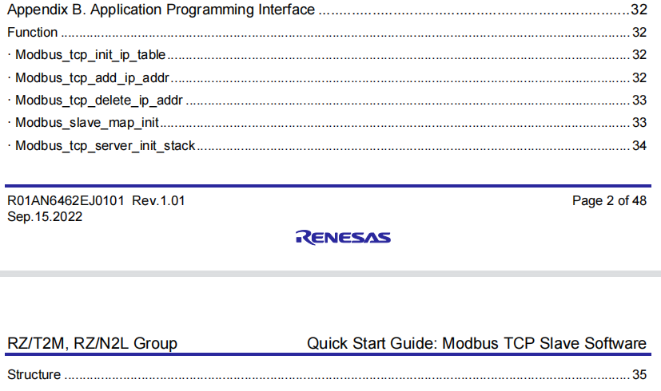
```
Function Modbus_tcp_init_ip_table
· Modbus_tcp_add_ip_addr
· Modbus_tcp_delete_ip_addr
· Modbus_slave_map_init
· Modbus_tcp_server_init_stack
Structure 
· slave_map_init_t
· p_req_read_coils_t
· p_req_read_inputs_t
· p_req_read_holding_reg_t 
· p_req_read_input_reg_t 
· p_req_write_single_coil_t
· p_req_write_single_reg_t 
· p_req_write_multiple_coils_t 
· p_req_write_multiple_reg _t 
· p_req_read_write_multiple_reg_t
· p_resp_read_coils_t 
· p_resp_read_inputs_t
· p_resp_read_holding_reg_t 
· p_resp_read_input_reg_t 
· p_resp_write_single_coil_t 
· p_resp_write_single_reg_t 
· p_resp_write_multiple_coils_t 
· p_resp_write_multiple_reg_t 
· p_resp_read_write_multiple_reg_t 
· p_resp_invalid_function_code_t
Callback function 
· fp_function_code1 
· fp_function_code2 
· fp_function_code3 
· fp_function_code4 
· fp_function_code5 
· fp_function_code6 
· fp_function_code15 
· fp_function_code16 
· fp_function_code25 
Enumeration type
```
