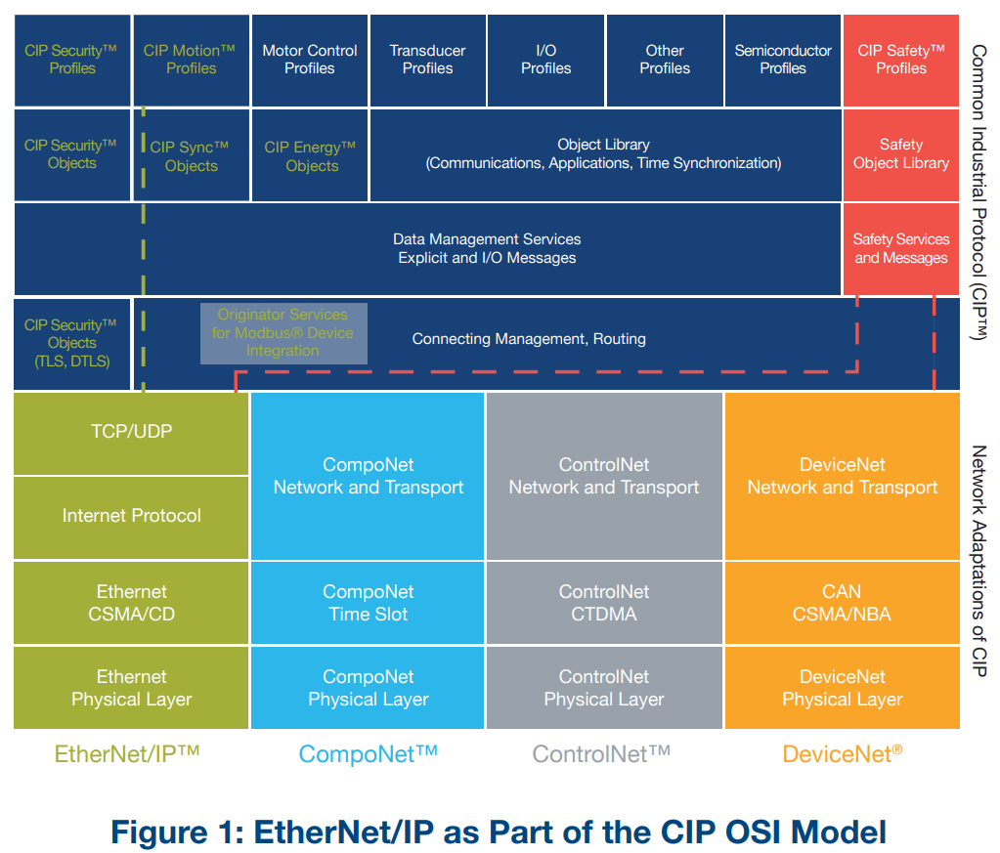
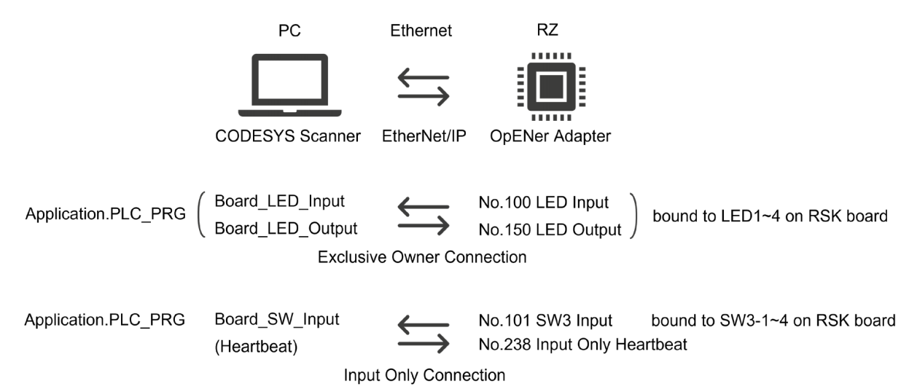
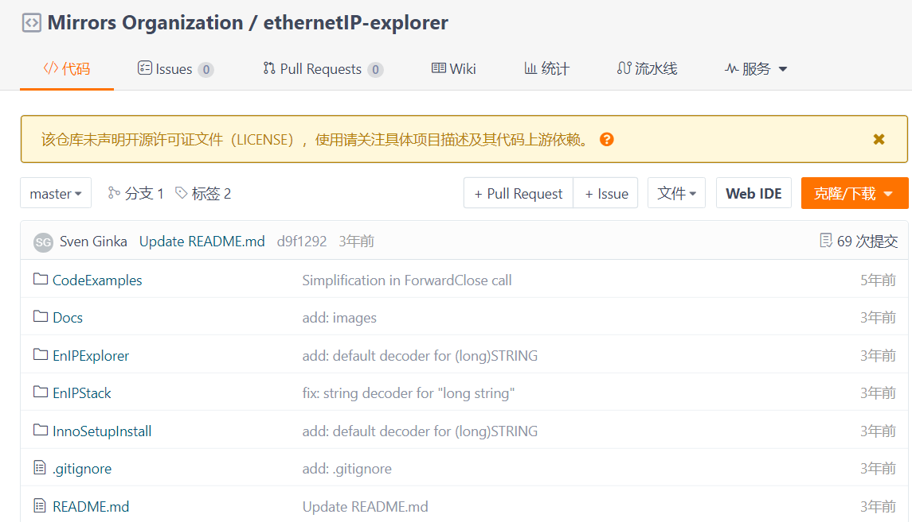
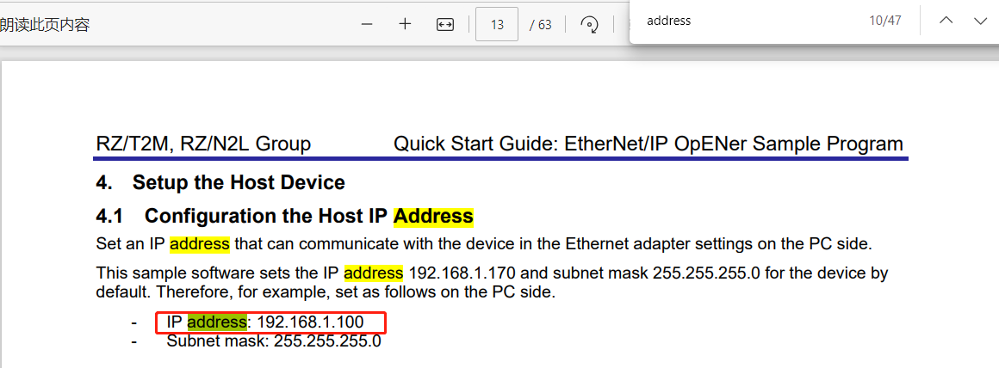
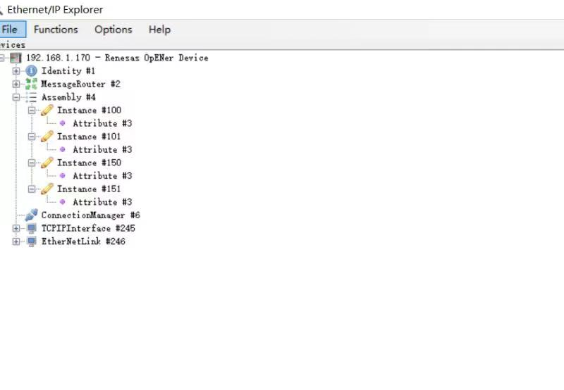
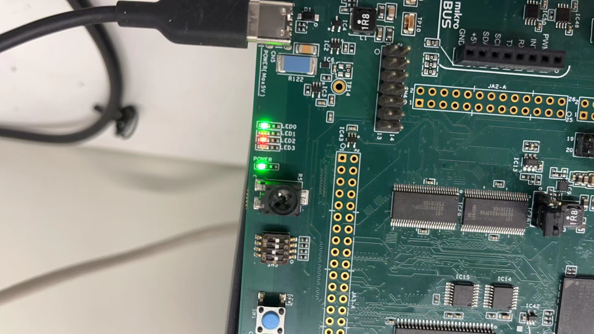

瑞萨RZN2L工业以太网MPU视频笔记 
六、瑞萨RZN2L Ethernet/IP通讯
[TOC]

# 一、概述/目的
本节通过使用CODESYS&SetupEnIPExplorer_1.2与RZN2L开发板建立Ethernet/IP通讯，展示IO通讯功能，来验证RZN2L开发板的软硬件能力。其次对于初学者来说能少走弯路。

RZN2L_OpENer_RSK_rev0101：例程软件包

# 二、软/硬件要求
|项目|功能描述|说明|
|:-:|:-:|:-:|
|开发板|RZ/N2L RSK Board |EIP从站|
|IDE|e² studio 2023-07 (RZN2L_FSP_Packs_v1.2.0)|编译软件并烧录到开发板|
|EIP主站软件|CODESYS SetupEnIPExplorer_1.2|13.5.15.10 32-bit SetupEnIPExplorer_1.2|
|EIP软件包|RZN2L_OpENer_RSK_rev0101|文档、例程|
|网卡|mac+phy+rj45|同Ethernet|

[RZ/T2M, RZ/N2L Quick Start Guide: EtherNet/IP OpENer Sample Program]()

[PUB00138R7_Tech-Series-EtherNetIP.pdf]()

# 三、EtherNet/IP™与ODVA
## 3.1 ODVA官方资料
https://www.odva.org/technology-standards/key-technologies/ethernet-ip/
https://www.odva.org/wp-content/uploads/2021/05/PUB00138R7_Tech-Series-EtherNetIP.pdf
https://www.odva.org/technology-standards/document-library/
### 3.1.1 CIP OSI Model

### 3.1.2 The Physical Layer
### 3.1.3 The Data Link Layer

### 3.1.4 The Network and Transport Layers

# 四、CODESYS(主)+rzn2l opener RSK(从)

[RZ/T2M, RZ/N2L Group Quick Start Guide: EtherNet/IP OpENer Sample Program ]()

## 4.1 硬件rzn2l RSK开发板
- rzn2l(sw-3)+phy+rj45
## 4.2 软件RZN2L_OpENer_RSK_rev0101
- EtherNet/IP OpENer
- FreeRTOS
- lwIP

## 4.3 CODESYS Software
version 3.5.15.10 32-bit
|Name| Description |Note|
|:-:| :-: |:-:|
|CODESYS V3|IDE||
CODESYS Gateway V3| Software Gateway| This may be already started by Windows Start Up Process.|
|CODESYS Control Win V3 |Software PLC |This may be already started by Windows Start Up Process.|

## 4.4 系统框图

## 4.5 附录
- 第三方软件版本
        https://github.com/EIPStackGroup/OpENer
         Git comment ID used in this sample software: 05cdd03
        https://aws.amazon.com/freertos/
        https://github.com/aws/amazon-freertos
         Git comment ID used in this sample software: a038063
        https://savannah.nongnu.org/projects/lwip/
        https://github.com/lwip-tcpip/lwip
         Git comment ID used in this sample software: 79cd89f
- Assembly Objects and I/O Connections
- Support CIP Object Classes
- DLR

# 五、EnIPExplorer(主)+rzn2l opener RSK(从)

## 5.1 主站软件
https://gitee.com/mirrors-org/ethernetIP-explorer

## 5.2 SetupEnIPExplorer_1.2.exe安装与运行

## 5.3 测试过程
### 5.3.1 主站IP地址

### 5.3.2 EnIPExplorer增加实例

### 5.3.3 wireshark抓包分析

### 5.3.4 实测效果
