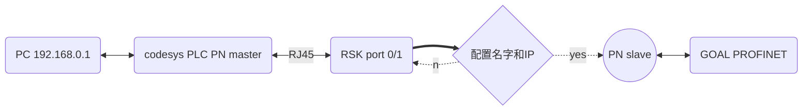

**瑞萨RZN2L工业以太网MPU视频笔记 
七、瑞萨RZN2L port GOAL PROFINET**
[TOC]

# 一、概述/目的
本文通过介绍在瑞萨RZN2L上运行port GmbH’s PROFINET即GOAL_PROFINET - IO DEVICE STACK V2.22.0，来了解瑞萨RZN2L工业以太网多协议的能力、PROFINET的一种实现方式、port GmbH’s是做什么的、GOAL PROFINET IO DEVICE STACK又是怎么回事。
当然了，要掌握一种标准、一种通讯协议、一个协议栈是要花费足够精力的，这里仅抛砖引玉，使之快速上手。

# 二、PROFINET简介
详见：嵌入式科普(1)，本文就是其中一种实现PROFINET的办法。

# 三、port和GOAL简介
- [port官网](https://www.port.de/en/products/applications.html)
- [GOAL中间件](https://portgmbh.atlassian.net/wiki/spaces/GOALR/pages/131629197/Features+Known+Restrictions)
- [瑞萨RZN2L RSK开发板](https://www.renesas.cn/cn/zh/products/microcontrollers-microprocessors/rz-mpus/rzn2l-rsk-renesas-starter-kit-rzn2l#overview)

# 四、在RZN2L运行GOAL PROFINET并连接codesys
## 4.1 从站：导入编译下载到RSK开发板
- 详细参考其他系列
- [port文档介绍](https://portgmbh.atlassian.net/wiki/spaces/GOALR/pages/639762433/GOAL+-+Renesas+RZ+N2L-RSK#GOAL-Profinet-Demo)
- 编译错误：复制到工作空间下；选择tool
- 设置RSK开发板的SW和CN
- debug下载： boot工程debug配置中增加app的 .elf文件

## 4.2 主站：codesys软PLC
- 下载并安装codesys
- start PLC（）安装codemeter
- 新建工程并依次添加GSDML、以太网适配器、PROFINET IOmaster、slave

## 4.3 【重要】配置RSK的名字和IP
- RSK port0/1连接到PC
- 设置PC网卡 192.168.0.1 255.255.255.0
- RSK 名字？IP是多少？ping不同？
- [下载西门子的PRONETA](https://mp.weixin.qq.com/s/9nU22p4wxnZ6B2fSLynZxg)

## 4.5 Setting up a PROFINET PLC (Tia Portal with S7-1500)

# 五、总结
- 流程

- RZN2L+GOAL是产品平台化的一种选择