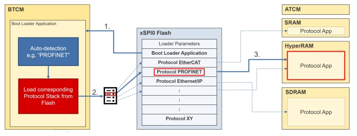
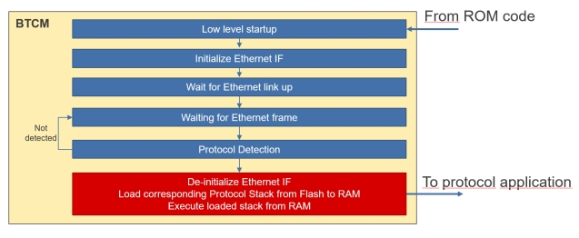
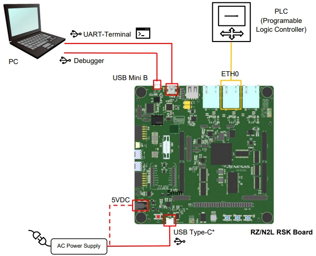
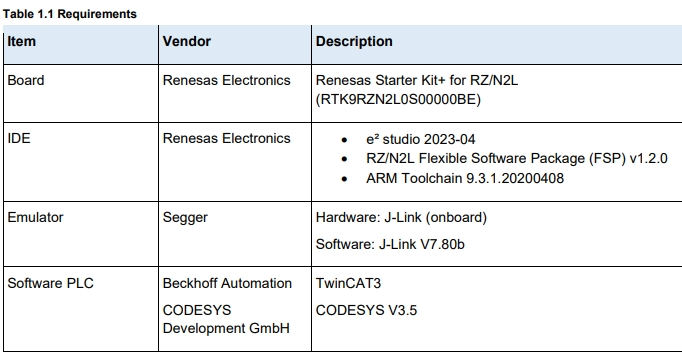
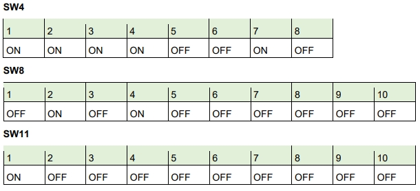
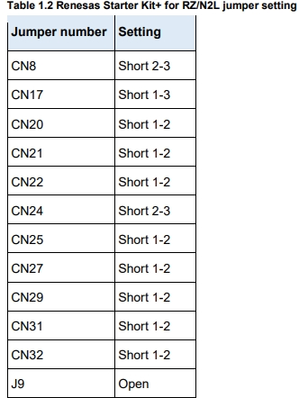
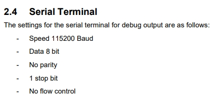
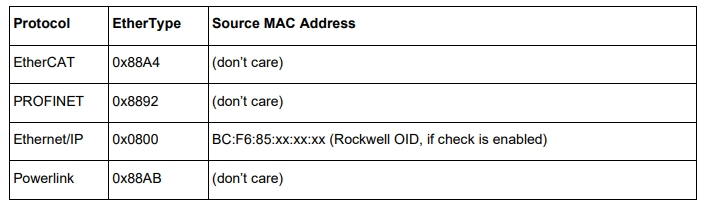

瑞萨RZN2L工业以太网MPU视频笔记之
八、瑞萨RZN2L多协议自动检测
===
[TOC]

# 一、概述/目的
介绍瑞萨最新Industrial Ethernet Protocol Auto-Detection，提供一种产品思路，并且实现了绝大部分架构源码。
多协议的支持方法：
- 相同硬件或pcba，出厂烧录不同协议固件
- flash烧录多个协议固件，根据设置或扫描启动1个协议固件
- 单独固件同时支持2个以上协议，实现较复杂

# 二、多协议自动检测例程
## 2.1 官方资料
- AN文档
- bin文件
- 源码工程
  
## 2.2 总结关键点
- 一级二级引导
- 复制固件和链接文件
- rzn2l_xspi0_x1_boot.cfg
- 自动合并section
- 自动更新section大小
- 输出bin
- SEGGER J-Flash Lite烧录
- printf实现 
  
# 三、 运行例程
## 3.1 框图



## 3.2 硬件准备





  
## 3.3 软件依赖
- Boot Loader Software
RZ/N2L Group Example of separating loader program and application program projects V1.1.0
- Industrial Protocol Auto-Detection Program
  
- EtherCAT
Renesas RZ/N2L Group EtherCAT Sample program Package V1.2.0
- PROFINET
GOAL Profinet Demo from port industrial automation GmbH (https://www.port.de).
RZ/N2L: 2.24.0 (Date of update: 29.09.2023)
https://portgmbh.atlassian.net/wiki/spaces/GOALR/pages/639762433/GOAL+-+Renesas+RZ+N2L-RSK
GOAL Profinet Demo
- EtherNet/IP
GOAL Ethernet/IP Demo from port industrial automation GmbH (https://www.port.de).
RZ/N2L: 2.24.0 (Date of update: 29.09.2023)
https://portgmbh.atlassian.net/wiki/spaces/GOALR/pages/639762433/GOAL+-+Renesas+RZ+N2L-RSK
GOAL Ethernet/IP Demo

## 3.4 代码
```
.section .APP2_IMAGE_QSPI_FLASH_section, "ax", %progbits
.incbin "../../RZN2L_PORT_pn/projects/goal_pnio_lib/10_led_demo/e2studio/renesas/
rzn2l_rsk_freertos/ram/Single-Core/goal_pnio_lib__10_led_demo__rzn2l_rsk_freertos_ram.bin"
```

```
.APP2_IMAGE_SYSRAM 0x30000000 : AT (0x30000000)
{
 APP2_IMAGE_SYSRAM_start = .;
 KEEP(*(APP2_IMAGE_SYSRAM))
}
.APP2_IMAGE_QSPI_FLASH_section 0x60200000 : AT (0x60200000)
{
 APP2_IMAGE_QSPI_FLASH_section_start = .;
 KEEP(./src/flash_section_PN.o(.APP2_IMAGE_QSPI_FLASH_section))
 APP2_IMAGE_QSPI_FLASH_section_end = .;
}
APP2_IMAGE_QSPI_FLASH_section_size = SIZEOF(.APP2_IMAGE_QSPI_FLASH_section);
```

```
extern uint32_t APP2_IMAGE_QSPI_FLASH_section_start;
extern uint32_t APP2_IMAGE_QSPI_FLASH_section_size;
extern uint32_t APP2_IMAGE_SYSRAM_start;
#define application2_prg_flash_addr (&APP2_IMAGE_QSPI_FLASH_section_start)
#define application2_prg_start_addr (&APP2_IMAGE_SYSRAM_start)
#define application2_prg_size (&APP2_IMAGE_QSPI_FLASH_section_size)
const loader_table table[TABLE_ENTRY_NUM] BSP_PLACE_IN_SECTION("CPU0_LOADER_TABLE") =
{
 { (uint32_t *)application1_prg_flash_addr, (uint32_t *)application1_prg_start_addr,
 (uint32_t)application1_prg_size, (uint32_t)TABLE_ENABLE },
 { (uint32_t *)application2_prg_flash_addr, (uint32_t *)application2_prg_start_addr, 
 (uint32_t)application2_prg_size, (uint32_t)TABLE_ENABLE },
 { (uint32_t *)TABLE_INVALID_VALUE, (uint32_t *)TABLE_INVALID_VALUE, 
 (uint32_t)TABLE_INVALID_VALUE, (uint32_t)TABLE_DISABLE },
 { (uint32_t *)TABLE_INVALID_VALUE, (uint32_t *)TABLE_INVALID_VALUE, 
 (uint32_t)TABLE_INVALID_VALUE, (uint32_t)TABLE_DISABLE }
};
```

```
startup.c
```

# 四、提问
- 误判eip
- app如何同时使用ATCM
- 期待第二版