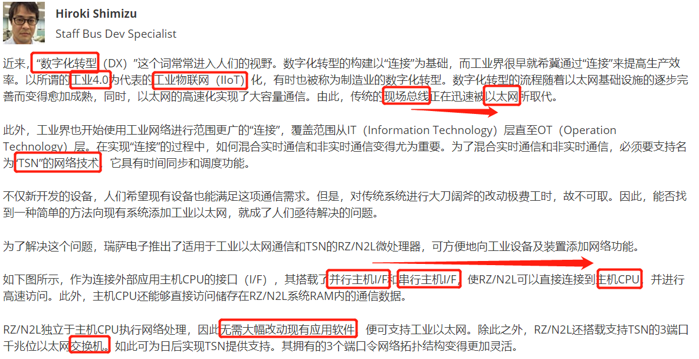
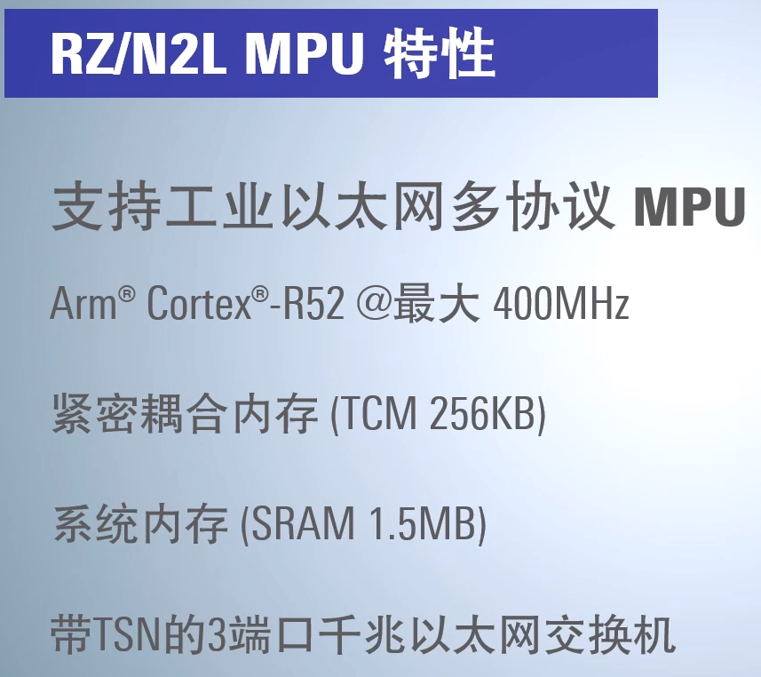
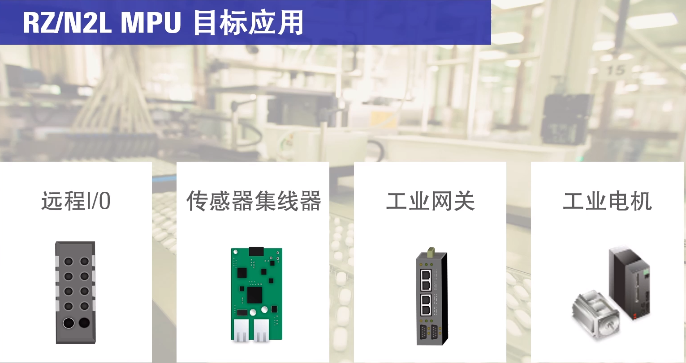
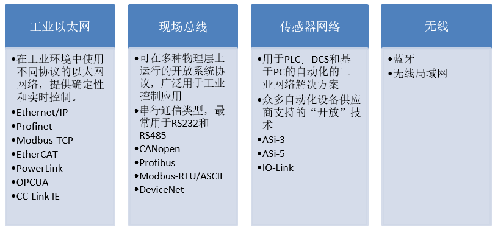
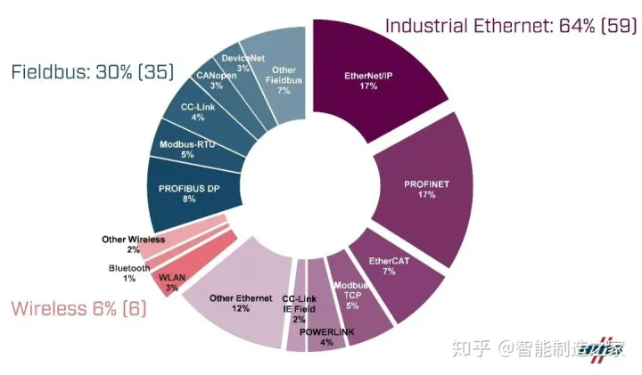
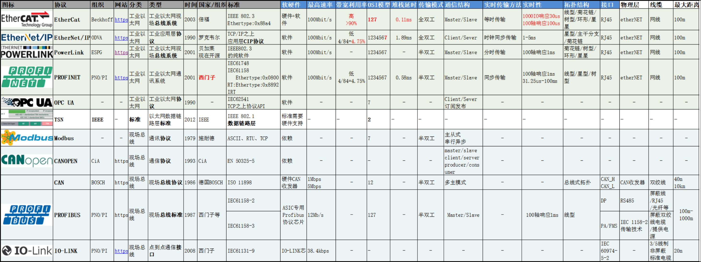

# 瑞萨RZN2L工业以太网MPU视频笔记 二、瑞萨RZN2L 工业网络概述
[TOC]

# 一、关键词：工业4.0和数字化转型
## 1.1 官网文章
使工业设备具备支持工业以太网和TSN的微处理器RZ/N2L：https://www.renesas.cn/cn/zh/blogs/rzn2l-microprocessor-implement-industrial-ethernet-and-tsn-industrial-equipment#videos_training

# 二、RZ N系列工业以太网
## 1.1 RZN2L如何"快"

## 1.2 RZN2L多协议

## 1.3 RZN2L工业应用

## 1.4 RZ N工业以太网roadmap

# 三、多种工业网络
**现场总线、工业以太网、传感器网络、无线网络**

## 3.1 工业网络市场比例

## 3.2 工业网络简介和对比

