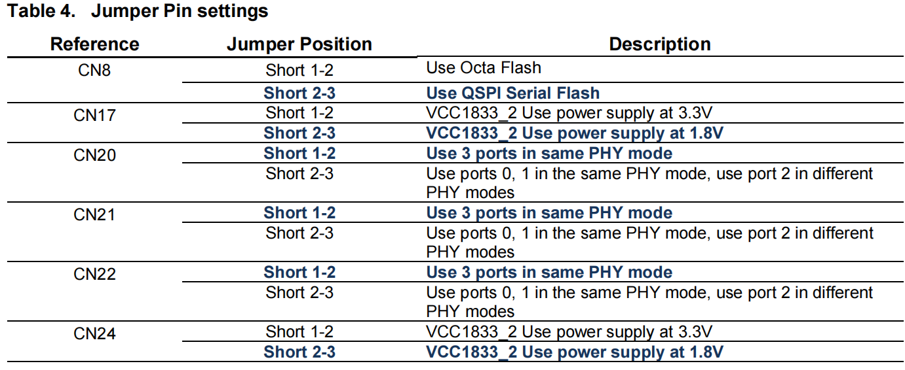
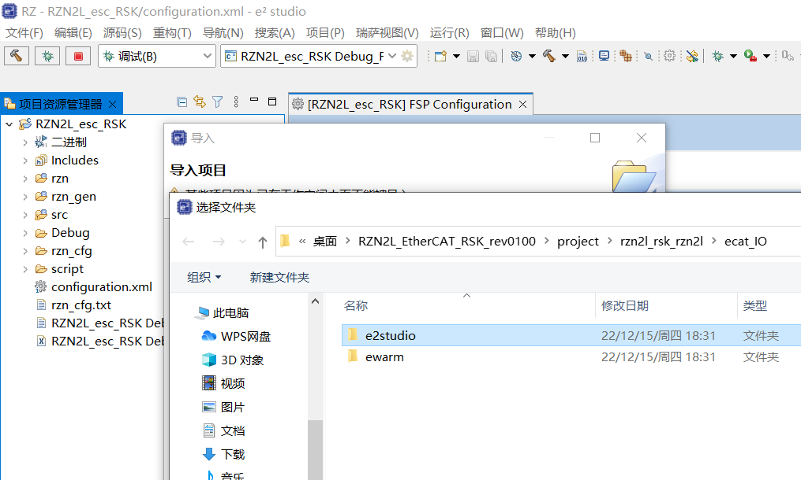
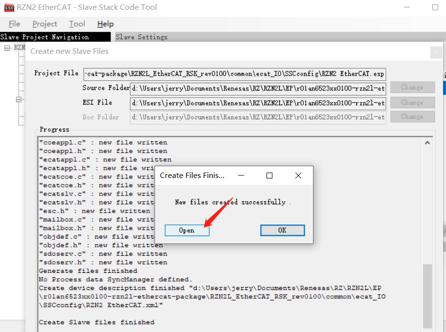
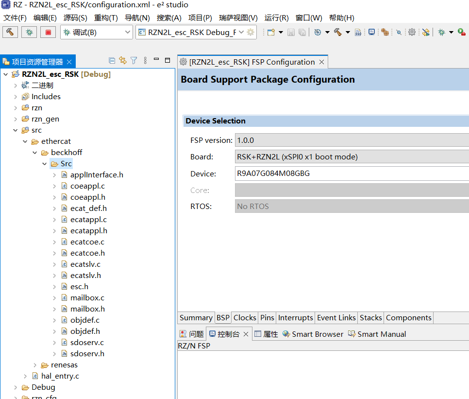
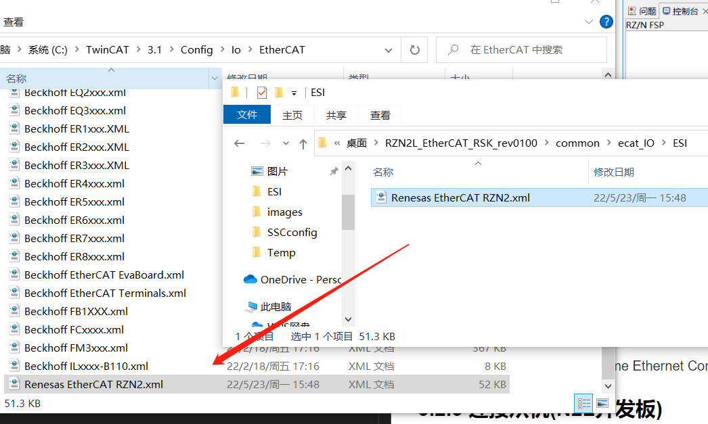
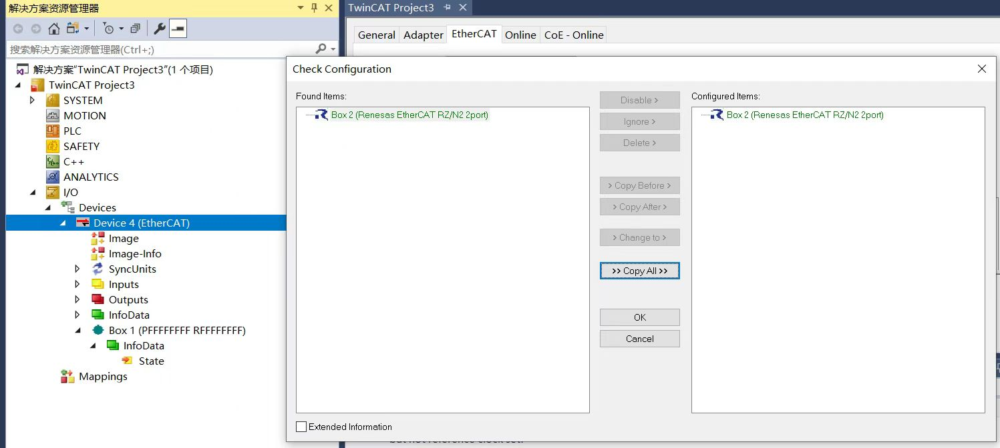
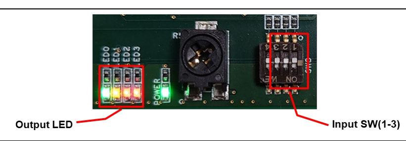

# 瑞萨RZN2L工业以太网MPU视频笔记 五、瑞萨RZN2L EtherCAT IO通讯
[TOC]

# 一、概述/目的
本节通过使用TwinCat3(软PLC)与RZN2L开发板建立EtherCAT通讯，展示IO通讯功能，来验证RZN2L开发板的软硬件能力。其次对于初学者来说能少走弯路。
RZN2L_esc_RSK：开发板工程
RZN2L_EtherCAT_RSK_rev0100：例程软件包

# 二、软/硬件要求
|项目|功能描述|作用|
|:-:|:-:|:-:|
|开发板|RZ/N2L RSK Board |EtherCAT 从机（ESC）|
|IDE|e² studio 2022-07 (RZN2L_FSP_Packs_v1.0.0)|编译软件并烧录到开发板|
|SSC Tool|Slave Stack Code (SSC) Tool Version 5.13|1.生成beckhoff src 2.生成eeprom烧写bin文件|
|Software PLC|TwinCAT3 v3.1.4024.32|EtherCAT 主机|
|N2L EtherCAT软件包|r01an6523xx0100-rzn2l-ethercat-package|文档、xml、例程|
|网卡|最好是intel网卡|据说intel更稳定|

# 三、开始测试
## 3.1 从机准备
### 3.1.1 N2L开发板准备
**4组表格的检查，拨码开关和跳线帽**

Table 4567

### 3.1.2 e2studio准备
#### 3.1.2.1 导入例程 
\RZN2L_EtherCAT_RSK_rev0100\project\rzn2l_rsk_rzn2l\ecat_IO\e2studio

#### 3.1.2.2 导入xml到SSC生成源码
使用ssc5.13导入xml，生成beckhoff src文件夹：
RZN2L_EtherCAT_RSK_rev0100\common\ecat_IO\SSCconfig\Renesas_RZN2_config.xml

#### 3.1.2.3 编译代码并烧录
BSP默认第二项RAM，断电会消失。可以修改成第三项xSPI0后重新生成并编译烧录，然后断电重启也一致运行，等待EtherCAT主机连接，也就是Twincat3

## 3.2 主机准备
### 3.2.1 复制ESI文件
复制RZN2L_EtherCAT_RSK_rev0100\common\ecat_IO\ESI\Renesas EtherCAT RZN2.xml到\TwinCAT\3.x\Config\IO\EtherCAT

**在TwinCAT3打开之前**
### 3.2.1 驱动网卡(重点)
新建项目TwinCAT Projects-XAE；
菜单选择TwinCAT3-Show Realtime Ethernet Compatible Devise选择网卡后点安装驱动；
### 3.2.3 连接从机(N2L开发板)
#### 3.2.3.1 搜索EtherCAT设备
双击SYSTEM-Choose Target-search-broadcast search等待后点ok，可能没有任何被选中；
#### 3.2.3.2 扫描IO设备(重点)

#### 3.2.3.3 写bin到从机eeprom

使用ssc导入xml，生成bin文件：
e:\Users\jerry.chen\Desktop\RZN2L_EtherCAT_RSK_rev0100\common\ecat_IO\ESI；
另存为bin；
使用TwinCAT3写bin到开发板，等待后读出来看看是否一致

## 3.3 测试IO通讯
### 3.3.1 主到从
看灯闪，按4bit控制led0-4

### 3.3.2 从到主
拨码开关反馈到input

# 四、总结
瑞萨N2L开发板EtherCAT从机；
注意：网卡驱动，扫描设备这两项最容易失败，可能跟电脑有关系
3次使用xml文件，bin文件和复制到TwinCAT安装目录是使用\ESI里面的
生成源码使用的是\SSCconfig里面的

