十三、从0开始卷出一个新项目之瑞萨RZN2L串口DMA接收不定长
===
[toc]

# 一、概述
- 关键原理：串口空闲中断，stm32利用空闲中断来处理串口dma接收不定长度，可用hal库api
- 瑞萨RA使用gpt定时器和elc来硬件检测串口空闲。但是：1、fsp没有sci+dma的api，需要自己封装；2：dma接收不定长的实现
- 瑞萨RZN2l可以按照RA的思路来实现，但是rzn2l的elc源不支持串口接收满，如何实现？
- [十一、从0开始卷出一个新项目之瑞萨RA6M5串口DTC接收不定长](https://mp.weixin.qq.com/s?__biz=MzkxNDQyMTU4Mg==&mid=2247485323&idx=1&sn=186d5310a5278e09916adde1e5c81097&chksm=c16fe5aaf6186cbc85d37bd69deeec93a80045fe80acfdbadaef983378973ac80499fae4b546&token=1257812003&lang=zh_CN#rd)
- [十二、从0开始卷出一个新项目之瑞萨RA6M5串口DMA接收不定长
](https://mp.weixin.qq.com/s?__biz=MzkxNDQyMTU4Mg==&mid=2247485338&idx=1&sn=77151bc3a7fae1633db1c22544001aeb&chksm=c16fe5bbf6186cad2a355634b3130f7bbd3be7b5e0b9626032823ed316c91027ed9412dbf550&token=1257812003&lang=zh_CN#rd)

参考资料：
- [STM32之串口DMA接收不定长数据:https://shequ.stmicroelectronics.cn/thread-617564-1-1.html](https://shequ.stmicroelectronics.cn/thread-617564-1-1.html)

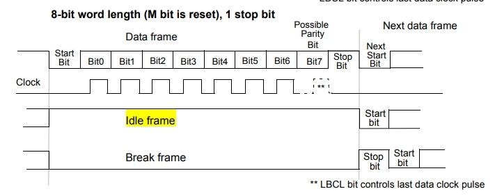

- [基于RA2L1实现串口DTC数据接收](https://mp.weixin.qq.com/s/fJFG_CBPK-5JkVWcqJ0OgA)
- [RA串口通信空闲中断](https://mp.weixin.qq.com/s/0lJAPD95SQB_bUEfDtuNkA)
- [RX系列MCU串口+DMA接收数据完成的空闲判断方法](https://mp.weixin.qq.com/s/lHGh4HUeYK3ISiUy4TZ1Pg)

# 二、rzn2l的elc不支持sci
- **rzn2l的elc基本不支持通信等类的外设，只支持定时器adc等类的外设**

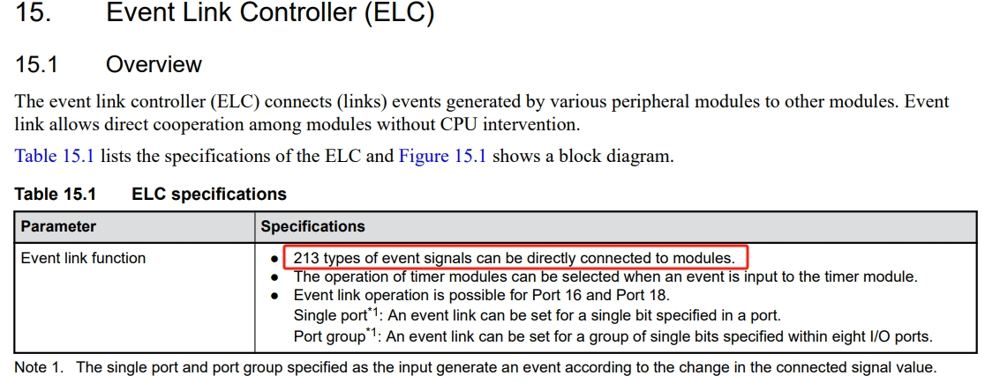
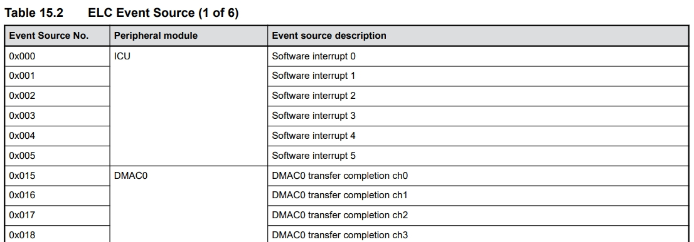
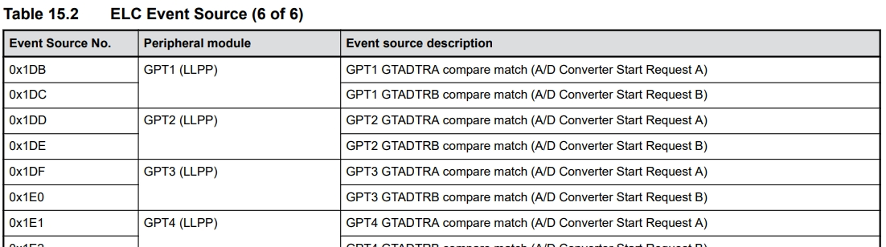

# 三、对策：通过rx引脚下降沿elc gpt
## 3.1 用户手册

- **RX p16-6--->ELC single port0--->LLPP GPT event A(GPT_SOURCE_GPT_A)--->GTSSR(Start Source)**
- **RX p16-6--->ELC single port0--->LLPP GPT event B(GPT_SOURCE_GPT_B)--->GTCSR(clear Source)**

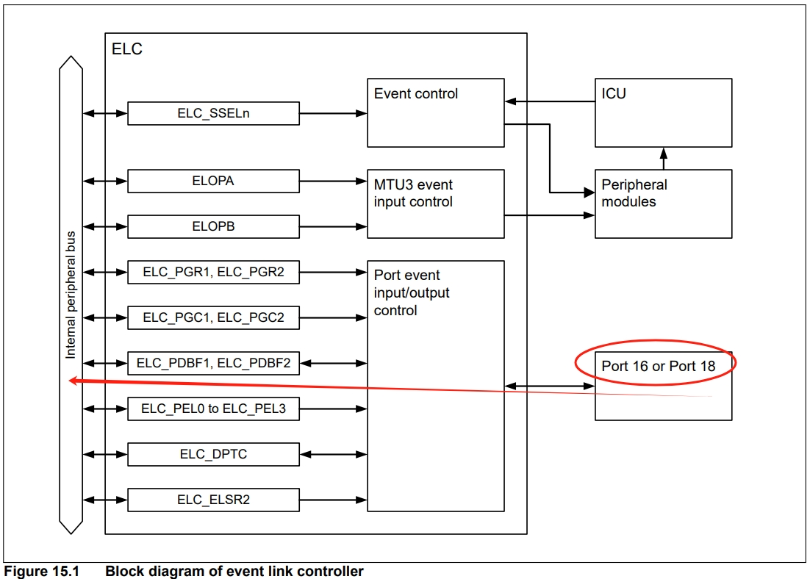

## 3.2 框图

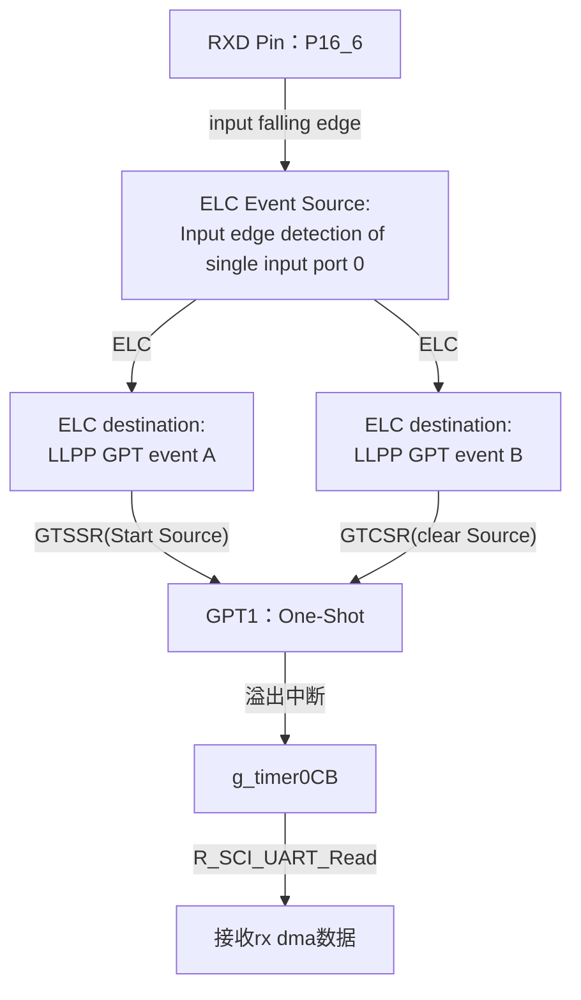

## 3.3 fsp配置

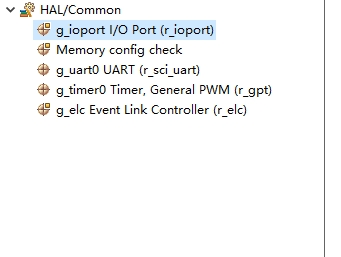

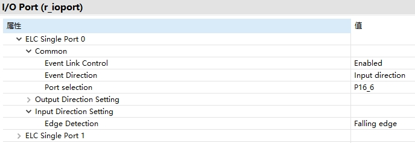


## 3.4 源码

```
void hal_entry(void)
{
    /* TODO: add your own code here */
    fsp_err_t err = g_uart0.p_api->open(g_uart0.p_ctrl, g_uart0.p_cfg);
    FSP_PARAMETER_NOT_USED(err);

    __asm volatile ("cpsie i");

    g_uart0.p_api->write(g_uart0.p_ctrl, (uint8_t *)"hello world!\n", sizeof("hello world!\n"));

    g_timer0.p_api->open(g_timer0.p_ctrl, g_timer0.p_cfg);
    g_timer0.p_api->enable(g_timer0.p_ctrl);

    g_elc.p_api->open(g_elc.p_ctrl, g_elc.p_cfg);
    g_elc.p_api->enable(g_elc.p_ctrl);

    g_timer0_ctrl.p_reg->GTSSR = GPT_SOURCE_GPT_A;//SCI RX p16-6--->ELC single port0--->LLPP GPT event A(GPT_SOURCE_GPT_A)--->GTSSR(Start Source)
    g_timer0_ctrl.p_reg->GTCSR = GPT_SOURCE_GPT_B;//SCI RX p16-6--->ELC single port0--->LLPP GPT event B(GPT_SOURCE_GPT_B)--->GTCSR(clear Source)

    R_SCI_UART_Read(&g_uart0_ctrl, (uint8_t*)g_receive_buffer, TEXT_LENGTH);//start uart0 dma rx

    while(1)
    {
        R_BSP_SoftwareDelay (1000, BSP_DELAY_UNITS_MILLISECONDS);
    }
}

void g_timer0CB(timer_callback_args_t *p_args)
{
    FSP_PARAMETER_NOT_USED(p_args);

    transfer_properties_t p_info;
    R_DMAC_InfoGet (g_transfer1.p_ctrl, &p_info);//rx dma

    uint8_t len = (uint8_t)(TEXT_LENGTH - p_info.transfer_length_remaining);//buf max - remaining = current recv len

    if(len > 0)
    {
        R_SCI_UART_Write(&g_uart0_ctrl, (uint8_t *)g_receive_buffer, TEXT_LENGTH - p_info.transfer_length_remaining);//for test

        R_SCI_UART_Read(&g_uart0_ctrl, (uint8_t*)g_receive_buffer, TEXT_LENGTH);//start uart0 dma rx
    }

    gpt0Cnt++;//for test
}
```

# 四、测试效果
略

# 五、RZN2L限制
- rzn2l串口有0-5共6个
- 支持dma串口0-4躬5个
- 支持串口dma接收不动长串口0、串口4共2个


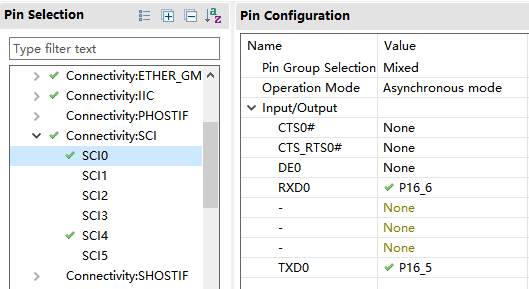
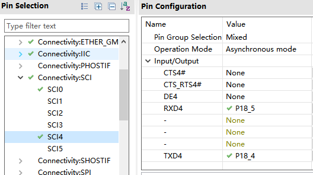
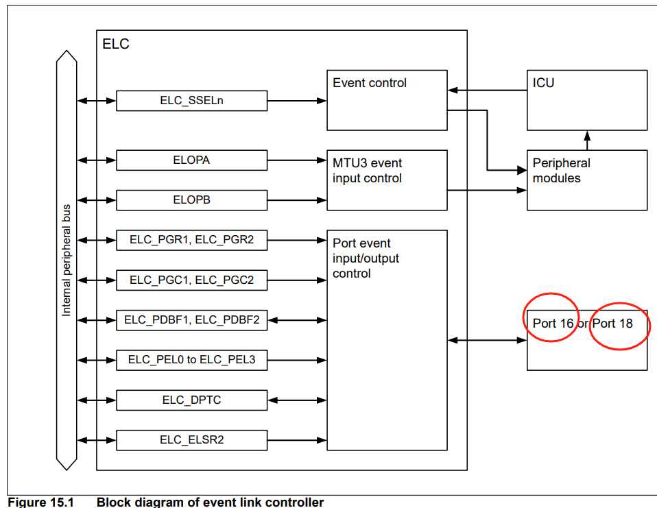

**以上是指使用gpt elc来计算串口空闲这种方式下的限制
或许有其他方式没有限制**