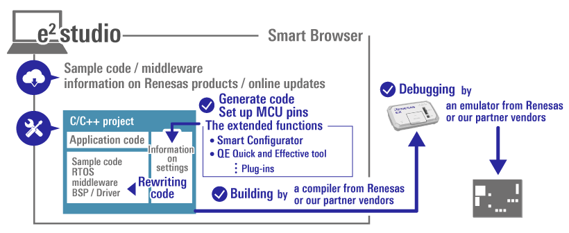
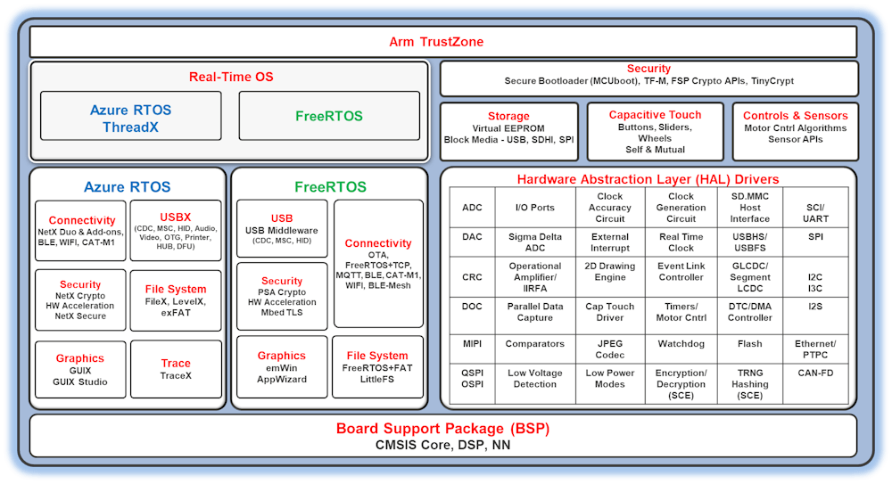
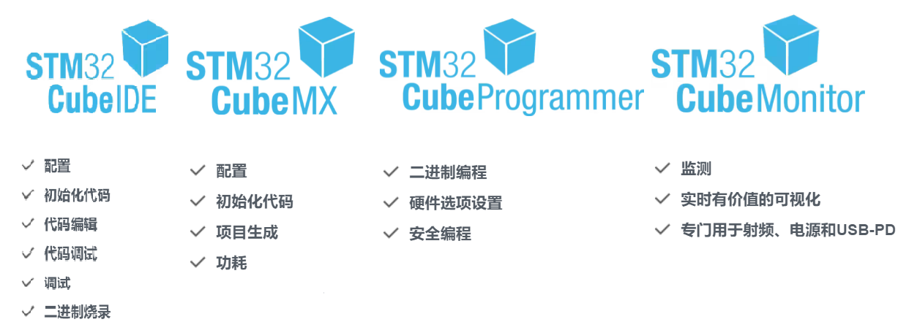

**一、e2studio VS STM32CubeIDE之下载和安装**

[TOC]

# 一、概述/目的
- 通过对比学习，更快速的掌握两款IDE
- 对比国产其他品牌，有一定的评估
- 下载和安装的资料

# 二、e2studio STM32CubeIDE的概念和逻辑
## 2.1 对比表
|品牌|STM32|RENESAS|TI/NXP/silicon|
|:-:|:-:|:-:|:-:|
|选型工具|ST MCU Finder(IDE内置+APP)|Renesas MCU/MPU Guide(APP)|
|图形化配置|STM32CubeMX|RASC/RZSC|
|集成开发|STM32CubeIDE|e² studio|CCS/MCUX/simplicity|
|烧录工具|STM32CubeProgrammer|Renesas Flash Programmer|
|监测工具|STM32CubeMonitor|Renesas QE/AI....|
|驱动库丨|标准库(停止) HAL库 LL库|Renesas Flexible Software Package (FSP) 含义1：驱动库(FSP_Packs_v5.2.0) 含义2：驱动库+e² studio整合包 含义3：驱动库+RASC整合包|

## 2.2 官网资料
### 2.2.1 Renesas
- https://www.renesas.cn/cn/zh/software-tool/flexible-software-package-fsp
- https://www.renesas.cn/cn/zh/software-tool/e-studio
- https://github.com/renesas
- 
- 

### 2.2.2 ST
- https://www.st.com/content/st_com/zh/stm32cubemx.html
- https://www.stmcu.com.cn/ecosystem/Cube/STM32Cubepackage
- https://github.com/STMicroelectronics/STM32Cube_MCU_Overall_Offer
- 
- 
  
# 三、国产品牌开发环境
|品牌|GD32/雅特力|华大/国民|RT-Thread Studio|MounRiver Studio|
|:-:|:-:|:-:|:-:|:-:|
|类型|芯片|芯片|RT-Thread|基于Eclipse GNURISC-V/CH32|
|选型工具|Excel/pdf|Excel/pdf|||
|图形化配置|GD32 Embedded Builder/AT32 Work Bench|?|||
|集成开发|KEIL、IAR、Eclipse/AT32 IDE|KEIL、IAR|||
|烧录工具|GigaDevice GD-Link Programmer/AT-Link Family|XHSC ISP/(EXE)XHSC Programmer Config Tool|||
|监测工具|？|?|||
|驱动库|标准库/Firmware Library|标准库?|||

# 四、下载和安装
## 4.1 ST
**下载：**
- https://www.st.com/content/st_com/zh/stm32cubeide.html
- https://www.stmcu.com.cn/ecosystem/Cube/STM32CubeIDE

**安装：**
https://www.bilibili.com/video/BV1aT4y1D7Qg/?spm_id_from=333.788&vd_source=8d542940fa16e9f470a2f6ace6bbd492

## 4.2 Renesas
**下载：**
- https://www.renesas.cn/cn/zh/software-tool/flexible-software-package-fsp#overview
- https://www.renesas.cn/cn/zh/software-tool/e-studio
- https://github.com/renesas/fsp/releases

**安装：**
- https://mp.weixin.qq.com/s/FsJjE77fQfq5unGrqhUjmA
