**三、e2studio VS STM32CubeIDE之RA printf redirect bare**

[TOC]

# 一、概述/目的
在嵌入式系统中，实现printf函数重定向输入日志，这是优秀代码的前提，或者说是基础。
瑞萨RA升级到fsp5.0.0之后，原fps4.6.0及之前的版本的printf重定向功能编译报错。
**所以，我们分析报错的原因和解决办法**

# 二、fsp4.6.0之前printf重定向方法
引用野火瑞萨RA系列FSP19.5.2.6. 重定向printf输出到串口
https://doc.embedfire.com/mcu/renesas/fsp_ra/zh/latest/doc/chapter19/chapter19.html?highlight=printf
- fsp 4.0.0
- gcc 10.3
- --specs=nano.specs
- -u _printf_float/-u_scanf_float
- --specs=nosys.specs(disable)
- --specs=rdimon.specs(disable)

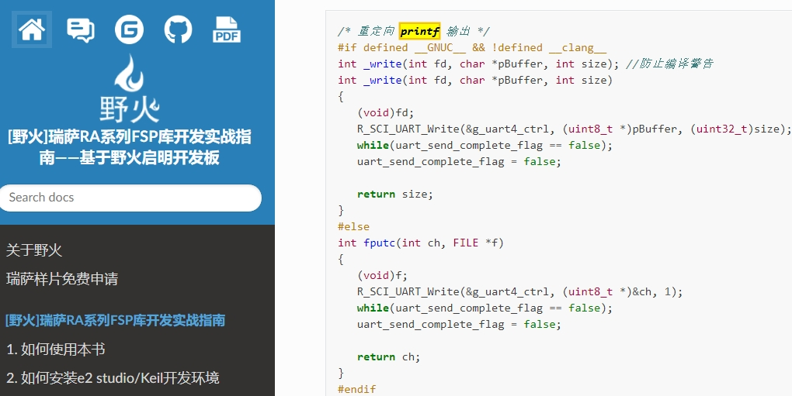
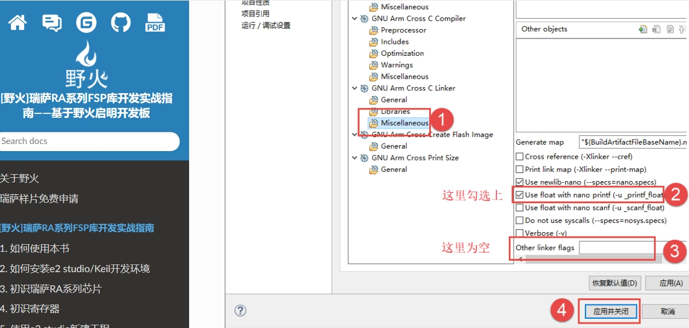
```
/* 重定向 printf 输出 */
#if defined __GNUC__ && !defined __clang__
int _write(int fd, char *pBuffer, int size); //防止编译警告
int _write(int fd, char *pBuffer, int size)
{
   (void)fd;
   R_SCI_UART_Write(&g_uart4_ctrl, (uint8_t *)pBuffer, (uint32_t)size);
   while(uart_send_complete_flag == false);
   uart_send_complete_flag = false;

   return size;
}
#else
int fputc(int ch, FILE *f)
{
   (void)f;
   R_SCI_UART_Write(&g_uart4_ctrl, (uint8_t *)&ch, 1);
   while(uart_send_complete_flag == false);
   uart_send_complete_flag = false;

   return ch;
}
#endif
```

# 三、fsp5.0.0之后printf重定向方法

## 3.1 升级后编译报错
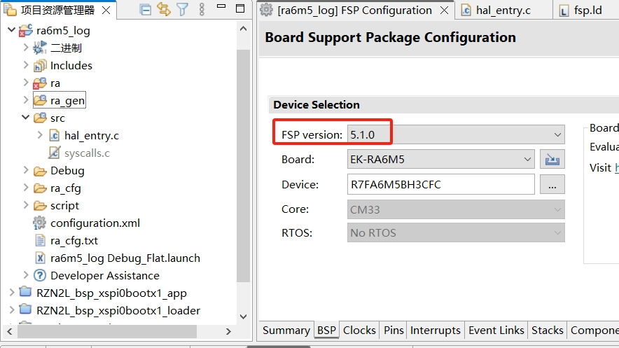


## 3.2 分析原因
- 差分源码
- 分析newlib：
文章：
嵌入式科普(5)ARM GNU Toolchain相关概念和逻辑
嵌入式科普(6)你听说过FreeRTOS heap6吗？
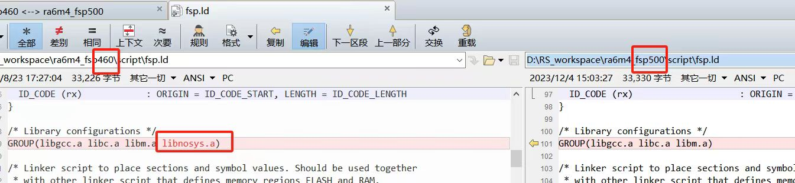
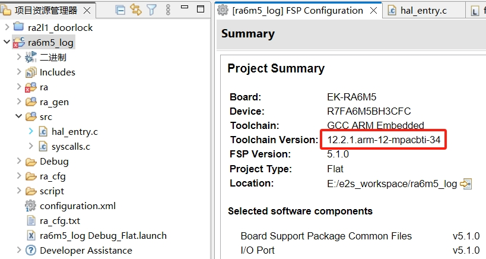


### 3.2.1 newlib和gcc版本
- The Red Hat newlib C Library
https://sourceware.org/newlib/libc.html#sprintf
- Arm GNU Toolchain
https://developer.arm.com/downloads/-/arm-gnu-toolchain-downloads


### 3.2.2 参考stm32cube ide
- gcc 10.3
- --specs=nano.specs
- -u _printf_float/-u_scanf_float
- --specs=nosys.specs
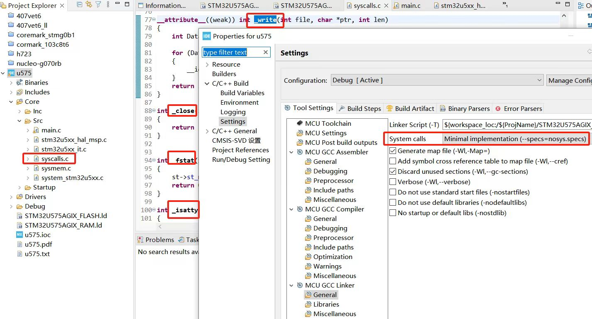
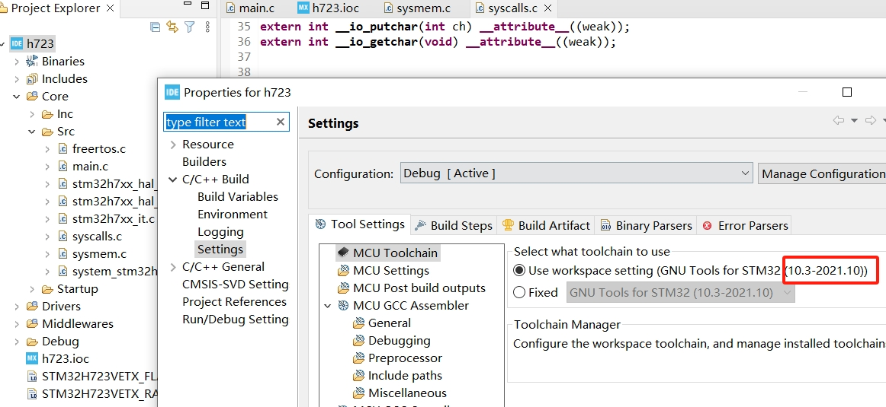

## 3.3 处理办法
- 测试fsp5.1.0printf重定向
- gcc 12.2


### 3.3.1 方法一
- --specs=nosys.specs
- 可用，但有警告
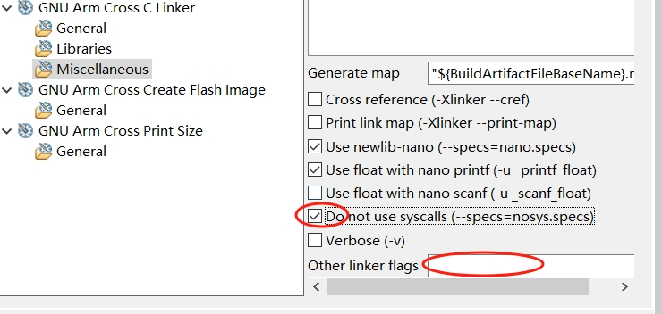
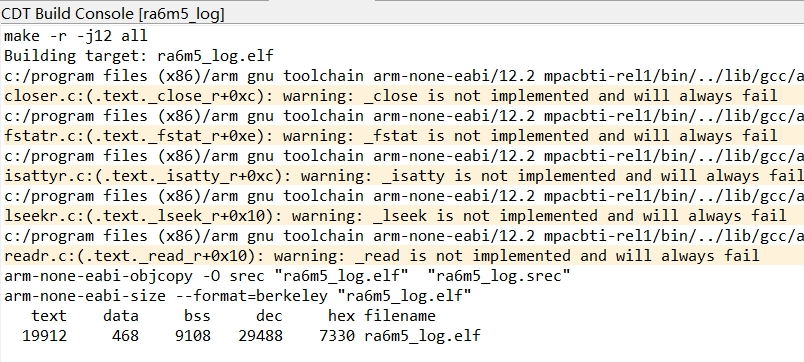

### 3.3.2 方法二
- 增加syscall.c解决警告
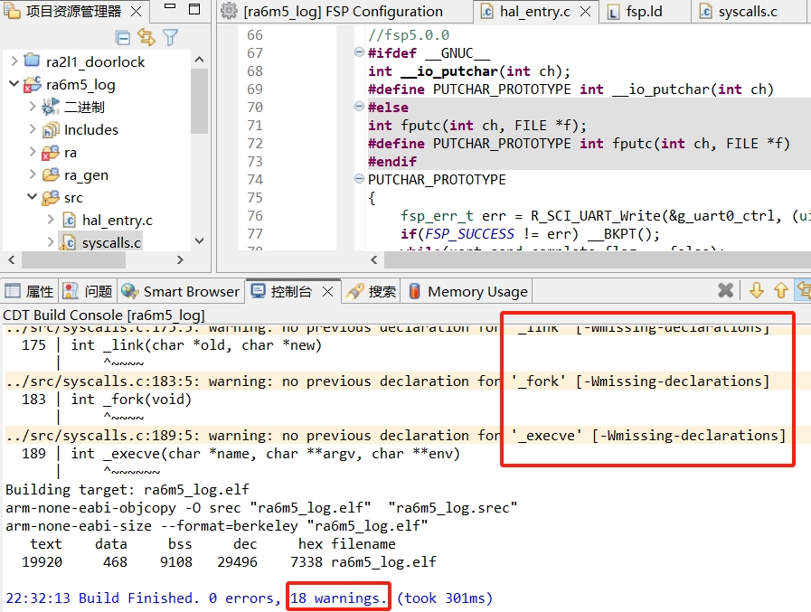
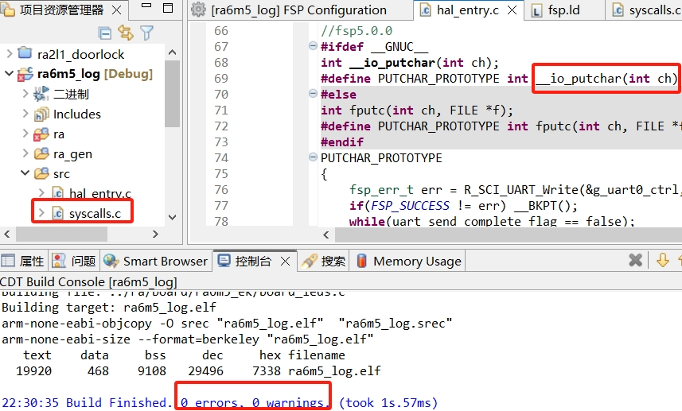

- 解决未定义警告
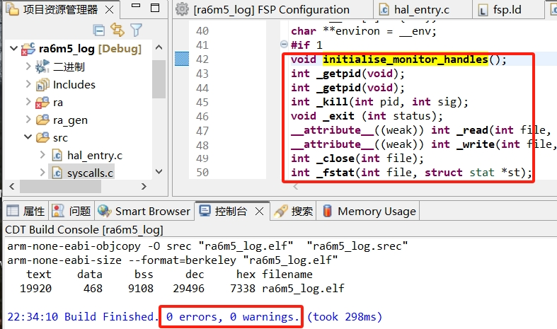

- bsp_sbrk.c文件
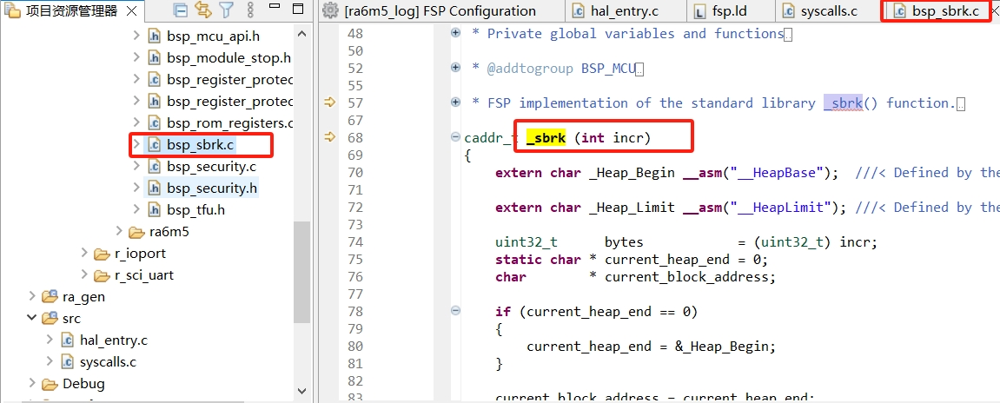

- 完美解决，新旧兼容
源码整理：printf重定向、syscall函数声明、例程ra6m5_log
```
//fsp5.0.0
#ifdef __GNUC__
int __io_putchar(int ch);
#define PUTCHAR_PROTOTYPE int __io_putchar(int ch)
#else
int fputc(int ch, FILE *f);
#define PUTCHAR_PROTOTYPE int fputc(int ch, FILE *f)
#endif
PUTCHAR_PROTOTYPE
{
    fsp_err_t err = R_SCI_UART_Write(&g_uart0_ctrl, (uint8_t *)ch, 1);
    if(FSP_SUCCESS != err) __BKPT();
    while(uart_send_complete_flag == false);
    uart_send_complete_flag = false;
    return ch;
}
```
```
#if 1
void initialise_monitor_handles();
int _getpid(void);
int _getpid(void);
int _kill(int pid, int sig);
void _exit (int status);
__attribute__((weak)) int _read(int file, char *ptr, int len);
__attribute__((weak)) int _write(int file, char *ptr, int len);
int _close(int file);
int _fstat(int file, struct stat *st);
int _isatty(int file);
int _lseek(int file, int ptr, int dir);
int _open(char *path, int flags, ...);
int _wait(int *status);
int _unlink(char *name);
int _times(struct tms *buf);
int _stat(char *file, struct stat *st);
int _link(char *old, char *new);
int _fork(void);
int _execve(char *name, char **argv, char **env);
#endif
```
